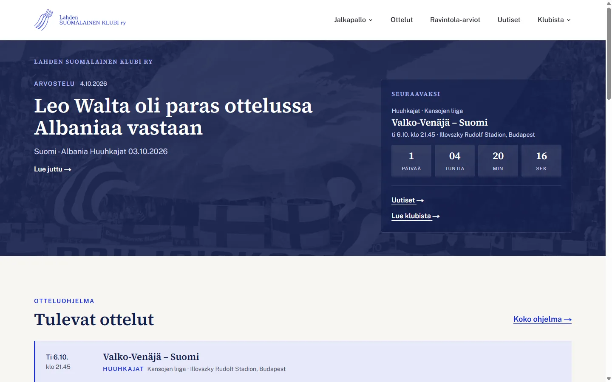
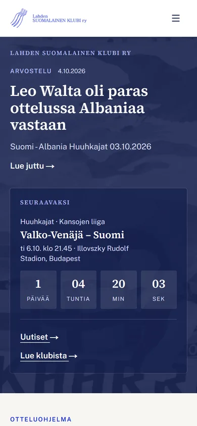
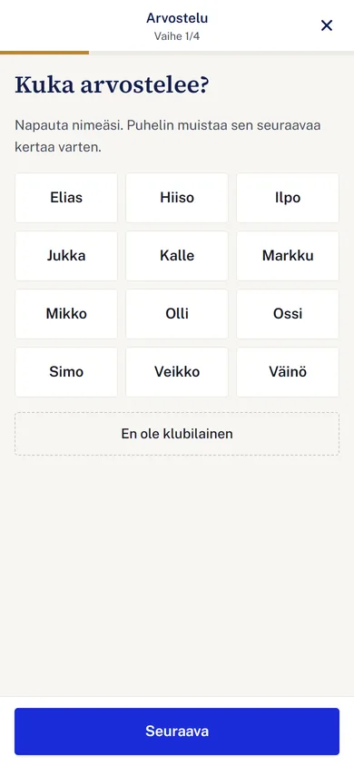
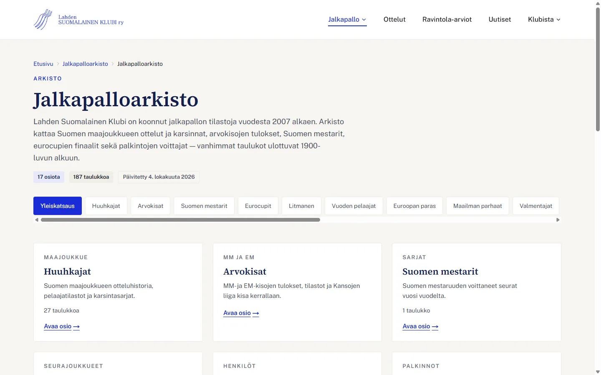
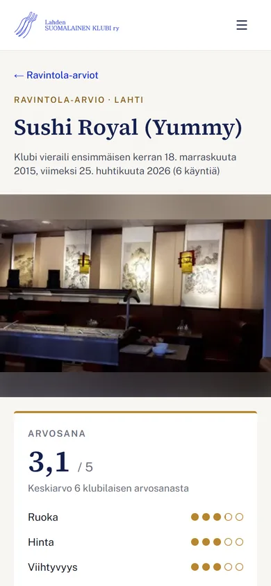
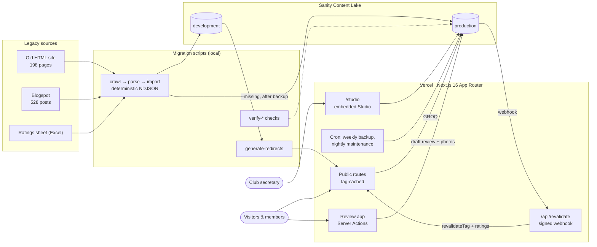

# Lahden Suomalainen Klubi — website rebuild

**Live:** [lahdensuomalainenklubi.com](https://www.lahdensuomalainenklubi.com) &nbsp;·&nbsp; Next.js 16 · Sanity · Vercel · TypeScript · Tailwind CSS v4

[](https://github.com/veikkope/klubi/actions/workflows/tarkistukset.yml)

A full rebuild of the website of **Lahden Suomalainen Klubi ry**, a Finnish football-supporters' association founded in 2007. The old site was a frame-based FrontPage-era HTML site (198 pages) plus a separate Blogspot blog (528 posts since 2007), holding two decades of football statistics, ~500 restaurant reviews, stadium guides and news.

I migrated all of it into a structured CMS, kept every old URL working, and handed the site over to the club's secretary, a non-technical editor who now maintains it in a Finnish-language Sanity Studio. The site went live on the original domain on **4 October 2026**.

<p align="center">
  
  &nbsp;
  
</p>

## Outcome in numbers

| | |
|---|---|
| Legacy content | **198 / 198** old pages accounted for (176 migrated, 19 merged, 3 dropped with a documented reason) and **528 / 528** blog posts |
| URL continuity | **730** permanent redirects generated from CMS data; production check 726 / 730 OK (the 4 are known false alarms in the checker) |
| Content today | ~5,500 Sanity documents: 753 news items, ~500 restaurants, 187 statistics tables, 1,544 club-member ratings imported from an Excel sheet |
| Accessibility | axe-core (WCAG 2.1 A/AA) over 66 pages: **0 violations** (colour contrast verified separately from design tokens) |
| Mobile | No horizontal scroll at 320 / 360 / 390 px on any tested page; LCP 0.2–0.5 s in mobile emulation |
| Quality gates | CI on every push: `tsc`, ESLint and **15 unit-test suites (130 cases)**; Dependabot |
| Launch audit | 13-area review before launch: 0 critical findings, average 7.9 / 10 ([docs/22](docs/22-julkaisuvalmius.md), in Finnish) |

## What I built



- **Public site** with news (search, tags, archive), match fixtures from external feeds, events with calendar export, photo galleries and a 17-section football archive with 187 statistics tables.
- **A phone-first restaurant review app** (`/ravintolat/arvostele`): a 4-step flow with a full-screen layout. The step is kept in the URL, so the phone's back gesture works, the draft survives reloads, and photos are resized in the browser (which also strips EXIF/GPS) before upload. It can be added to the home screen via a web app manifest.
- **Automatic club ratings.** A restaurant's score is the mean of club members' latest ratings. It appears publicly only after two members have rated it, and it is recalculated by the CMS webhook with a nightly safety-net job.
- **Comments and prediction games** on news posts, including 502 legacy blog comments imported onto the right posts.
- **An editor experience for a non-developer:** a Finnish Studio, strict validation with human-readable errors, custom document actions (approve/reject reviews, hide comments), a spreadsheet-style table editor with Excel paste, live preview, and a "needs review" queue for content flagged during migration.

<br clear="right">

## Engineering highlights

**Reproducible migration with a measurable definition of done.** The old site was crawled once to a local copy. Per-type `parse-*` scripts turn the HTML (partly windows-1252) into CMS-agnostic JSON, and `import-*` adapters turn that JSON into NDJSON with deterministic IDs. Two consecutive runs produce byte-identical output. "Done" meant script-checked criteria: zero unaccounted pages, zero mojibake, table row counts matching the source and alt text on every image. Uncertain cases were flagged for human review instead of guessed. → [`scripts/`](scripts), [`docs/12`](docs/12-sisaltomigraatio.md)

**Redirects generated from content.** Every migrated document stores its legacy URL, and a generator builds [`lib/redirects.ts`](lib/redirects.ts) from Sanity plus a manual CSV. Blog posts imported after the last build are resolved at request time by a route handler, so new redirects need no deploy.

**Migrating a blog that was still in use.** Blogger post IDs map to stable document IDs, so re-runs update instead of duplicating. Production syncs back up first and import only missing documents, so the editor's own edits are never overwritten.

**On-demand revalidation.** Pages are cached with tags. A signed Sanity webhook expands dependent tags (e.g. a new review also invalidates the restaurant) and revalidates with `expire: 0`, so the editor sees their change on the next request. → [`app/api/revalidate`](app/api/revalidate/route.ts)

**Safe user uploads.** Review photos are re-validated on the server (JPEG magic bytes, metadata segments stripped, size limits). Reviews are stored as unpublished drafts until approved, and rejecting a review deletes its photos immediately. → [`lib/arvostelukuvat.ts`](lib/arvostelukuvat.ts)

**Operations on a free tier.** Sanity's free plan keeps only 3 days of history, so a weekly cron exports and gzips the content into a downloadable backup inside Studio and keeps the latest 12. A nightly job recalculates ratings and removes orphaned photos. Images are served through Sanity's CDN with a custom `next/image` loader to stay within Vercel's image quota.

**Security and SEO basics done properly:** signed webhooks, secret-protected cron routes, an open-redirect guard with tests, security headers, `noindex` on preview domains, JSON-LD (NewsArticle, Event, Restaurant), a generated sitemap and per-page Open Graph images.

<p align="center">
  
  &nbsp;
  
</p>

## Architecture



## How I worked: AI-assisted, spec-driven

I built this with **Claude Code** as an engineering team I directed, not as autocomplete. Most of the repo's structure comes from that process:

- **Specs before code.** 23 numbered planning documents ([`docs/`](docs)) define the content model, IA, design system and migration contract. They include binary gates (type-check, lint, build) and explicit definitions of done.
- **Specialised sub-agents** ([`.claude/agents/`](.claude/agents)), each owning one area and one document: content audit, IA, CMS schema, design system, migration, SEO, build and editor UX. [`CLAUDE.md`](CLAUDE.md) is the shared rulebook.
- **Parallel work with ownership boundaries.** The migration ran in phases: sequential groundwork and frozen schemas, then parallel migration agents with separate files, then integration, then an independent QA pass that only reported defects with evidence.
- **Adversarial audits.** Before launch, read-only audits covered 9 areas and then 13. Every high-severity finding was independently re-verified before anything was fixed, and the audit lists its own limitations.
- **Tests as guardrails** for all rule-heavy logic: rating calculation, comment validation, upload checks, redirects, table conversion, team-name matching, backups and link validation.

My part was choosing the stack, writing and approving the specs, reviewing diffs, deciding trade-offs, and running production operations myself: backups, data imports, DNS cutover and the handover to the editor.

## A note on language

The client and the editor are Finnish, so the domain language is too: Studio, content model, many identifiers and the planning docs are in Finnish. A small glossary for reading the code:

| Finnish | English | | Finnish | English |
|---|---|---|---|---|
| uutinen | news item | | arvostelu / arvosana | review / rating |
| ravintola | restaurant | | klubilainen | club member |
| sivu | page | | varmuuskopio | backup |
| ottelu | match | | huolto | maintenance |
| tarkistettava | needs review | | tarkistukset | checks (CI) |

## Running locally

```bash
npm install
cp .env.example .env.local   # Sanity project ID + dataset; tokens only for write scripts
npm run dev                  # http://localhost:3000, Studio at /studio
npm test                     # all unit-test suites (same as CI)
npm run type-check && npm run lint && npm run build
```

Project layout: `app/(public)` site routes · `app/(sovellus)` app-like views without site chrome · `app/studio` embedded Studio · `app/api` webhook, cron and preview handlers · `sanity/` schemas, Studio structure, custom actions and inputs · `lib/` pure, tested domain logic · `scripts/` migration, verification and test scripts · `docs/` specs and decision records (Finnish).

## Timeline

Scaffolded in May 2026. The main build ran from 26 September to 4 October 2026 (go-live), with the launch audit and fixes on 5 October.

## License

Source code published for reference and portfolio review. All rights reserved. Content, name and logo belong to Lahden Suomalainen Klubi ry.

Built by [@veikkope](https://github.com/veikkope).
