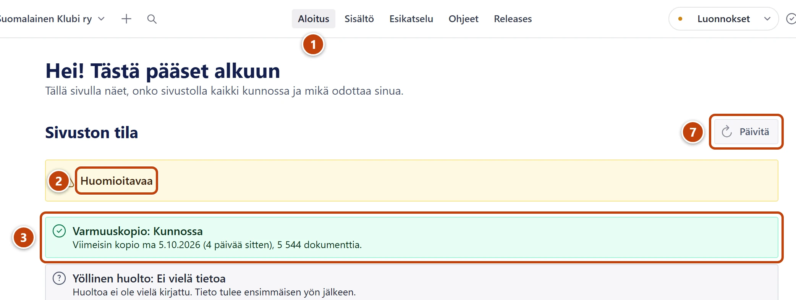
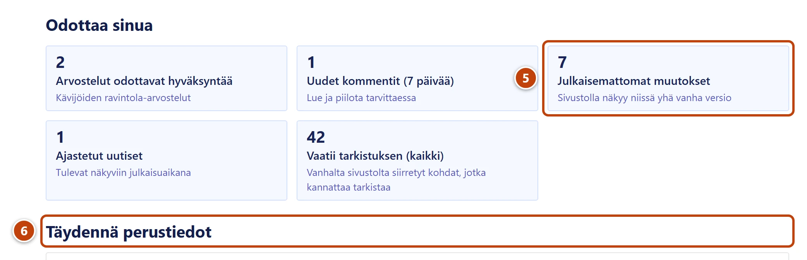

## Milloin

Aina kun avaat Studion. Aloitus kertoo yhdellä silmäyksellä, onko sivustolla kaikki kunnossa ja mikä odottaa sinua.

## Askeleet

1. Avaa Studio. Aloitus aukeaa ensimmäisenä. Muualta pääset sinne yläpalkin painikkeesta **Aloitus**. ①
2. Katso kohdan **Sivuston tila** yhteenveto: **Kaikki kunnossa**, **Huomioitavaa** tai **Vaatii toimia**. ②
3. Lue rivit. Rivin nimen perässä tila lukee sanana, esim. **Kunnossa**, **Huomio**, **Vaatii toimia** tai **Ei vielä tietoa**. ③
4. Jos rivi on keltainen tai punainen, lue sen alla oleva ohje. Kerro tukihenkilölle rivin otsikko ja teksti.
   Sisältösi on silti tallessa. Voit jatkaa työtä normaalisti.

5. Kohdassa **Odottaa sinua** paina korttia, jossa on luku. ⑤
   Oikea lista aukeaa. Teksti **Ei odottavia** tarkoittaa, ettei siinä ole tehtävää.
6. Jos näet kohdan **Täydennä perustiedot**, paina riviä. ⑥
   Oikea kohta aukeaa valikosta. Jos lomake ei aukea itse, valitse listasta ylin kohta, esim. **Osoite, sähköposti ja some**.
7. Kun haluat tuoreet tiedot kesken työn, paina **Päivitä**. ⑦

Rivit ja niiden merkitys:

| Rivi | Mitä se kertoo | Kun se ei ole vihreä |
|---|---|---|
| **Varmuuskopio** | Viikoittainen varmuuskopio, joka tehdään maanantaiyönä | Kerro tukihenkilölle. Keltainen: kopio on tallessa, palautus toimii. |
| **Yöllinen huolto** | Ravintoloiden arvosanat ja vanhojen tiedostojen siivous joka yö | Kerro tukihenkilölle, jos sama toistuu useana päivänä. |
| **Otteluohjelman haku** | Veikkausliigan ottelut haetaan automaattisesti | Punainen: lisää tärkeät ottelut käsin ja kerro tukihenkilölle. Keltainen talvella on normaalia. |
| **Dokumenttikiintiö (arvio)** | Arvio siitä, paljonko sisältöä sivustolle mahtuu vielä | Keltainen: kerro tukihenkilölle. Tila **Arvio** on normaali. |
| **Julkaisemattomat muutokset** | Sisältö, jossa on muutos, jota et ole julkaissut | Paina **Avaa julkaisemattomat muutokset**. Julkaise tai hylkää muutos. |

## Tulos

- Tiedät, onko sivustolla kaikki kunnossa.
- Näet, montako arvostelua, kommenttia ja muuta asiaa odottaa sinua.

## Lisävalinnat

- Samat listat ovat aina valikon kohdassa **Tehtävät sinulle**.
- Julkaisemattomien muutosten käsittely: [Tallenna, julkaise ja peru muutos](luonnos-julkaisu-ja-peruminen.md)
- Ottelun lisääminen käsin: [Lisää ottelu otteluohjelmaan](../ottelut/ottelun-lisaaminen.md)
- Tilamerkkien selitykset: [Tilamerkit ja listojen merkinnät](../hakuteos/tilamerkit.md)

> [!NOTE]
> Harmaa rivi ja teksti **Ei vielä tietoa** tarkoittavat, ettei automaattinen työ ole vielä ajanut kertaakaan. Se ei vaadi toimia.

## Jos jokin menee vikaan

- Rivi on punainen: sisältösi ei ole kadonnut. Katso [Aloituksessa lukee Vaatii toimia tai Huomioitavaa](../vianetsinta/aloituksessa-punainen-rivi.md).
- Aloitus näyttää punaisen laatikon eikä rivejä: paina **Päivitä**. Jos laatikko jää, kerro tukihenkilölle sen teksti.

Katso myös: [Kirjaudu ja tutustu Studioon](studion-osat-ja-kirjautuminen.md) · [Tarkista ja lataa varmuuskopio](../turvaverkko/varmuuskopiot.md) · [Käy läpi tarkistettavat](../turvaverkko/tarkistettavat.md)
