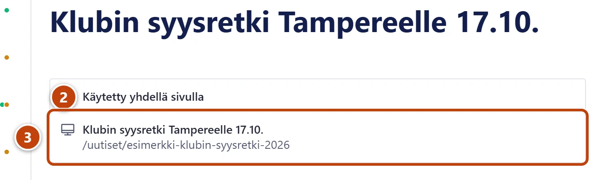
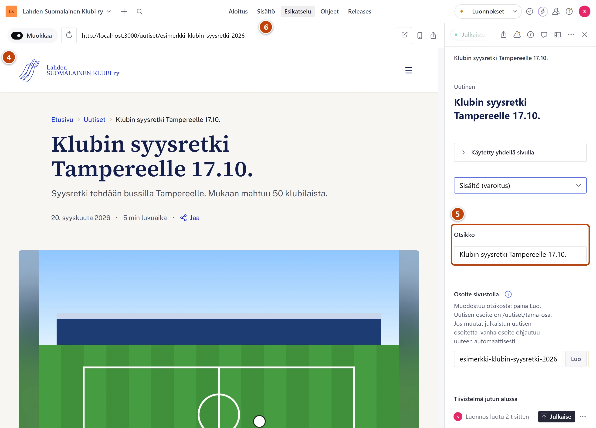

## Milloin

Kun haluat nähdä, miltä muutos näyttää sivulla, ennen kuin julkaiset sen. Samalla näet, millä sivulla sisältö näkyy.

## Askeleet

1. Avaa muokattava sisältö, esim. uutinen.
2. Lomakkeen yläreunassa, otsikon alla, paina kohtaa **Käytetty yhdellä sivulla**. ②
   Kohta aukeaa, ja sen alla näkyy sivun nimi ja osoite. Monella sivulla näkyvästä lukee esim. "Käytetty 2 sivulla".
3. Paina sivun nimeä. ③ Sivu aukeaa työkaluun **Esikatselu**.

4. Katso sivua. Siinä näkyvät myös julkaisemattomat muutokset. ④
5. Muokkaa tarvittaessa lomakkeella. ⑤ Sivu päivittyy samalla.
6. Kun sivu näyttää hyvältä, paina lomakkeen oikeasta alakulmasta **Julkaise**. Palaa muokkaukseen yläpalkin painikkeesta **Sisältö**. ⑥

## Tulos

- Näit sivun sellaisena kuin se näkyy julkaisun jälkeen.
- Kävijät eivät näe luonnosta ennen kuin painat **Julkaise**.

## Lisävalinnat

- Esikatselun voi avata myös suoraan yläpalkista: **Esikatselu** → selaa oikealle sivulle → valitse sisältö listasta **Tämän sivun dokumentit**.
- Hyväksymätön ravintola-arvostelu ei näy esikatselussakaan. Se näkyy vain hyväksyntälistassa.

## Jos jokin menee vikaan

- Kohdassa lukee **Ei käytetty millään sivulla**: sisältö ei vielä näy missään. Taulukon kohdalla lue sen alla oleva ohje.
- Kohdassa lukee **Ratkaistaan sijainteja...** pitkään: odota hetki tai avaa sisältö uudelleen.
- Sivuston tai Studion yläreunassa on palkki "Esikatselutila: näet myös julkaisemattomat luonnokset". Se jää näkyviin esikatselun jälkeen. Paina palkista "Poistu esikatselusta". Katso [Sivuston yläreunassa lukee Esikatselutila](../vianetsinta/sivusto-jaa-esikatselutilaan.md).

Katso myös: [Tallenna, julkaise ja peru muutos](luonnos-julkaisu-ja-peruminen.md) · [Muutos ei näy sivustolla](../vianetsinta/muutos-ei-nay-sivustolla.md)
