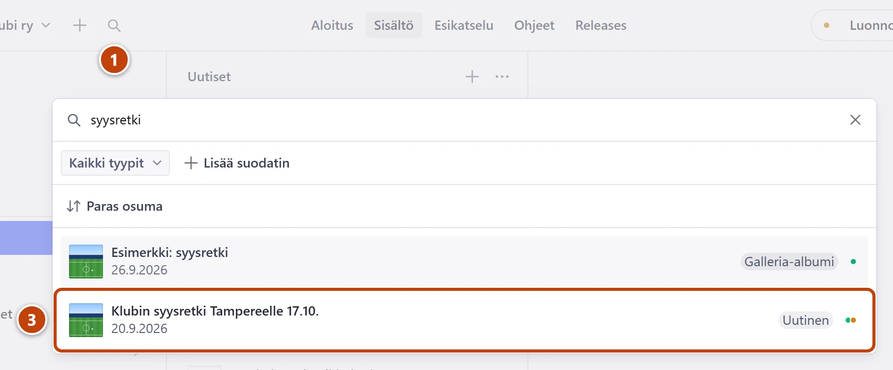
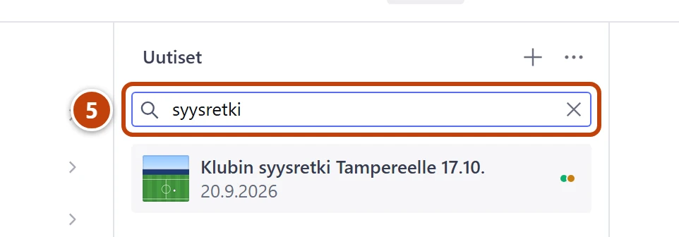

## Milloin

Kun et löydä uutista, sivua tai muuta sisältöä valikosta. Esimerkiksi uutisia on yli 500, eikä lista näytä niitä kaikkia kerralla.

## Askeleet

### Koko Studiosta

1. Yläpalkissa vasemmalla, plus-painikkeen vieressä, paina suurennuslasia. ①
   Kun viet hiiren sen päälle, näet tekstin **Etsi**. Hakuikkuna aukeaa.
2. Kirjoita otsikon tai nimen alku, esim. "vuosikokous".
3. Valitse oikea tulos listasta. ③ Lomake aukeaa.

### Yhdestä listasta

4. Avaa lista valikosta, esim. **Uutiset**.
5. Kirjoita listan yläreunan kenttään **Etsi listalta** hakusana. ⑤
6. Valitse oikea rivi.

## Tulos

- Haettu sisältö aukeaa lomakkeeksi oikealle, ja voit muokata sitä.

## Lisävalinnat

- Kommentoijan tai arvostelijan nimellä haku: [Poista henkilön tiedot pyynnöstä](../turvaverkko/tietosuojapyynto.md)
- Sivuston kävijöiden uutishaku toimii itsestään, kun uutinen on julkaistu.

## Jos jokin menee vikaan

- **Tuloksia ei löytynyt**: kokeile lyhyempää sanaa tai pelkkää sanan alkua.
- Löydät sisällön, mutta et tiedä, millä sivulla se näkyy: katso lomakkeen yläreunan kohta **Käytetty yhdellä sivulla**. Ohje: [Katso muutos ennen julkaisua](esikatselu.md).

Katso myös: [Kirjaudu ja tutustu Studioon](studion-osat-ja-kirjautuminen.md) · [Studion valikon kartta](../hakuteos/valikon-kartta.md)
