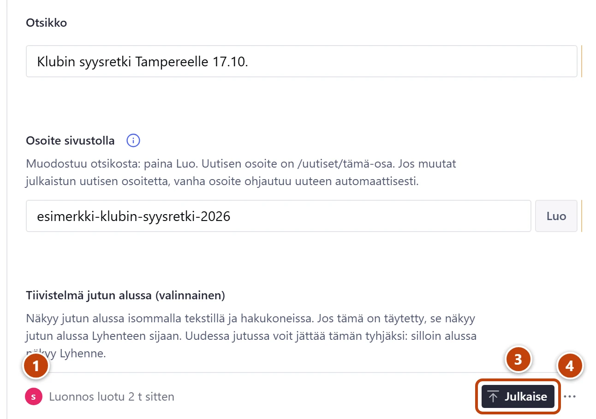
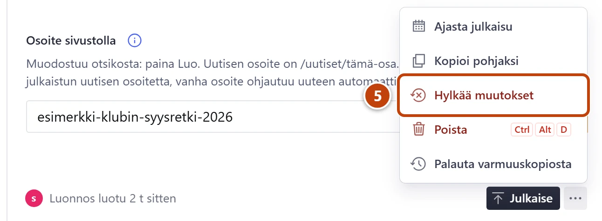
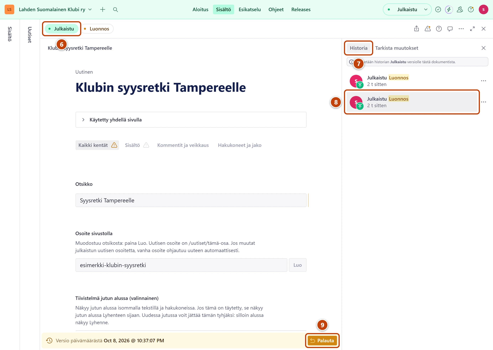

## Milloin

Aina kun muokkaat jotain. Muutos tallentuu itsestään luonnokseksi, ja sivustolle se menee vasta, kun painat **Julkaise**. Tästä kortista näet myös, miten perut virheen.

## Askeleet

### Tallenna ja julkaise

1. Kirjoita tai muuta kenttää. Muutos tallentuu itsestään. ①
   Alapalkissa vasemmalla lukee hetken **Tallennettu**, sitten esim. "Muokattu juuri nyt". Tallennuspainiketta ei ole.
2. Tee kaikki muutokset rauhassa. Voit välillä sulkea selaimen: luonnos säilyy.
3. Kun kaikki on valmista, paina oikeassa alakulmassa **Julkaise**. ③
   Ruudulle tulee ilmoitus **Dokumentti on julkaistu**, ja painike muuttuu harmaaksi. Sivusto päivittyy noin minuutissa.

> [!TIP]
> Julkaise vasta lopuksi, kerran. Esimerkiksi ottelun jälkeen päivitä kaikki taulukon solut ja paina **Julkaise** vasta sitten.

### Peru muutos, jota et ole julkaissut

4. Oikeassa alakulmassa paina **Julkaise**-painikkeen vieressä olevaa kolmen pisteen painiketta (⋯). ④
   Toimintovalikko aukeaa. Painikkeen nimi on **Asiakirjatoiminnot**.
5. Valitse **Hylkää muutokset**. ⑤ Ikkunassa **Hylätäänkö muutokset?** paina **Hylkää muutokset**.
   Lomake palaa samaksi kuin sivustolla nyt.

### Palauta aiempi versio historiasta

6. Lomakkeen yläreunassa vasemmalla paina **Julkaistu**. ⑥
   Yläpalkki muuttuu vihreäksi. Lomake näyttää sivustolla olevan version.
7. Alareunassa vasemmalla paina aikatekstiä, esim. "Viimeksi julkaistu 2 pv sitten". Valitse oikealle aukeavasta paneelista välilehti **Historia**. ⑦
8. Valitse listasta aiempi **Julkaistu**-rivi, jolloin kaikki oli vielä kunnossa. ⑧
   Lomake näyttää sen version.
9. Paina alhaalla oikealla **Palauta** ja sitten **Vahvista**. ⑨
   Vanha versio tulee luonnokseksi. Sivusto ei vielä muutu.
10. Paina lomakkeen yläreunasta **Luonnos**. Tarkista lomake ja paina **Julkaise**.

> [!NOTE]
> Kun yläpalkki on vihreä, **Julkaise**-painikkeen paikalla on punainen **Poista julkaisu**. Älä paina sitä: se vie sisällön pois sivustolta. Palaa painamalla **Luonnos**.

## Tulos

- Julkaisun jälkeen **Julkaise** on harmaa, ja alapalkissa lukee "Viimeksi julkaistu juuri nyt". Muutos näkyy sivustolla noin minuutin kuluessa.
- Hylkäyksen tai palautuksen jälkeen lomake näyttää vanhan sisällön.

## Lisävalinnat

- Kirjoitusvirheen perut heti näppäimillä Ctrl + Z (Macissa Cmd + Z).
- Taulukosta poistetun rivin saat takaisin ilmoituksen painikkeesta **Kumoa**.
- Muutos näkyviin ennen julkaisua: [Katso muutos ennen julkaisua](esikatselu.md)
- Vanhempi virhe: [Palauta vanha versio varmuuskopiosta](../turvaverkko/vanhan-version-palautus.md)
- Kokonaan poistettu sisältö: [Palauta poistettu sisältö](../turvaverkko/poistetun-palautus.md)

> [!NOTE]
> Historia säilyy vain muutaman päivän. Vanhempiin virheisiin käytä varmuuskopiota. Tarkemmin: [Mihin tarvitset tukihenkilöä](../hakuteos/tukihenkilo.md).

## Jos jokin menee vikaan

- **Julkaise** on harmaa, ja välilehden nimen vieressä on punainen huutomerkki: jokin pakollinen kenttä puuttuu. Katso [Julkaise on harmaa](../vianetsinta/julkaise-ei-onnistu.md).
- **Hylkää muutokset** puuttuu valikosta: muutoksia ei ole, kaikki on jo julkaistu.
- Sisältöä ei ole koskaan julkaistu: **Hylkää muutokset** poistaa koko luonnoksen. Ikkuna kysyy sitä ennen varmistuksen.
- Historiassa lukee "Emme löytäneet valittua dokumentin versiota": paina ensin lomakkeen yläreunasta **Julkaistu** ja valitse versio uudelleen.
- Historiassa ei ole tarpeeksi vanhaa versiota: käytä toimintovalikon kohtaa **Palauta varmuuskopiosta**.

Katso myös: [Lue Aloitus ja sivuston tila](aloitus-ja-sivuston-tila.md) · [Muutos ei näy sivustolla](../vianetsinta/muutos-ei-nay-sivustolla.md)
