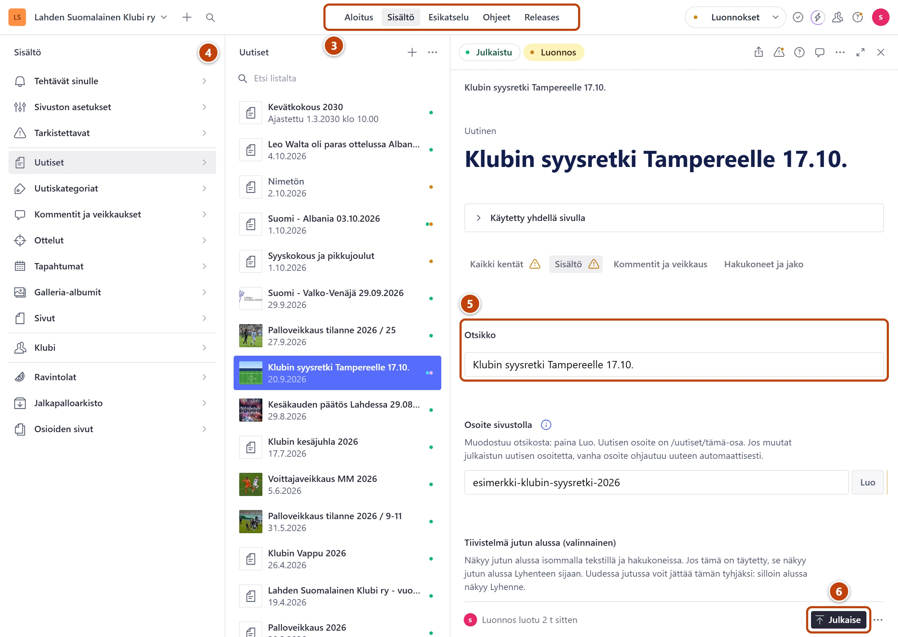

## Milloin

Kun avaat sivuston ylläpidon ensimmäistä kertaa tai olet ollut pitkään poissa. Kaikki sivuston tekstit, kuvat ja taulukot muokataan Studiossa.

## Ennen kuin aloitat

- Sinulla on tunnus, jolla sinut on kutsuttu Studioon (Google-tili tai sähköposti).
- Tunnus on henkilökohtainen. Älä anna sitä muille.

## Askeleet

1. Avaa selaimessa osoite https://www.lahdensuomalainenklubi.com/studio ja tallenna se kirjanmerkiksi.
2. Kirjaudu samalla tunnuksella, jolla sinut kutsuttiin.
   Studio avautuu Aloitukseen.
3. Yläpalkin keskellä ovat **Aloitus**, **Sisältö**, **Esikatselu** ja **Ohjeet**. ③
   **Aloitus** kertoo sivuston tilan, **Sisältö** on muokkausta varten, **Esikatselu** näyttää sivun ennen julkaisua. **Ohjeet** sisältää tämän ohjeen.
4. Paina **Sisältö**. Vasemmalla on valikko, esimerkiksi **Uutiset**, **Klubi** ja **Ravintolat**. ④
5. Valitse valikosta kohta ja listasta sisältö. Lomake aukeaa oikealle. ⑤
6. Lomakkeen alareunassa on alapalkki. Oikeassa alakulmassa on **Julkaise**. ⑥
   Sen vieressä on kolmen pisteen painike (⋯), josta löytyvät muut toiminnot.

## Tulos

- Näet Studion valikon ja voit avata minkä tahansa sisällön.
- Kun suljet selaimen, kirjautuminen säilyy yleensä seuraavaan kertaan.

## Lisävalinnat

- Puhelimella Studio toimii samassa osoitteessa. Yläpalkin työkalut ovat silloin valikon takana.
- Valikon kaikki kohdat yhdellä sivulla: [Studion valikon kartta](../hakuteos/valikon-kartta.md)

> [!NOTE]
> Yläpalkissa näkyy myös **Kyselyt (tukihenkilö)**. Älä käytä sitä: se on tukihenkilön työkalu.
> Älä käytä myöskään Sanityn omia toimintoja: yläpalkin "Releases" ja **Julkaisut**, oikean yläkulman **Tehtävät**,
> toimintovalikon **Ajasta julkaisu** ja lomakkeen valikon **Luo uusi tehtävä**. Ne eivät kuulu klubin ohjeisiin.
> Klubin omat tehtävät ovat valikon kohdassa **Tehtävät sinulle**. Oikean yläkulman valikossa pitää lukea **Luonnokset**.

## Jos jokin menee vikaan

- Kirjautuminen ei onnistu: tarkista, että käytät samaa tiliä kuin kutsussa. Kokeile toista selainta.
- Studio näyttää virheen tai jää tyhjäksi: päivitä sivu. Jos vika jatkuu, katso [Studio näyttää virheen tai ei aukea](../vianetsinta/studio-nayttaa-virheen.md).
- Yläpalkki on vihreä, eikä lomakkeeseen voi kirjoittaa: paina lomakkeen yläreunasta **Luonnos**.
- Sanityn hallintasivulle (sanity.io/manage) sinun ei tarvitse mennä. Sen asiat hoitaa tukihenkilö.

Katso myös: [Lue Aloitus ja sivuston tila](aloitus-ja-sivuston-tila.md) · [Tallenna, julkaise ja peru muutos](luonnos-julkaisu-ja-peruminen.md)
