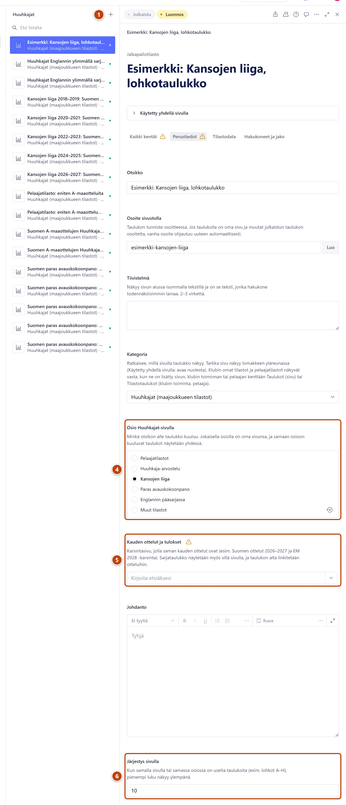

## Milloin

Kun Huuhkajat-sivulle tarvitaan uusi taulukko, esimerkiksi uuden Kansojen liigan kauden lohko.
Huuhkajat-sivu on jaettu aiheisiin, ja jokaisella aiheella on oma sivunsa.

## Ennen kuin aloitat

- Kansojen liigan kaudelle tarvitaan myös saman kauden karsintasivu. Tee se ensin:
  [Lisää karsintasarja](karsinnat.md).

## Askeleet

1. Valitse **Jalkapalloarkisto** → **Tilastot** → **Huuhkajat** ja paina listan yläreunassa
   plus-painiketta (+), jonka nimi on **Luo uusi asiakirja**. ①
   Uusi taulukko avautuu oikealle. **Kategoria** on valmiina.
2. Kirjoita kenttään **Otsikko** taulukon nimi, esimerkiksi "Kansojen liiga 2026–2027, lohko B4".
3. Kentän **Osoite sivustolla** vieressä paina **Luo**.
4. Kohdassa **Osio Huuhkajat-sivulla** valitse aihe, esimerkiksi "Kansojen liiga". ④
5. Jos valitsit Kansojen liigan, valitse kenttään **Kauden ottelut ja tulokset** saman kauden
   karsintasivu. ⑤
   Kirjoita nimen alkua, esimerkiksi "2026", ja valitse listasta.
6. Kirjoita kenttään **Järjestys sivulla** luku. Pienempi luku näkyy ylempänä. ⑥
7. Täytä taulukko välilehdellä **Tilastodata**, esimerkiksi painikkeella **Tuo Excelistä**.
8. Oikeassa alakulmassa paina **Julkaise**.

## Tulos

- Taulukko näkyy valitun aiheen sivulla, esimerkiksi Huuhkajat → Kansojen liiga.
- Kansojen liigan taulukko näkyy myös kauden karsintasivulla otteluiden yhteydessä.
  Silloin lomakkeen yläreunassa lukee "Käytetty 2 sivulla".
- Uusi aihe ilmestyy Huuhkajat-sivulle vasta, kun siinä on julkaistu taulukko.

## Lisävalinnat

- Sarjataulukkoa päivitetään vain Kansojen liigan taulukkoon. Ottelut ja tulokset kirjoitetaan
  karsintasivulle: [Lisää karsintasarja](karsinnat.md).
- Pisteiden ja sijojen päivitys: [Päivitä tilastotaulukko](tilastotaulukon-paivitys.md)

## Jos jokin menee vikaan

- **Julkaise** ei onnistu, ja kentässä lukee "Valitse osio, jotta taulukko löytyy oikean otsikon
  alta.": valitse aihe kohdassa **Osio Huuhkajat-sivulla**.
- Keltainen "Valitse kauden karsintasivu…": julkaisu onnistuu, mutta taulukko ei näy
  karsintasivulla. Valitse karsintasivu kenttään **Kauden ottelut ja tulokset**.
- Karsintasivua ei löydy listasta: sitä ei ole vielä tehty. Katso [Lisää karsintasarja](karsinnat.md).

Katso myös: [Päivitä tilastotaulukko](tilastotaulukon-paivitys.md) · [Lisää uusi tilastotaulukko](uusi-tilastotaulukko.md)
