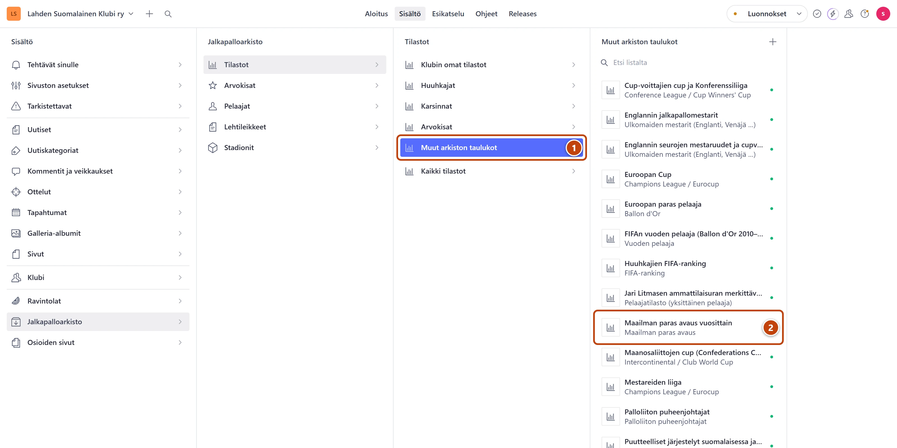

## Milloin

Kolmella arkiston aiheella on oma sivunsa: TOP 10 järkytykset, Maailman parhaat ja Ulkomaiset mestarit.
Niiden taulukot ovat ryhmässä **Muut arkiston taulukot**.

## Askeleet

1. Valitse **Jalkapalloarkisto** → **Tilastot** → **Muut arkiston taulukot**. ①
2. Valitse taulukko listasta, esimerkiksi "Maailman paras avaus vuosittain". ②
3. Päivitä taulukko välilehdellä **Tilastodata**. Katso [Päivitä tilastotaulukko](tilastotaulukon-paivitys.md).
4. Maailman parhaissa lisää uuden vuoden kenttäkaavio välilehden **Perustiedot** kenttään **Kuvat**.
   Raahaa uusi kuva listan alkuun.
5. Oikeassa alakulmassa paina **Julkaise**.

## Tulos

- TOP 10 järkytykset ja Maailman parhaat näkyvät arkiston valikossa omina sivuinaan.
- Ulkomaisten mestareiden taulukko näkyy valitun maan sivulla.

## Lisävalinnat

- Uusi taulukko jollekin sivulle: paina listan yläreunassa plus-painiketta (+) ja valitse kategoria.
  - Järkytykset: "Suomen jalkapallon järkytykset".
  - Maailman parhaat: "Maailman paras avaus".
  - Ulkomaiset mestarit: "Ulkomaiden mestarit (Englanti, Venäjä …)". Valitse sitten maa kohdassa
    **Maa Ulkomaiset mestarit -sivulla**.
- Kaikki saman kategorian taulukot näkyvät samalla sivulla. Järjestys: **Järjestys sivulla**.

## Jos jokin menee vikaan

- Keltainen "Valitse maa, jotta taulukko löytyy oikean valikon alta.": valitse maa kohdassa
  **Maa Ulkomaiset mestarit -sivulla**.
- Uusi maa puuttuu valinnoista: uuden maan sivu tarvitsee [tukihenkilön](../hakuteos/tukihenkilo.md).

Katso myös: [Päivitä tilastotaulukko](tilastotaulukon-paivitys.md) · [Lisää uusi tilastotaulukko](uusi-tilastotaulukko.md)
