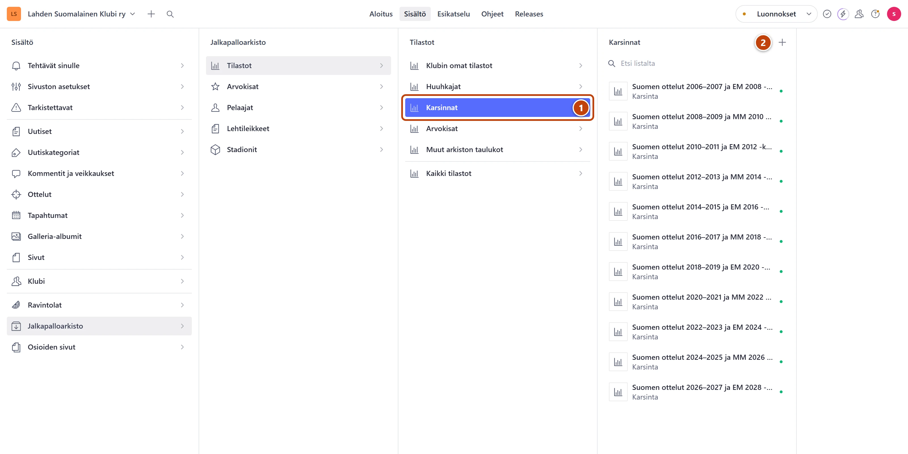

## Milloin

Uuden kauden alussa teet karsintasarjalle oman sivun. Ottelujen jälkeen päivität sen
tulokset ja otteluraportit. Karsintasivut näkyvät Huuhkajat-sivun alaosassa uusin ensin.

## Ennen kuin aloitat

- Jos karsintasivu on jo olemassa ja vain päivität tuloksia, siirry suoraan askeleeseen 6.

## Askeleet

1. Valitse **Jalkapalloarkisto** → **Tilastot** → **Karsinnat**. ①
2. Paina listan yläreunassa plus-painiketta (+), jonka nimi on **Luo uusi asiakirja**. ②
   Uusi sivu avautuu oikealle. **Kategoria** on valmiina.
3. Kirjoita kenttään **Otsikko** sivun nimi, esimerkiksi "Suomen ottelut 2026–2027 ja EM 2028 -karsinta".
4. Kentän **Osoite sivustolla** vieressä paina **Luo**.
5. Kirjoita halutessasi lyhyt esittely kenttään **Johdanto**.
6. Välilehdellä **Tilastodata** kirjoita taulukkoon kauden ottelut ja tulokset.
   Taulukon käyttö: [Päivitä tilastotaulukko](tilastotaulukon-paivitys.md).
7. Kirjoita otteluraportit ja kokoonpanot kenttään **Lisätiedot taulukon jälkeen**.
8. Kun kaikki illan muutokset on tehty, paina oikeassa alakulmassa **Julkaise**.

> [!TIP]
> Otteluiltana kirjoita tulos, raportti ja kokoonpano kaikki ensin valmiiksi. Muutokset
> tallentuvat itsestään. Paina **Julkaise** vasta lopuksi, yhden kerran.

## Tulos

- Sivu näkyy osoitteessa www.lahdensuomalainenklubi.com/jalkapalloarkisto/karsinnat/… ja
  Huuhkajat-sivun karsintalistassa.
- Lomakkeen yläreunan **Käytetty yhdellä sivulla** avaa sivun.

## Lisävalinnat

- Saman kauden Kansojen liigan sarjataulukko näkyy tällä sivulla, kun se on liitetty:
  [Huuhkajat ja Kansojen liiga](huuhkajat-ja-kansojen-liiga.md)
- Kokoonpano kenttäkuvana: [Piirrä kokoonpano pelikentälle](kokoonpano-pelikentalle.md)
- Linkki tekstiin: [Linkit](../tekstit/linkit.md)

## Jos jokin menee vikaan

- Linkki tai kappale katosi Lisätiedoista: paina heti Ctrl+Z. Myöhemmin palautat edellisen
  version versiohistoriasta: [Peru muutos](../alkuun/luonnos-julkaisu-ja-peruminen.md).
- Sivu ei näy Huuhkajat-sivulla: tarkista, että painoit **Julkaise** ja että
  **Osoite sivustolla** on täytetty.

Katso myös: [Päivitä tilastotaulukko](tilastotaulukon-paivitys.md) · [Huuhkajat ja Kansojen liiga](huuhkajat-ja-kansojen-liiga.md)
