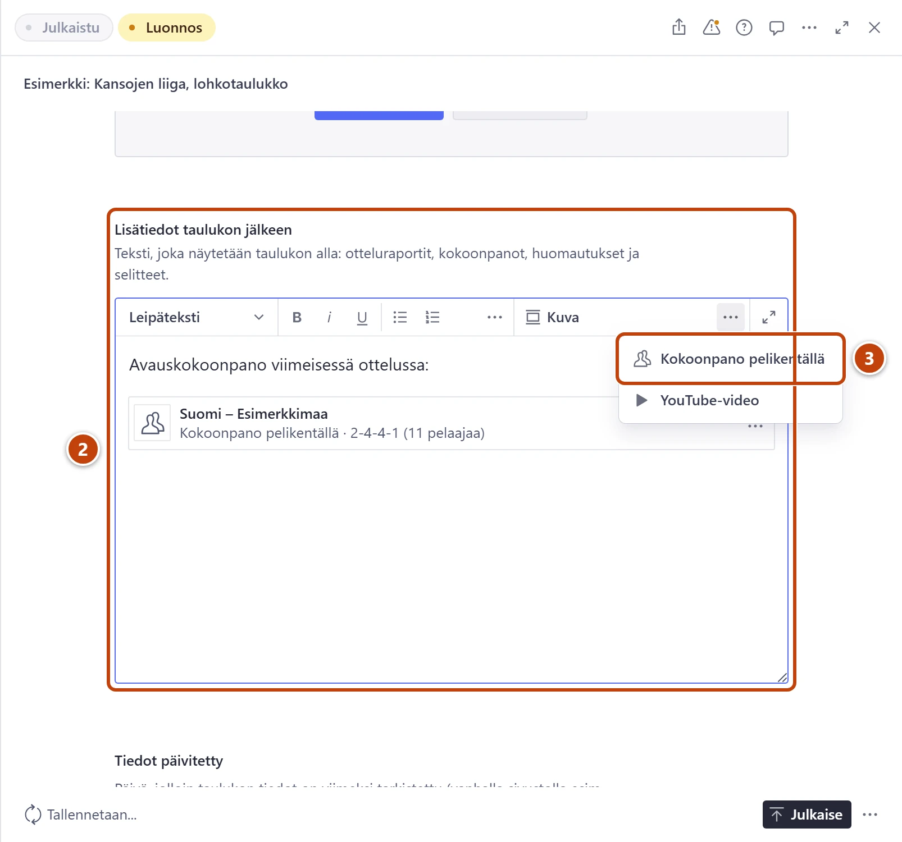
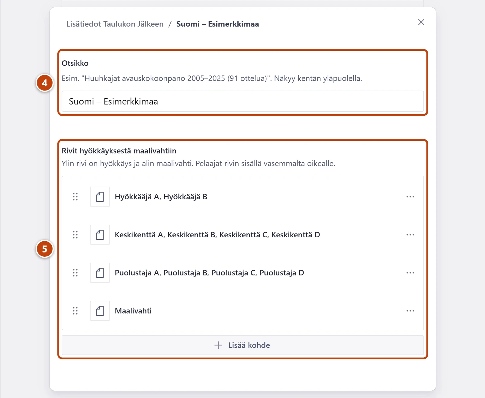

## Milloin

Kun haluat näyttää avauskokoonpanon kenttäkuvana, esimerkiksi Huuhkaja-arvostelun parhaan
avauksen. Sivulla pelaajat piirretään pelikentälle riveittäin.

## Askeleet

1. Avaa taulukko ja välilehti **Tilastodata**. Katso tarvittaessa
   [Päivitä tilastotaulukko](tilastotaulukon-paivitys.md).
2. Napsauta kentässä **Lisätiedot taulukon jälkeen** kohtaa, johon kokoonpano tulee. ②
3. Tekstikentän työkalupalkin oikeassa reunassa paina kolmea pistettä (⋯) ja valitse
   **Kokoonpano pelikentällä**. ③
   Leveällä näytöllä painike näkyy suoraan työkalupalkissa. Ikkuna **Kokoonpano** avautuu.

4. Kirjoita kenttään **Otsikko** esimerkiksi "Huuhkajat avauskokoonpano 2005–2025 (91 ottelua)". ④
5. Kohdassa **Rivit hyökkäyksestä maalivahtiin** paina **Lisää kohde**. ⑤
   Rivin ikkuna avautuu. Ensimmäinen rivi on hyökkäys, viimeinen maalivahti.
6. Kohdassa **Pelaajat** paina **Lisää kohde**. Kirjoita pelaajan **Nimi** ja
   **Luku (valinnainen)**. Luku näkyy pelaajan pallossa.
7. Palaa rivin ikkunaan: paina ikkunan yläreunan polusta **Pelaajat**. Lisää rivin
   seuraava pelaaja samoin. Lisää pelaajat vasemmalta oikealle.
8. Kun rivi on valmis, paina yläreunan polusta kokoonpanon otsikkoa. Lisää seuraava rivi
   toistamalla askeleet 5–7.
9. Kirjoita halutessasi **Selite (valinnainen)**. Sulje ikkuna oikean yläkulman ruksista
   ja paina oikeassa alakulmassa **Julkaise**.

> [!NOTE]
> Ruksi sulkee kaikki ikkunat kerralla. Mitään ei katoa: jatka kohdasta "Muokkaa olemassa
> olevaa" alla.

## Tulos

- Sivulla näkyy pelikenttä, jolla pelaajat ovat riveittäin ylhäältä alas.
- Studion tekstissä kokoonpano näkyy laatikkona. Siinä lukee rivien pelaajamäärät
  hyökkäyksestä alkaen, esimerkiksi "2-4-4-1 (11 pelaajaa)".

## Lisävalinnat

- Muokkaa olemassa olevaa: paina tekstissä kokoonpanon laatikon oikeasta reunasta ⋯ ja valitse
  **Muokkaa**. Avaa rivi napsauttamalla sitä.
- Järjestä pelaajia: raahaa pelaajaa rivin sisällä.

## Jos jokin menee vikaan

- Keltainen "Kentällä on 10 pelaajaa (yleensä 11).": tarkista pelaajat. Julkaisu onnistuu silti.
- Punainen "Rivillä pitää olla 1–6 pelaajaa.": rivi on tyhjä tai siinä on liikaa pelaajia.
- Punainen "Kokoonpanossa pitää olla 1–6 riviä.": poista ylimääräinen rivi tai lisää puuttuva.

Katso myös: [Päivitä tilastotaulukko](tilastotaulukon-paivitys.md) · [Lisää karsintasarja](karsinnat.md)
