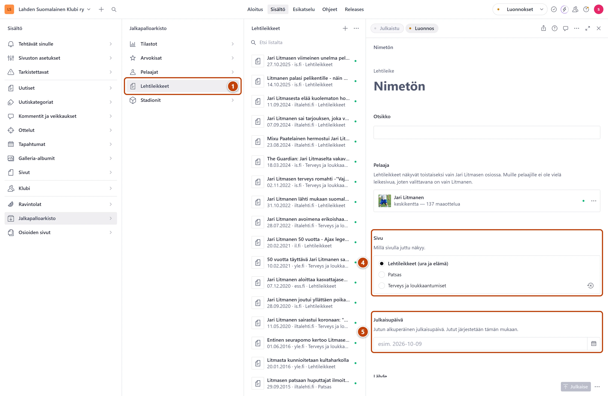
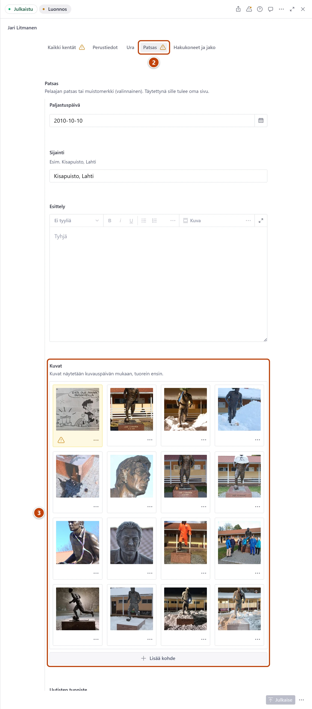

## Milloin

Litmanen-osiossa on neljä sivua: Jari Litmanen, Lehtileikkeet, Patsas ja Litmasen loukkaantumiset.
Tällä kortilla lisäät uuden lehtijutun tai patsaskuvan.

## Askeleet

1. Valitse **Jalkapalloarkisto** ja sitten **Lehtileikkeet**. ①
2. Paina listan yläreunassa plus-painiketta (+).
   **Pelaaja** on valmiina: Jari Litmanen.
3. Kirjoita jutun **Otsikko**.
4. Valitse **Sivu**: **Lehtileikkeet (ura ja elämä)**, **Patsas** tai **Terveys ja loukkaantumiset**. ④
5. Valitse **Julkaisupäivä**: päivä, jolloin juttu alun perin julkaistiin. ⑤
6. Kirjoita **Lähde**, esimerkiksi is.fi, ja halutessasi **Linkki alkuperäiseen juttuun (valinnainen)**.
7. Kirjoita tai liitä jutun **Teksti** ja paina oikeassa alakulmassa **Julkaise**.

## Tulos

- Juttu näkyy valitulla sivulla. Jutut ovat julkaisupäivän mukaan uusin ensin.
- Sivulla näkyy jutun ensimmäinen kappale. Loput avautuvat "Lue koko juttu" -painikkeesta.

## Lisävalinnat

Uusi patsaskuva:

1. Valitse **Jalkapalloarkisto** → **Pelaajat** → Jari Litmanen.
2. Valitse välilehti **Patsas**. ②
3. Lisää kuva kenttään **Kuvat**. ③
4. Kirjoita **Vaihtoehtoinen teksti (alt)** ja valitse **Kuvauspäivä**.
5. Oikeassa alakulmassa paina **Julkaise**.
   Patsaskuvat näkyvät sivulla kuvauspäivän mukaan uusin ensin.

Muut:

- Uusi loukkaantuminen: lisää rivi Litmasen loukkaantumistaulukkoon. Taulukko on Jari Litmasen
  lomakkeella välilehden **Ura** kentässä **Tilastotaulukot**. Katso
  [Päivitä tilastotaulukko](tilastotaulukon-paivitys.md). Yhteenveto ja kaavio päivittyvät itsestään.
- Yleiskatsaus: Jari Litmasen perustiedot, seurat ja saavutukset, katso [Pelaaja](pelaaja.md).

## Jos jokin menee vikaan

- **Julkaise** ei onnistu: **Otsikko**, **Sivu**, **Julkaisupäivä** ja **Teksti** ovat pakollisia.
- Keltainen "Ilman päivämäärää kuva näytetään listan lopussa.": valitse kuvalle **Kuvauspäivä**.
- Lehtijuttuja voi lisätä vain Litmaselle. Muiden pelaajien juttusivua varten ota yhteyttä
  [tukihenkilöön](../hakuteos/tukihenkilo.md).

Katso myös: [Pelaaja](pelaaja.md) · [Kuva](../tekstit/kuva.md)
