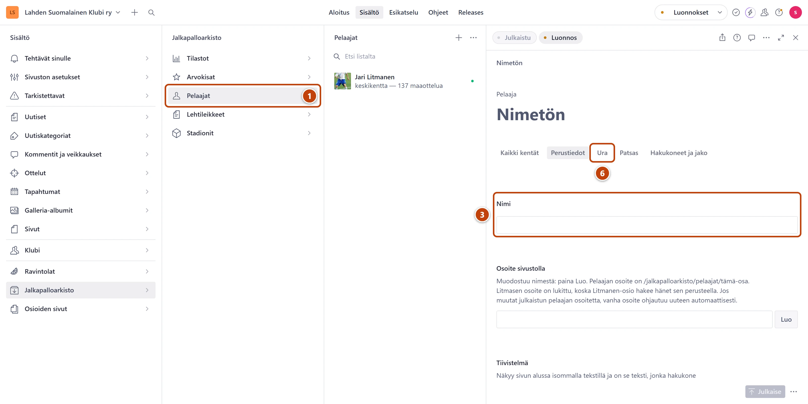

## Milloin

Kun arkistoon tulee uusi pelaaja tai pelaajan tiedot muuttuvat, esimerkiksi maaottelujen määrä.
Pelaajalla on oma sivunsa arkiston pelaajissa.

## Askeleet

1. Valitse **Jalkapalloarkisto** ja sitten **Pelaajat**. ①
2. Valitse pelaaja listasta. Uutta varten paina listan yläreunassa plus-painiketta (+).
3. Kirjoita **Nimi**. ③ Uudelle pelaajalle paina kentän **Osoite sivustolla** vieressä **Luo**.
4. Täytä välilehdellä **Perustiedot** tarvittavat kentät: **Syntymäaika**, **Syntymäpaikka**,
   **Pituus (cm)**, **Pelipaikka** ja **Esittely**.
5. Lisää kuva kenttään **Kuvat**. Ensimmäinen kuva on pelaajan pääkuva.
6. Valitse välilehti **Ura**. ⑥ Päivitä **Maaottelut** ja **Maalit maajoukkueessa**.
7. Lisää seura kohdassa **Seurat**: paina **Lisää kohde** ja täytä **Seura**, **Alkuvuosi** ja **Loppuvuosi**.
8. Lisää saavutus kohdassa **Saavutukset ja palkinnot**: valitse **Ryhmä** ja kirjoita
   **Saavutus** ja **Vuodet**.
9. Oikeassa alakulmassa paina **Julkaise**.

## Tulos

- Pelaajasivu päivittyy sivustolla noin minuutissa.
- Lomakkeen yläreunan **Käytetty yhdellä sivulla** avaa sivun.

## Lisävalinnat

- Pelaajan uutiset sivulle: kirjoita kenttään **Uutisten tunniste** uutisten tunniste,
  esimerkiksi litmanen. Katso [Kategoriat ja tunnisteet](../uutiset/kategoriat-ja-tunnisteet.md).
- Pelaajan taulukot: välilehden **Ura** kenttä **Tilastotaulukot**.
- Järjestys: seuroja ja saavutuksia voi järjestää raahaamalla.
- Jari Litmasen osio: [Litmanen](litmanen.md)

## Jos jokin menee vikaan

- Punainen virhe kentässä **Pituus (cm)**: kirjoita pituus senttimetreinä, esimerkiksi 182.
- **Osoite sivustolla** on harmaa eikä muutu: Litmasen osoite on lukittu tarkoituksella.

Katso myös: [Kuva](../tekstit/kuva.md) · [Lisää uusi tilastotaulukko](uusi-tilastotaulukko.md)
