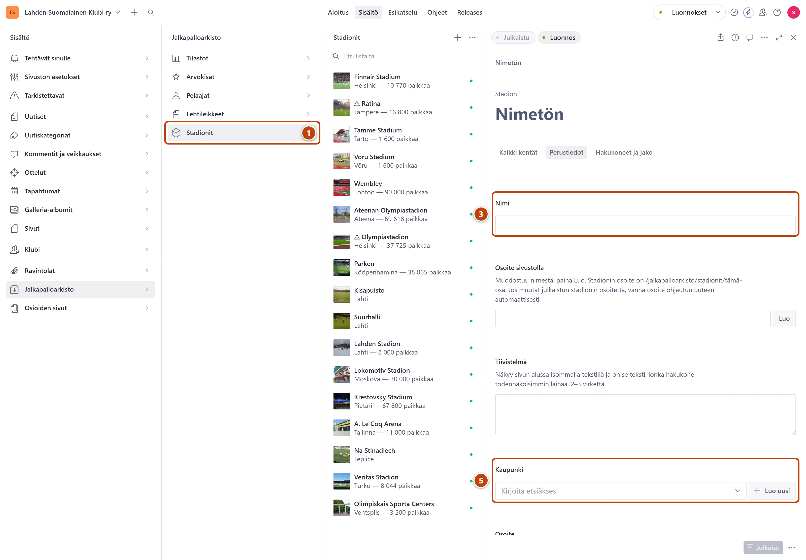

## Milloin

Kun arkistoon tulee uusi stadion, esimerkiksi klubin matkan kohde. Stadionilla on oma sivunsa.

## Askeleet

1. Valitse **Jalkapalloarkisto** ja sitten **Stadionit**. ①
2. Paina listan yläreunassa plus-painiketta (+).
3. Kirjoita **Nimi**. ③
4. Kentän **Osoite sivustolla** vieressä paina **Luo**.
5. Kirjoita kenttään **Kaupunki** nimen alkua ja valitse listasta. ⑤
6. Täytä halutessasi **Osoite**, **Kapasiteetti**, **Rakennusvuosi** ja **Kuvaus**.
7. Lisää kuvat kenttään **Kuvat**.
8. Oikeassa alakulmassa paina **Julkaise**.

## Tulos

- Stadion näkyy arkiston stadioneissa ja omalla sivullaan.
- Lomakkeen yläreunan **Käytetty yhdellä sivulla** avaa sivun.

## Lisävalinnat

- **Karttapaikka** on stadionin sijainti kartalla. Kenttä on valinnainen. Jätä se tyhjäksi, jos et
  tiedä koordinaatteja. Kenttien nimet ovat englanniksi: Latitude on leveysaste (esimerkiksi
  60.98) ja Longitude pituusaste (esimerkiksi 25.66). Jätä Altitude tyhjäksi.
- Kuvan lisäys ja kuvaus: [Kuva](../tekstit/kuva.md)

## Jos jokin menee vikaan

- Kaupunkia ei löydy listasta: lisää se ensin, katso [Lisää uusi kaupunki](../ravintolat/uusi-kaupunki.md).
  Samat kaupungit ovat käytössä ravintoloilla.
- Punainen virhe kentässä **Rakennusvuosi**: kirjoita nelinumeroinen vuosi, esimerkiksi 1981.

Katso myös: [Lisää uusi kaupunki](../ravintolat/uusi-kaupunki.md) · [Kuva](../tekstit/kuva.md)
