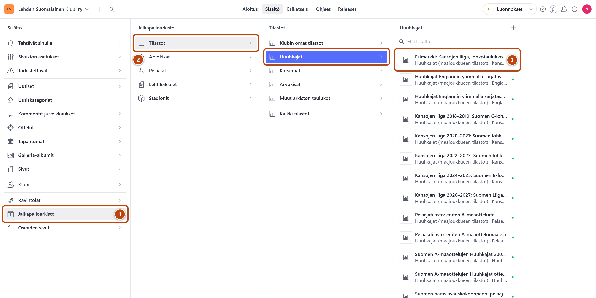
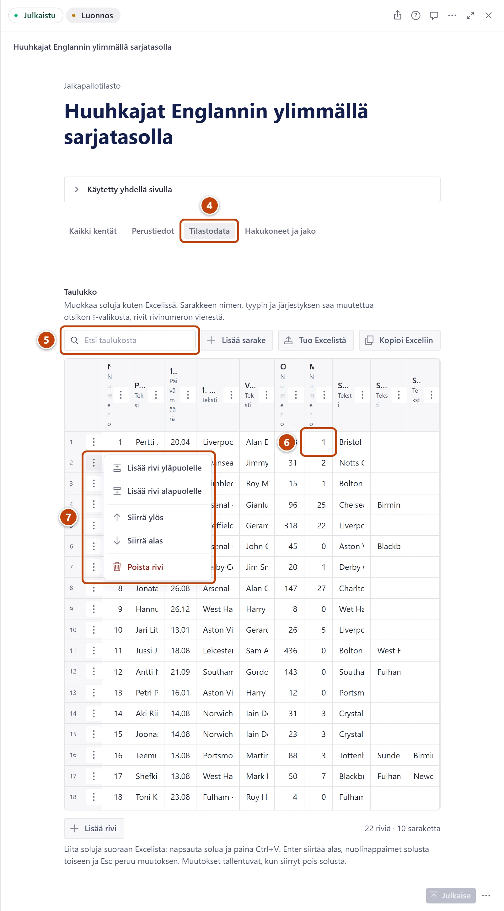
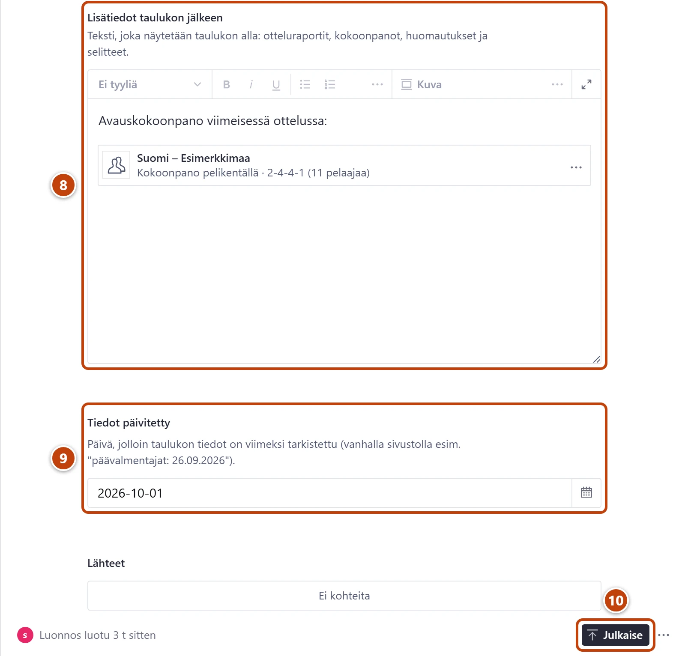

## Milloin

Ottelun jälkeen päivität taulukoita: Huuhkaja-arvostelua, pelaajatilastoja, Kansojen liigaa tai muuta tilastoa.
Muutos näkyy sivustolla taulukon omalla sivulla, kun julkaiset sen.

## Ennen kuin aloitat

- Kokoa illan muutokset ensin yhteen, esimerkiksi paperille tai Exceliin.
- Kirjoittamasi tallentuu itsestään luonnokseksi. Kävijät eivät näe luonnosta.
- Tee kaikki taulukon muutokset ensin. Paina **Julkaise** vain kerran, aivan lopuksi.

> [!TIP]
> Jokainen taulukko julkaistaan erikseen. Jos päivität kolme taulukkoa, painat **Julkaise** kolme
> kertaa: kerran kunkin taulukon lopuksi.

## Askeleet

1. Vasemmasta valikosta valitse **Jalkapalloarkisto**. ①
2. Valitse **Tilastot** ja sitten ryhmä, esimerkiksi **Huuhkajat**. ②
3. Valitse listasta taulukko, jota päivität. ③
   Taulukko avautuu oikealle.

4. Otsikon alla valitse välilehti **Tilastodata**. ④
5. Kirjoita kenttään **Etsi taulukosta** pelaajan tai ottelun nimi. ⑤
   Näkyviin jäävät vain ne rivit, joilla nimi on.
6. Napsauta solua ja kirjoita uusi arvo. Paina lopuksi Enter. ⑥
   Napsautus valitsee vanhan arvon, joten uusi korvaa sen. Arvo tallentuu, kun poistut
   solusta. Enter vie alempaan soluun.

> [!NOTE]
> Kirjoita luvut samalla tavalla joka taulukossa:
> - prosentti: luku, välilyönti ja prosenttimerkki, esimerkiksi 13 % tai 40 %
> - desimaali pilkulla: 2,5
> - iso luku välilyönnillä: 61 035
> - päivämäärä: 26.9.2026.
>
> Numerosarakkeessa prosentti ja desimaali saavat solun alle aaltoviivan. Se on normaalia.
> Arvo tallentuu sellaisenaan.

7. Tarkista lopuksi järjestys ja sijat. Siirrä riviä rivinumeron vieressä olevasta valikosta ⋮:
   **Siirrä ylös** tai **Siirrä alas**. ⑦
   - Tyhjennä ensin hakukenttä. Haun aikana rivejä ei voi siirtää.
   - Korjaa sitten sijanumerot ylhäältä alas.
   - Saman pistemäärän kohdalla toimi kuten taulukossa on ennenkin tehty.

8. Kirjoita tarvittaessa ottelun tiedot kenttään **Lisätiedot taulukon jälkeen**. ⑧
   Teksti näkyy sivulla taulukon alla.
9. Kentän **Tiedot päivitetty** oikeassa reunassa paina kalenterikuvaketta ja valitse tämä päivä. ⑨
10. Kun kaikki on valmista, paina oikeassa alakulmassa **Julkaise**. ⑩

## Tulos

- Oikeaan alakulmaan tulee hetkeksi ilmoitus **Dokumentti on julkaistu**.
  Alapalkissa lukee "Viimeksi julkaistu juuri nyt", ja **Julkaise** muuttuu harmaaksi.
- Taulukko päivittyy sivustolla noin minuutissa.
- Lomakkeen yläreunassa kohta **Käytetty yhdellä sivulla** kertoo, millä sivulla taulukko näkyy.
  Avaa se nuolesta, niin linkki vie sivulle.

## Lisävalinnat

- Uusi rivi: paina taulukon alla **Lisää rivi**. Tai valitse rivin valikosta ⋮
  **Lisää rivi yläpuolelle** tai **Lisää rivi alapuolelle**.
- Rivin poisto: valitse rivin valikosta ⋮ **Poista rivi**.
- Monta riviä uuteen järjestykseen kerralla:
  1. Paina **Kopioi Exceliin** ja liitä taulukko Exceliin.
  2. Järjestä ja muokkaa rivit Excelissä. Kopioi sitten kaikki solut otsikkoriveineen.
  3. Paina **Tuo Excelistä** ja liitä solut.
  4. Valitse **Korvaa koko taulukko (sarakkeet ja rivit)**. Valmiiksi on valittu
     **Lisää rivit taulukon loppuun**, joten vaihda valinta.
  5. Tarkista esikatselu. Paina oikeassa alakulmassa painiketta, jossa lukee esimerkiksi
     **Korvaa taulukko (63 riviä, 3 saraketta)**.
- Sarakkeen nimi tai tyyppi: valitse sarakeotsikon valikosta ⋮ **Muokkaa nimeä ja tyyppiä**.
- Tarkistus illan lopuksi: valikon **Tehtävät sinulle** kohdasta **Julkaisemattomat muutokset**
  näet, jäikö jokin taulukko julkaisematta.
- Uusi taulukko: [Lisää uusi tilastotaulukko](uusi-tilastotaulukko.md)

## Jos jokin menee vikaan

- Kirjoitit soluun väärin: paina Esc ennen kuin poistut solusta. Jos ehdit jo poistua,
  kirjoita oikea arvo uudelleen.
- Poistit rivin vahingossa: oikeaan alakulmaan tulee ilmoitus, esimerkiksi **Rivi 3 poistettu**.
  Paina siinä heti **Kumoa**. Ilmoitus näkyy noin kahdeksan sekuntia.
- Lisätiedoista katosi linkki tai teksti: paina heti Ctrl+Z. Vanhemman version saat
  versiohistoriasta, katso [Peru muutos](../alkuun/luonnos-julkaisu-ja-peruminen.md).
- **Julkaise**-painikkeessa lukee pitkään "Validoidaan dokumenttia…": päivitä selaimen sivu
  (F5) ja paina **Julkaise** uudelleen. Muutokset ovat tallessa.
- Haluat perua kaiken julkaisemattoman: avaa **Julkaise**-painikkeen vierestä valikko
  **Asiakirjatoiminnot** (⋯) ja valitse **Hylkää muutokset**. Vahvista ikkunassa painamalla
  **Hylkää muutokset**. Sivuston versio ei muutu.

Mikään ei katoa: keskeneräinen taulukko säilyy luonnoksena, vaikka suljet selaimen.

Katso myös: [Lisää uusi tilastotaulukko](uusi-tilastotaulukko.md) · [Huuhkajat ja Kansojen liiga](huuhkajat-ja-kansojen-liiga.md) · [Luonnos, julkaisu ja peruminen](../alkuun/luonnos-julkaisu-ja-peruminen.md)
