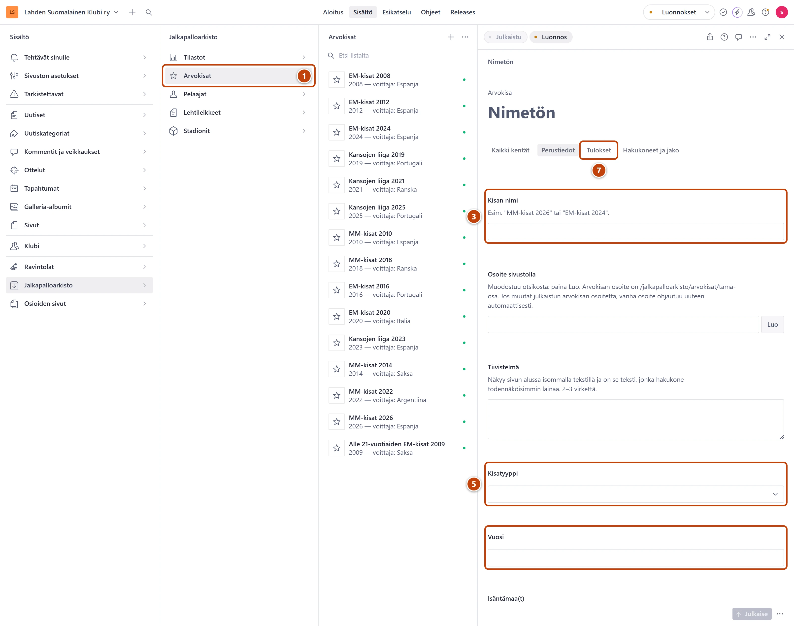

## Milloin

Kun alkaa uusi MM- tai EM-turnaus tai muu arvokisa, esimerkiksi EM 2028.
Kisa saa oman sivunsa arkiston arvokisoihin.

## Ennen kuin aloitat

- Lohkojen taulukot tehdään erikseen ryhmään **Arvokisat**:
  [Lisää uusi tilastotaulukko](uusi-tilastotaulukko.md). Ne voi liittää kisaan myöhemmin.

## Askeleet

1. Valitse **Jalkapalloarkisto** ja sitten **Arvokisat**. ①
2. Paina listan yläreunassa plus-painiketta (+).
3. Kirjoita kenttään **Kisan nimi** esimerkiksi "EM-kisat 2028". ③
4. Kentän **Osoite sivustolla** vieressä paina **Luo**.
5. Valitse **Kisatyyppi** ja kirjoita **Vuosi**. ⑤
6. Täytä halutessasi **Isäntämaa(t)**, **Alkupäivä**, **Loppupäivä** ja **Kuvaus**.
   Isäntämaat kirjoitetaan yksi kerrallaan: kirjoita nimi ja paina Enter.
7. Kun kisa on pelattu, valitse välilehti **Tulokset**. ⑦
   Täytä **Voittaja**, **Hopea**, **Pronssi** ja **Suomen sijoitus**.
8. Liitä lohkotaulukot kenttään **Tilastotaulukot**: paina **Lisää kohde** ja valitse taulukko.
9. Oikeassa alakulmassa paina **Julkaise**.

## Tulos

- Kisa näkyy sivustolla arvokisojen listassa ja omalla sivullaan.
- Lomakkeen yläreunan **Käytetty yhdellä sivulla** avaa sivun.

## Lisävalinnat

- Kuvat kisaan: välilehden **Perustiedot** kenttä **Kuvat**. Katso [Kuva](../tekstit/kuva.md).
- Tuloksia voi täydentää myöhemmin. Muista julkaista jokaisen muutoksen jälkeen.

## Jos jokin menee vikaan

- Punainen "Loppupäivä ei voi olla ennen alkupäivää.": tarkista päivämäärät.
- **Julkaise** ei onnistu: **Kisan nimi**, **Osoite sivustolla**, **Kisatyyppi** ja **Vuosi**
  ovat pakollisia.

Katso myös: [Lisää uusi tilastotaulukko](uusi-tilastotaulukko.md) · [Päivitä tilastotaulukko](tilastotaulukon-paivitys.md)
