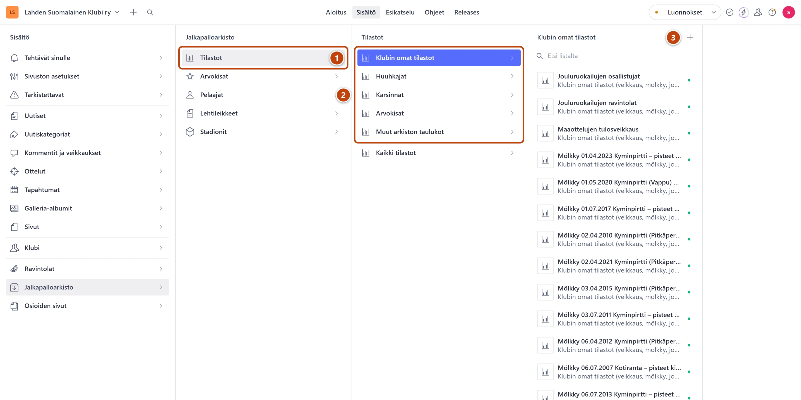
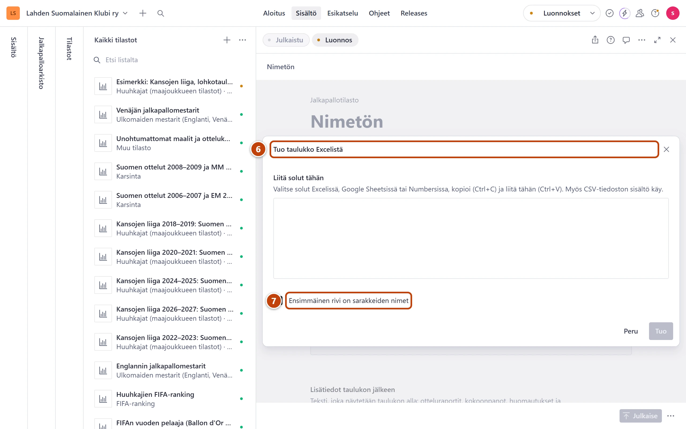

## Milloin

Kun tarvitset kokonaan uuden taulukon: uusi kausi, uusi veikkaus tai uusi tilasto.
Olemassa olevan taulukon päivitys on omassa kortissaan.

## Ennen kuin aloitat

- Taulukko on helpointa tehdä ensin Excelissä tai Google Sheetsissä.
- Mieti, mihin ryhmään taulukko kuuluu. Ryhmä ratkaisee, millä sivulla se näkyy.

## Askeleet

1. Valitse **Jalkapalloarkisto** ja sitten **Tilastot**. ①
2. Valitse ryhmä, esimerkiksi **Klubin omat tilastot**. ②
3. Paina listan yläreunassa plus-painiketta (+). Sen nimi on **Luo uusi asiakirja**. ③
   Ryhmässä **Muut arkiston taulukot** valitse ensin taulukon kategoria. Muissa ryhmissä se on valmiina.
   Uusi taulukko avautuu oikealle. Keskimmäinen lista vaihtuu listaksi **Kaikki tilastot**.
4. Kirjoita kenttään **Otsikko** taulukon nimi.
5. Kentän **Osoite sivustolla** vieressä paina **Luo**.

6. Valitse välilehti **Tilastodata** ja paina **Tuo Excelistä**. ⑥
7. Kopioi solut Excelissä (Ctrl+C) ja liitä ne ikkunaan (Ctrl+V). Jätä rasti
   **Ensimmäinen rivi on sarakkeiden nimet**, jos ylimmällä rivillä on otsikot. ⑦
8. Tarkista esikatselu. Paina oikeassa alakulmassa painiketta, jossa lukee esimerkiksi
   **Korvaa taulukko (3 riviä, 4 saraketta)**.
   Taulukko täyttyy. Sarakkeiden tyypit arvataan sisällöstä.
9. Oikeassa alakulmassa paina **Julkaise**.

> [!NOTE]
> Ryhmän **Klubin omat tilastot** taulukot ja pelaajatilastot näkyvät vasta, kun ne on liitetty sivuun.
> Lisää taulukko sivun kenttään **Taulukot**. Klubin toiminnassa ja pelaajalla kentän nimi on
> **Tilastotaulukot**. Julkaise sitten myös se sivu.

## Tulos

- Oikeaan alakulmaan tulee ilmoitus **Dokumentti on julkaistu**.
- Lomakkeen yläreunassa lukee **Käytetty yhdellä sivulla**. Avaa se nuolesta, niin näet sivun.
  Ryhmän **Klubin omat tilastot** taulukossa siinä on keltainen huomautus, kunnes liität
  taulukon sivuun (katso huomautus askelten lopussa).
- Taulukko näkyy sivustolla noin minuutin kuluttua.

## Lisävalinnat

- Sarakkeet yksi kerrallaan: paina **Lisää sarake**. Anna **Sarakkeen nimi** ja valitse
  kohdassa **Mitä sarakkeessa on?** tyyppi: **Teksti**, **Numero**, **Päivämäärä**, **Vuosi** tai
  **Linkki**. Paina **Tallenna**.
- Prosenteille ja desimaaleille valitse **Teksti**. Kokonaisluvuille **Numero**.
- Rivit: paina **Lisää rivi** ja kirjoita solut kuten Excelissä.
- Teksti taulukon ylle: välilehden **Perustiedot** kenttä **Johdanto**.
- Monta taulukkoa samalla sivulla: pienempi luku kentässä **Järjestys sivulla** näkyy ylempänä.
- Huuhkajat-taulukko: [Huuhkajat ja Kansojen liiga](huuhkajat-ja-kansojen-liiga.md)
- Karsintasarja: [Lisää karsintasarja](karsinnat.md)

## Jos jokin menee vikaan

- Yläreunassa lukee "Taulukko ei näy vielä millään sivulla. Täytä Osoite sivustolla…":
  paina kentän **Osoite sivustolla** vieressä **Luo** ja julkaise.
- Yläreunassa lukee "Taulukko ei näy vielä millään sivulla. Lisää se sivun…": liitä taulukko
  sivun kenttään **Taulukot** tai **Tilastotaulukot** ja julkaise sivu.
- Valitsit väärän ryhmän: vaihda kenttää **Kategoria** välilehdellä **Perustiedot**.
- Korvasit vahingossa vanhan taulukon: palauta edellinen versio, katso
  [Peru muutos](../alkuun/luonnos-julkaisu-ja-peruminen.md).

Katso myös: [Päivitä tilastotaulukko](tilastotaulukon-paivitys.md) · [Taulukko tekstissä](../tekstit/taulukko-tekstissa.md)
