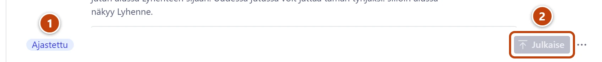

Merkit kertovat tilan, jota et muuten näkisi. Ne eivät vaadi aina toimia.

## Merkit lomakkeen alapalkissa

Merkit ovat lomakkeen alareunassa, **Julkaise**-painikkeen vasemmalla puolella. Kun viet
osoittimen merkin päälle, näet selityksen.

| Merkki | Missä | Mitä se tarkoittaa | Mitä teet |
|---|---|---|---|
| **Ajastettu** | Uutinen | Julkaisuaika on tulevaisuudessa. Uutinen tulee sivustolle itsestään. | Ei mitään. Ohje: [Uutinen ei näy, ja alapalkissa lukee Ajastettu](../vianetsinta/uutinen-ei-nay-ajastettu.md). |
| **Tarkistettava** | Monet tyypit | Siirrossa tieto merkittiin tarkistettavaksi. | Lue kohta **Mitä tarkistaa**. Korjaa tai totea oikeaksi, käännä kytkin **Vaatii tarkistuksen** pois päältä ja julkaise. Ohje: [Käy läpi tarkistettavat](../turvaverkko/tarkistettavat.md). |
| **Odottaa toista arvioijaa** | Ravintola | Ravintola ei näy sivustolla, koska sillä on alle kahden klubilaisen arvosanat. | Ohje: [Ravintola ei näy](../vianetsinta/ravintola-ei-nay.md). |
| **Piilotettu** | Kommentti | Kommentti ei näy sivulla. | Palautus: paina alareunasta **Näytä sivulla**. |

Lisäksi alapalkissa näkyy Studion oma tieto siitä, onko muutos vielä luonnos vai julkaistu.

## Merkinnät listoissa

| Merkintä | Missä | Mitä se tarkoittaa |
|---|---|---|
| ⚠ nimen edessä | Uutiset, ravintolat, taulukot ym. | Sama kuin merkki **Tarkistettava**. |
| Kieltomerkki nimen edessä | Kommentit | Kommentti on piilotettu sivulta. |
| Ajastettu ja aika nimen alla | Uutiset | Uutinen tulee sivustolle tuolloin. |
| UUSI: ja ravintolan nimi | Arvostelut | Kävijä ehdottaa ravintolaa, jota ei vielä ole listassa. |
| Ei klubilainen | Arvostelut | Arvostelija ei valinnut nimeään klubilaisten joukosta. |
| Piilotettu | Etusivun lohkot | Lohkossa on kytkin **Piilota lohko sivulta** päällä. |
| Osion sivu ja osoite | Sivut | Sivu on osion sivu, jota ei voi poistaa. |
| Entinen ja rooli | Hallitus | Jäsen ei enää ole hallituksessa. |

## Aloituksen tilat

Aloituksen kohdassa **Sivuston tila** jokaisella rivillä on tila sanoin ja värinä:

| Tila | Väri | Mitä se tarkoittaa |
|---|---|---|
| **Kunnossa** | Vihreä | Kaikki toimii. |
| **Huomio** | Keltainen | Jotain kannattaa tarkistaa. Sisältö on tallessa. |
| **Vaatii toimia** | Punainen | Kerro tukihenkilölle. Sisältö on tallessa. |
| **Ei vielä tietoa** | Harmaa | Työ ei ole vielä ajanut kertaakaan. Ei vaadi toimia. |
| **Arvio** | Harmaa | Kiintiön arvio on alle rajan. Ei vaadi toimia. |

Yhteenveto ylimpänä: **Kaikki kunnossa**, **Huomioitavaa**, **Vaatii toimia** tai
**Tilaa ei vielä tiedetä**. Ohje: [Aloituksessa lukee Vaatii toimia tai Huomioitavaa](../vianetsinta/aloituksessa-punainen-rivi.md).
