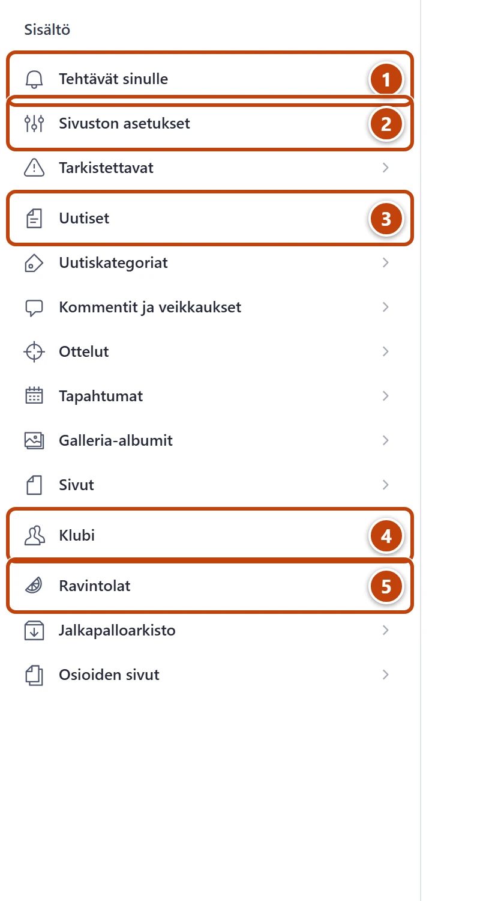

Tässä ovat Studion kaikki valikon kohdat samassa järjestyksessä kuin ruudulla.

## Yläpalkki

| Kohta | Mitä siellä on |
|---|---|
| **Aloitus** | Studio avautuu tähän: sivuston tila, odottavat tehtävät ja puuttuvat perustiedot. |
| **Sisältö** | Kaikki muokattava sisältö. Vasemmalla valikko, oikealla lomake. |
| **Esikatselu** | Sivuston sivut luonnoksineen ennen julkaisua. |
| **Ohjeet** | Tämä ohje. Haku ja kaikki kortit. |
| **Kyselyt (tukihenkilö)** | Tukihenkilön työkalu. Älä käytä sitä. |
| Releases | Englanninkielinen lisätyökalu. Älä käytä sitä. |
| Plus-painike (+), **Luo uusi asiakirja** | Yläpalkin vasemmassa reunassa. Uuden sisällön teko suoraan. Sama onnistuu listan plus-painikkeella. |

Yläpalkissa on myös haku (suurennuslasi, **Avaa haku**). Ohje: [Etsi haulla](../alkuun/etsi-haulla.md).
Oikealla oleva valinta **Luonnokset** näyttää, mitä versiota katselet. Älä muuta sitä.

## Sisältö: vasen valikko

**Tehtävät sinulle**: kaikki, mikä odottaa sinua. Tyhjä lista tarkoittaa, ettei tehtävää ole.

- **Arvostelut odottavat hyväksyntää**: kävijöiden ravintola-arvostelut
- **Uudet kommentit (7 päivää)**: jäsenten kommentit ja veikkaukset
- **Julkaisemattomat muutokset**: muutokset, joita ei ole julkaistu
- **Ajastetut uutiset**: uutiset, joiden julkaisuaika on tulevaisuudessa
- **Vaatii tarkistuksen (kaikki)**: siirrossa tarkistettaviksi merkityt

**Sivuston asetukset**

- **Etusivu**: yläosa, lohkot ja hakukoneteksti
- **Navigaatio**: valikko ja alatunniste
- **Ohjaukset ja lyhytosoitteet**: **Lyhytosoitteet ja ohjaukset** ja **Muuttuneet osoitteet (automaattiset)**
- **Varmuuskopiot**: viikoittaiset varmuuskopiot ja poistettujen palautus

**Tarkistettavat**: siirrossa tarkistettaviksi merkityt tyypeittäin: Uutiset, Ravintolat,
Tilastot, Stadionit, Klubin toiminta, Pelaajat, Lehtileikkeet, Arvokisat, Sivut, Tapahtumat
ja Galleria-albumit.

**Uutiset**: kaikki uutiset ja vanhan blogin kirjoitukset, uusin ensin.

**Uutiskategoriat**: uutisten aiheet ja uutislistan suodatin.

**Kommentit ja veikkaukset**: **Uusimmat**, **Uutisittain** ja **Piilotetut**.

**Ottelut**: käsin lisätyt ottelut otteluohjelmaan.

**Tapahtumat**: klubin tapahtumat.

**Galleria-albumit**: kuva-albumit.

**Sivut**: omat tekstisivut, esimerkiksi säännöt ja tietosuojaseloste.

**Klubi**: sama rakenne kuin sivuston Klubi-osiossa.

- **Esittely**: Klubi-sivun teksti ja kuva
- **Toiminta**: **Toiminta-sivun otsikko ja johdanto** ja **Toimintamuodot**
- **Hallitus**: **Hallitus-sivun otsikko ja johdanto**, **Nykyinen hallitus** ja **Entiset jäsenet**
- **Palloveikkaus**: **Palloveikkaus-sivu** ja **Veikkausten alasivut**
- **Yhteystiedot**: **Osoite, sähköposti ja some** ja **Yhteystiedot-sivun otsikko ja johdanto**

**Ravintolat**

- **Kaikki ravintolat**
- **Ravintolat: odottavat toista arvioijaa**: ravintolat, joilla on alle kahden klubilaisen arvosanat
- **Arvostelut: odottavat hyväksyntää**
- **Arvostelut: kaikki**
- **Klubilaisten arvosanat**: **Ravintoloittain** ja **Kaikki (uusin ensin)**
- **Klubilaiset**
- **Kaupungit**

**Jalkapalloarkisto**

- **Tilastot**: **Klubin omat tilastot**, **Huuhkajat**, **Karsinnat**, **Arvokisat**, **Muut arkiston taulukot** ja **Kaikki tilastot**
- **Arvokisat**
- **Pelaajat**
- **Lehtileikkeet**: Litmasen lehtijutut
- **Stadionit**

**Osioiden sivut**: listasivujen otsikot, johdannot ja hakukonetekstit.

- **Uutiset ja tapahtumat**: Uutiset, Uutisarkisto, Uutisten tunnisteet, Tapahtumat, Galleria ja Ottelut
- **Ravintolat**: Ravintola-arviot ja Odottavat toista arvioijaa
- **Jalkapalloarkisto**: arkiston etusivu ja sen 16 osiota, esimerkiksi Huuhkajat, Suomen mestarit ja Stadionit

## Mistä löydän…

| Haluan muuttaa | Mene kohtaan |
|---|---|
| Etusivun pääjutun tai taustakuvan | **Sivuston asetukset → Etusivu** |
| Valikon tai alatunnisteen | **Sivuston asetukset → Navigaatio** |
| Klubin sähköpostin tai osoitteen | **Klubi → Yhteystiedot → Osoite, sähköposti ja some** |
| Hallituksen jäsenet | **Klubi → Hallitus → Nykyinen hallitus** |
| Tapahtumat-sivun johdannon | **Osioiden sivut → Uutiset ja tapahtumat** |
| Palloveikkauksen taulukot | **Jalkapalloarkisto → Tilastot → Klubin omat tilastot** |
| Klubilaisen pisteet ravintolalle | **Ravintolat → Klubilaisten arvosanat → Ravintoloittain** |
| Lyhytosoitteen esitteeseen | **Sivuston asetukset → Ohjaukset ja lyhytosoitteet → Lyhytosoitteet ja ohjaukset** |
| Vahingossa poistetun | **Sivuston asetukset → Varmuuskopiot** |
