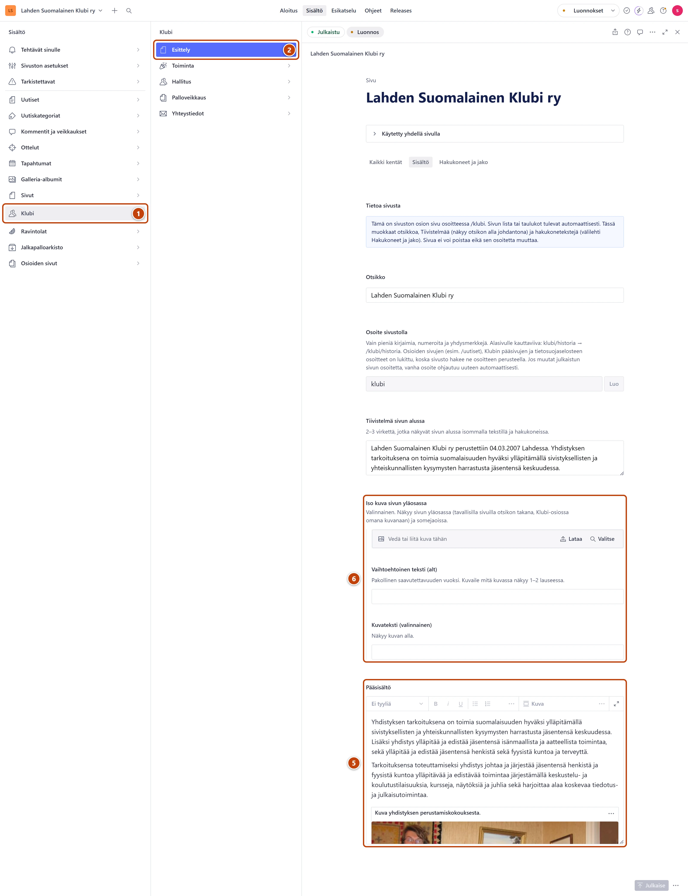

## Milloin

Kun haluat muuttaa klubin esittelytekstiä tai sen kuvaa. Teksti näkyy sivulla
https://www.lahdensuomalainenklubi.com/klubi.

[Avaa Esittely](studio:rakenne/klubi/esittely)

## Askeleet

1. Vasemmasta valikosta valitse **Klubi**. ①
2. Valitse **Esittely**. ②
   Lomake avautuu oikealle. Välilehtien alla on sininen laatikko **Tietoa sivusta**. Se kertoo,
   mitä sivulla muokataan.
3. Halutessasi muuta kenttää **Otsikko**.
4. Kirjoita lyhyt johdanto kenttään **Tiivistelmä sivun alussa**. Kaksi tai kolme virkettä riittää.
5. Muokkaa esittelyä kentässä **Pääsisältö**. ⑤
6. Halutessasi vaihda kuva kentässä **Iso kuva sivun yläosassa**. ⑥
   Kirjoita kuvalle **Vaihtoehtoinen teksti (alt)**: mitä kuvassa näkyy.
7. Oikeassa alakulmassa paina **Julkaise**.

## Tulos

- Oikeaan alakulmaan tulee hetkeksi ilmoitus **Dokumentti on julkaistu**.
- Muutos näkyy sivulla /klubi viimeistään minuutin kuluttua.

## Lisävalinnat

- Kuvan lisääminen ja rajaus: [Lisää kuva](../tekstit/kuva.md)
- Linkki tekstiin: [Tee linkki](../tekstit/linkit.md)
- Googlen hakutuloksen teksti: välilehti **Hakukoneet ja jako**, kenttä **Kuvaus hakutuloksissa (valinnainen)**.

## Jos jokin menee vikaan

- **Julkaise** ei onnistu, ja kuvan kohdalla on punaista: kuvasta puuttuu kuvaus. Kirjoita **Vaihtoehtoinen teksti (alt)**.
- Poisto ja kopiointi ovat harmaina, eikä osoitetta voi muuttaa. Tämä on tarkoituksellista: sivusto hakee tämän sivun aina samasta osoitteesta. Sisältöä saat muokata vapaasti.

Katso myös: [Muokkaa listasivun otsikkoa ja johdantoa](../sivusto/osioiden-sivut.md) · [Julkaisu ei onnistu](../vianetsinta/julkaise-ei-onnistu.md)
