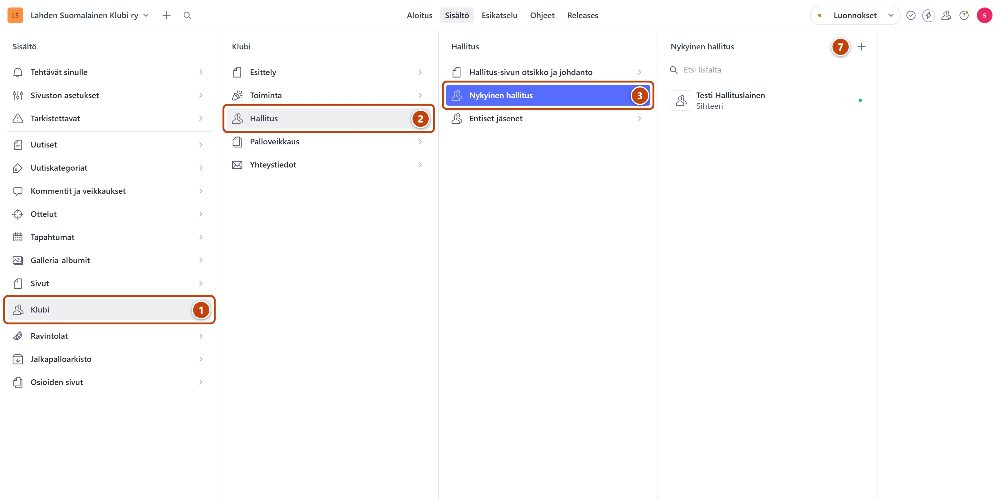
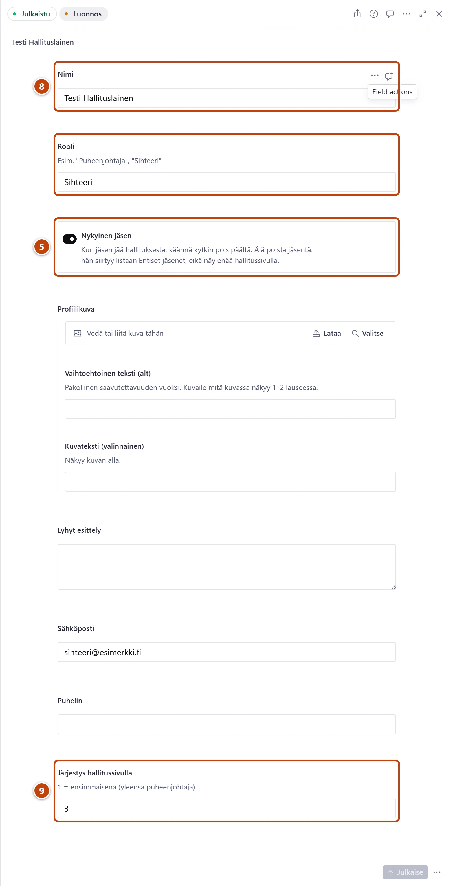

## Milloin

Kun hallitus vaihtuu, esimerkiksi vuosikokouksen jälkeen. Hallituksen jäsenet näkyvät
sivulla https://www.lahdensuomalainenklubi.com/klubi/hallitus.

[Avaa Nykyinen hallitus](studio:rakenne/klubi/hallitus/nykyinen)

## Ennen kuin aloitat

- Jos kukaan ei jää pois, aloita askeleesta 7.

## Askeleet

1. Vasemmasta valikosta valitse **Klubi**. ①
2. Valitse **Hallitus**. ②
3. Valitse **Nykyinen hallitus**. ③
4. Avaa listasta jäsen, joka jää pois.
5. Käännä kytkin **Nykyinen jäsen** pois päältä. Kytkin muuttuu vaaleaksi. ⑤
6. Oikeassa alakulmassa paina **Julkaise**.
   Jäsen siirtyy listaan **Klubi → Hallitus → Entiset jäsenet**. Hän ei enää näy hallitussivulla.
7. Uusi jäsen: listan **Nykyinen hallitus** yläreunassa paina plus-painiketta (+). ⑦

8. Kirjoita **Nimi** ja **Rooli**, esimerkiksi Sihteeri. ⑧
9. Kirjoita **Järjestys hallitussivulla**: 1 näkyy ensimmäisenä, yleensä puheenjohtaja. ⑨
10. Oikeassa alakulmassa paina **Julkaise**.

## Tulos

- Uusi jäsen on listassa **Nykyinen hallitus**.
- Hallitussivu päivittyy viimeistään minuutin kuluttua.

> [!NOTE]
> Älä poista jäsentä, joka jää pois. Käännä vain kytkin **Nykyinen jäsen** pois päältä.
> Näin hänen tietonsa säilyvät listassa **Entiset jäsenet**.

## Lisävalinnat

- Kuva, esittely ja yhteystiedot ovat valinnaisia: **Profiilikuva**, **Lyhyt esittely**, **Sähköposti** ja **Puhelin**.
- Entinen jäsen palaa hallitukseen: avaa hänet listasta **Entiset jäsenet**, käännä kytkin **Nykyinen jäsen** päälle ja julkaise.
- Hallitussivun johdanto: **Klubi → Hallitus → Hallitus-sivun otsikko ja johdanto**, kenttä **Tiivistelmä sivun alussa**. Ohje: [Muokkaa listasivun otsikkoa ja johdantoa](../sivusto/osioiden-sivut.md).

## Jos jokin menee vikaan

- **Julkaise** ei onnistu: **Nimi**, **Rooli** ja **Järjestys hallitussivulla** ovat pakollisia. Täytä punaiset kentät.
- Kahdella jäsenellä on sama järjestysnumero: sivusto näyttää heidät silti. Vaihda numerot, jos järjestys on väärä.

Katso myös: [Päivitä klubin yhteystiedot](yhteystiedot.md) · [Julkaisu ei onnistu](../vianetsinta/julkaise-ei-onnistu.md)
