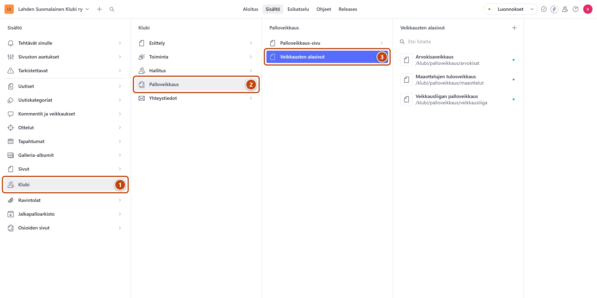
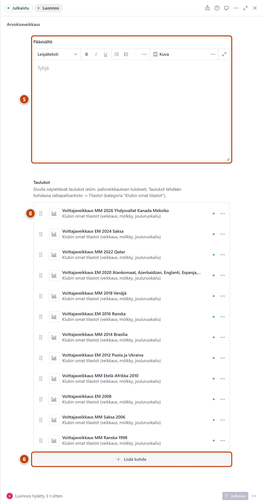

## Milloin

Kun palloveikkauksen uusi kausi alkaa tai säännöt muuttuvat. Jokaisella veikkauksella on
oma sivunsa. Palloveikkaus-sivu https://www.lahdensuomalainenklubi.com/klubi/palloveikkaus
listaa ne itsestään.

[Avaa Veikkausten alasivut](studio:rakenne/klubi/palloveikkaus/veikkausten-alasivut)

## Ennen kuin aloitat

- Uuden kauden taulukko on tehty kohtaan **Jalkapalloarkisto → Tilastot → Klubin omat tilastot** ja julkaistu. Ohje: [Tee uusi taulukko](../arkisto/uusi-tilastotaulukko.md).
- Pelkkä tulosten päivitys ei vaadi tätä korttia: päivitä taulukko suoraan. Ohje: [Päivitä tilastotaulukko](../arkisto/tilastotaulukon-paivitys.md).

## Askeleet

1. Vasemmasta valikosta valitse **Klubi**. ①
2. Valitse **Palloveikkaus**. ②
3. Valitse **Veikkausten alasivut**. ③
4. Valitse veikkaus, esimerkiksi Veikkausliigan palloveikkaus.

5. Muokkaa sääntöjä tarvittaessa kentässä **Pääsisältö**. ⑤
6. Kohdan **Taulukot** alla paina **Lisää kohde**. ⑥
7. Listan loppuun tulee tyhjä rivi. Kirjoita sen kenttään uuden taulukon nimen alkua ja valitse
   taulukko listasta.
8. Vedä uusi taulukko kahvasta (⋮⋮) listan alkuun. ⑧
   Ylin taulukko näkyy sivulla ensimmäisenä.
9. Oikeassa alakulmassa paina **Julkaise**.

## Tulos

- Uuden kauden taulukko näkyy veikkauksen sivulla ylimpänä viimeistään minuutin kuluttua.
- Vanhat kaudet näkyvät sen alla.

## Lisävalinnat

- Uusi veikkaus omalle sivulleen: avaa **Veikkausten alasivut** ja paina listan yläreunassa plus-painiketta (+). Kirjoita **Otsikko**. Kirjoita kenttään **Osoite sivustolla** alku klubi/palloveikkaus/ ja perään veikkauksen nimi, esimerkiksi klubi/palloveikkaus/mestarisarja. Julkaise.
- Palloveikkaus-pääsivun teksti ja kuva: **Klubi → Palloveikkaus → Palloveikkaus-sivu**.
- Veikkauslomake uutisen alle (jäsenet veikkaavat sarjajärjestyksen): [Veikkaus ja kommentit](../uutiset/veikkaus-ja-kommentit.md).

## Jos jokin menee vikaan

- Taulukkoa ei löydy listasta: taulukkoa ei ole julkaistu, tai kirjoitit nimen eri tavalla. Avaa taulukko ja julkaise se ensin.
- Uusi veikkaus ei näy listassa **Veikkausten alasivut**: osoitteen alusta puuttuu klubi/palloveikkaus/. Sivu on silloin listassa **Sivut**. Korjaa osoite ja julkaise.
- Punainen "Tämä osoite on sivuston oma osio, joten sivu ei näkyisi siinä. Valitse toinen osoite.": osoitteessa on liian monta osaa. Käytä muotoa klubi/palloveikkaus/nimi.

Katso myös: [Päivitä tilastotaulukko](../arkisto/tilastotaulukon-paivitys.md) · [Tee uusi sivu](../sivusto/uusi-sivu.md)
