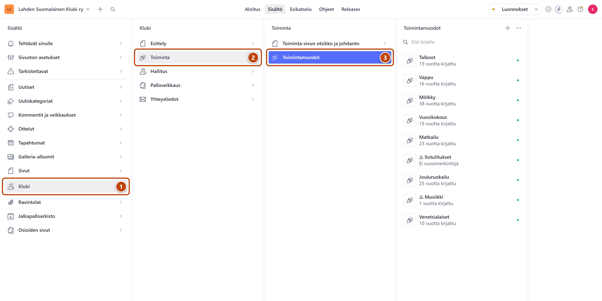
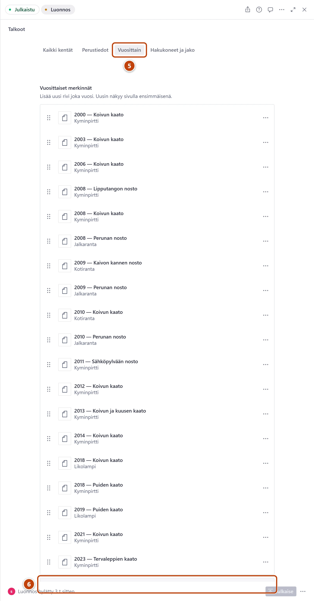

## Milloin

Kun klubin toiminta on taas pidetty, esimerkiksi mölkkyturnaus tai jouluruokailu.
Vuosimerkinnät näkyvät toiminnan omalla sivulla, uusin ensin. Kaikki toiminnot ovat sivulla
https://www.lahdensuomalainenklubi.com/klubi/toiminta.

[Avaa Toimintamuodot](studio:rakenne/klubi/toiminta/toimintamuodot)

## Askeleet

1. Vasemmasta valikosta valitse **Klubi**. ①
2. Valitse **Toiminta**. ②
3. Valitse **Toimintamuodot**. ③
4. Valitse listasta toiminta, esimerkiksi Mölkky.

5. Lomakkeen yläreunasta valitse välilehti **Vuosittain**. ⑤
6. Kohdan **Vuosittaiset merkinnät** alla paina **Lisää kohde**. ⑥
   Uuden vuoden ikkuna avautuu. Uusi vuosi tulee listan loppuun.
7. Kirjoita **Vuosi**. Se on ainoa pakollinen kenttä.
8. Halutessasi täytä **Päivämäärä**, **Otsikko**, **Paikka**, **Osallistujat** ja **Kuvaus**.
   Osallistujat kirjoitetaan yksi kerrallaan: kirjoita etunimi ja paina Enter.
   **Monesko kerta** kirjoitetaan tavallisena lukuna, esimerkiksi 37. Sivulla se näkyy muodossa (37.).
9. Sulje ikkuna oikean yläkulman ruksista ja paina oikeassa alakulmassa **Julkaise**.

## Tulos

- Listassa näkyy uusi rivi, esimerkiksi "2026".
- Toiminnan sivulla uusi vuosi on ensimmäisenä viimeistään minuutin kuluttua.

## Lisävalinnat

- Linkki matkakuvaukseen tai videoon: avaa vuoden kohta **Linkki**. Kirjoita **Linkin teksti**, esimerkiksi "Matkakuvaus". Valitse sitten **Mihin linkki vie?**. Ohje: [Tee linkki](../tekstit/linkit.md).
- Vuoden kuvat: kohta **Kuvat** vuoden kentissä.
- Taulukot, esimerkiksi mölkyn pisteet: välilehden **Vuosittain** kenttä **Tilastotaulukot**. Taulukko tehdään ensin jalkapalloarkistoon: [Tee uusi taulukko](../arkisto/uusi-tilastotaulukko.md).
- Uusi toimintamuoto: [Lisää uusi toimintamuoto](uusi-toimintamuoto.md).

## Jos jokin menee vikaan

- Keltainen "Linkin teksti on kirjoitettu, mutta kohde puuttuu.": valitse **Mihin linkki vie?** ja kohde, tai poista linkin teksti.
- **Julkaise** ei onnistu, ja kohdassa **Vuosi** on punaista: kirjoita vuosi numeroina, esimerkiksi 2026.

Katso myös: [Lisää uusi toimintamuoto](uusi-toimintamuoto.md) · [Linkki vie väärään paikkaan](../vianetsinta/linkki-vie-vaaraan-paikkaan.md)
