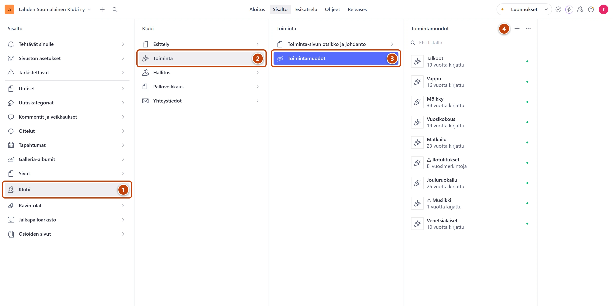
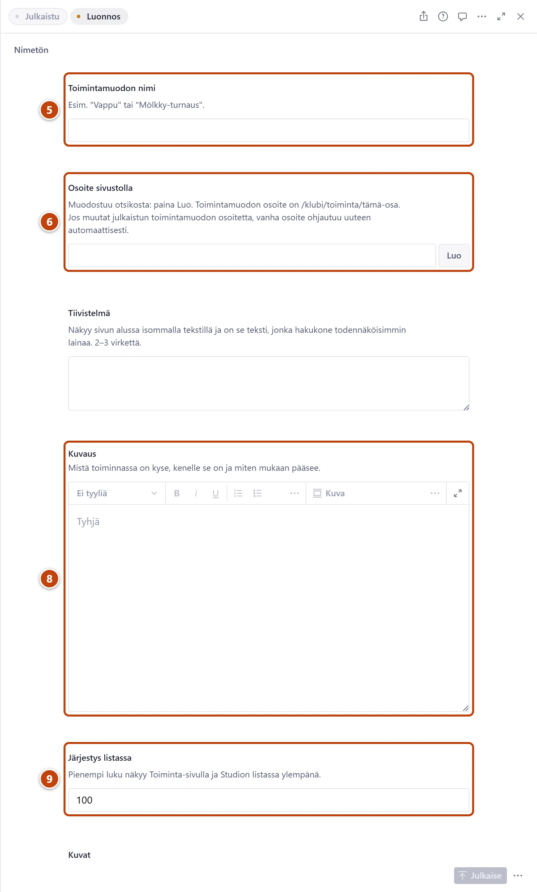

## Milloin

Kun klubi aloittaa uuden, toistuvan toiminnan. Toimintamuoto saa oman sivunsa, ja se näkyy
Toiminta-sivulla https://www.lahdensuomalainenklubi.com/klubi/toiminta.

[Avaa Toimintamuodot](studio:rakenne/klubi/toiminta/toimintamuodot)

## Askeleet

1. Vasemmasta valikosta valitse **Klubi**. ①
2. Valitse **Toiminta**. ②
3. Valitse **Toimintamuodot**. ③
4. Listan yläreunassa paina plus-painiketta (+). ④
   Tyhjä lomake avautuu oikealle.

5. Kirjoita **Toimintamuodon nimi**, esimerkiksi "Keilailu". ⑤
6. Kentän **Osoite sivustolla** vieressä paina **Luo**. ⑥
   Kenttään tulee nimestä tehty osoite, esimerkiksi keilailu.
7. Kirjoita lyhyt johdanto kenttään **Tiivistelmä**. Kaksi tai kolme virkettä riittää.
8. Kirjoita kenttään **Kuvaus**, mistä toiminnassa on kyse ja miten mukaan pääsee. ⑧
9. Kirjoita **Järjestys listassa**. Pienempi luku näkyy Toiminta-sivulla ylempänä. ⑨
10. Oikeassa alakulmassa paina **Julkaise**.

## Tulos

- Toimintamuoto näkyy Studion listassa samassa järjestyksessä kuin sivustolla.
- Toimintamuodolla on oma sivu, esimerkiksi /klubi/toiminta/keilailu.

## Lisävalinnat

- Kuvia: kenttä **Kuvat** välilehdellä **Perustiedot**.
- Ensimmäinen vuosi: [Lisää toimintaan uusi vuosi](toiminta-uusi-vuosi.md).
- Pohjaksi olemassa oleva toiminta: avaa samankaltainen toimintamuoto. Valitse **Julkaise**-painikkeen vieressä olevasta valikosta **Kopioi pohjaksi**. Anna kopiolle uusi nimi ja paina osoitteen kohdalla **Luo**.

## Jos jokin menee vikaan

- **Julkaise** ei onnistu: **Toimintamuodon nimi** ja **Osoite sivustolla** ovat pakollisia.
- Toiminta on listassa väärässä kohdassa: muuta lukua **Järjestys listassa**. Katso muiden toimintojen luvut ja valitse luku niiden väliltä.

Katso myös: [Lisää toimintaan uusi vuosi](toiminta-uusi-vuosi.md) · [Muuta sivun osoitetta](../sivusto/osoitteen-muuttaminen.md)
