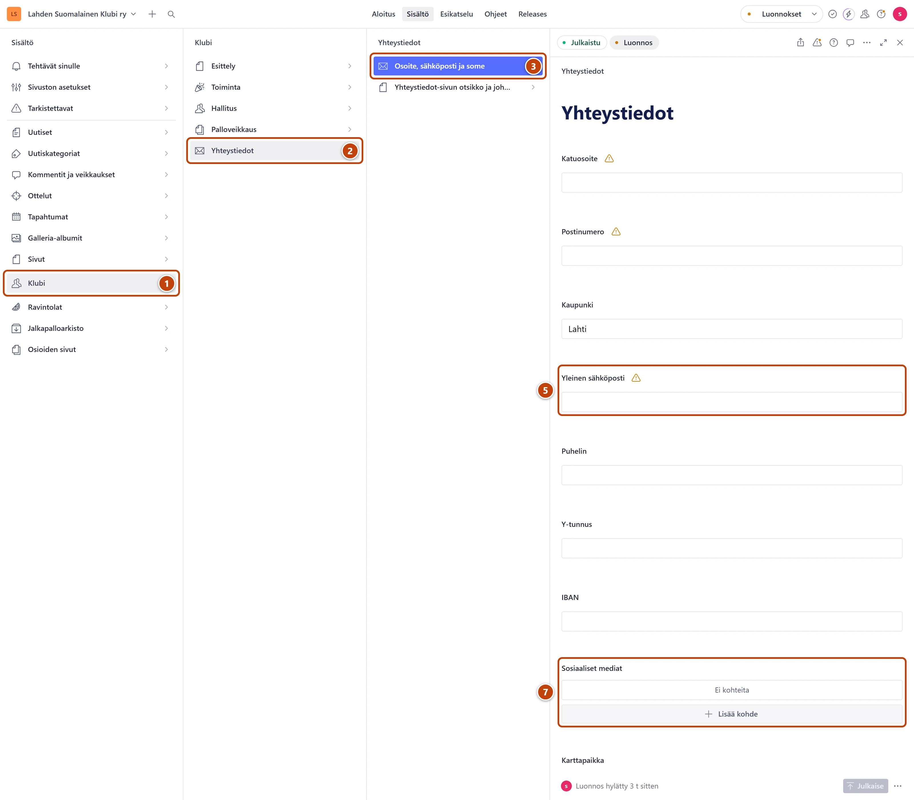

## Milloin

Kun klubin osoite, sähköposti, puhelin tai someosoite muuttuu. Tiedot näkyvät jokaisen sivun
alareunassa ja sivulla https://www.lahdensuomalainenklubi.com/klubi/yhteystiedot.

[Avaa yhteystiedot](studio:muokkaa/yhteystiedot)

## Askeleet

1. Vasemmasta valikosta valitse **Klubi**. ①
2. Valitse **Yhteystiedot**. ②
3. Valitse **Osoite, sähköposti ja some**. ③
4. Muuta tarvittaessa **Katuosoite**, **Postinumero** ja **Kaupunki**.
5. Muuta tarvittaessa **Yleinen sähköposti** ja **Puhelin**. ⑤
6. Halutessasi täytä **Y-tunnus** ja **IBAN**.
7. Uusi someosoite: kohdan **Sosiaaliset mediat** alla paina **Lisää kohde**. ⑦
   Valitse **Alusta**, esimerkiksi Facebook. Kirjoita **Verkko-osoite**, joka alkaa https://.
8. Oikeassa alakulmassa paina **Julkaise**.

## Tulos

- Uudet tiedot näkyvät sivujen alareunassa ja yhteystietosivulla viimeistään minuutin kuluttua.
- Aloituksen kohta **Täydennä perustiedot** ei enää muistuta puuttuvasta tiedosta.

## Lisävalinnat

- Yhteystietosivun otsikko ja johdanto: **Klubi → Yhteystiedot → Yhteystiedot-sivun otsikko ja johdanto**. Ohje: [Muokkaa listasivun otsikkoa ja johdantoa](../sivusto/osioiden-sivut.md).
- Kokoontumispaikan kartta: kenttä **Karttapaikka**.
- Someosoitteen poisto: vie osoitin rivin päälle, avaa rivin valikko ja valitse **Poista**.

## Jos jokin menee vikaan

- Keltainen teksti, esimerkiksi "Täytä sähköposti — näkyy yhteystietosivulla.": tieto puuttuu. Voit silti julkaista.
- **Julkaise** ei onnistu, ja **Kaupunki** on punainen: kaupunki on pakollinen. Kirjoita esimerkiksi Lahti.
- Someosoite ei kelpaa: kirjoita koko osoite alusta asti, esimerkiksi https://www.facebook.com/…

Katso myös: [Muokkaa valikkoa ja alatunnistetta](../sivusto/valikko-ja-alatunniste.md) · [Vaihda hallituksen jäseniä](hallitus.md)
