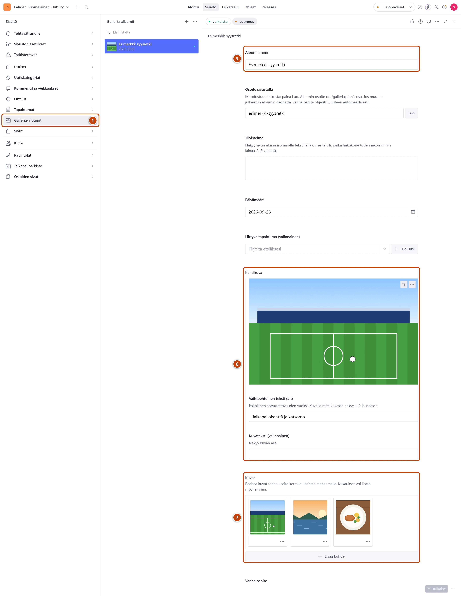

## Milloin

Kun haluat näyttää tapahtuman tai matkan kuvat sivuston galleriassa. Albumi saa oman sivunsa.

## Ennen kuin aloitat

- Kokoa albumin kuvat yhteen kansioon tietokoneelle.

## Askeleet

1. Vasemmasta valikosta valitse **Galleria-albumit**. ①
2. Paina listan yläreunassa plus-painiketta (+).
3. Kirjoita **Albumin nimi**, esimerkiksi "Vappu 2026". ③
4. Kentän **Osoite sivustolla** vieressä paina **Luo**.
5. Valitse **Päivämäärä**. Halutessasi valitse **Liittyvä tapahtuma (valinnainen)**.
6. Kohdassa **Kansikuva** paina **Lataa** ja valitse kuva. Kirjoita sille **Vaihtoehtoinen teksti (alt)**. ⑥
7. Raahaa kaikki kuvat kansiosta kerralla kenttään **Kuvat**. ⑦
   Kuvat latautuvat hetken. Järjestä ne tarvittaessa raahaamalla.
8. Oikeassa alakulmassa paina **Julkaise**.

## Tulos

- Albumi näkyy galleriassa ja omalla sivullaan noin minuutissa.
- Kuvaa napsauttamalla kävijä näkee sen suurena.

## Lisävalinnat

- Kuvan kuvaus: napsauta kuvaa. Avautuvassa ikkunassa kirjoita **Mitä kuvassa on (alt)**. Se on suositeltava, ei pakollinen.
  Ilman sitä sivu nimeää kuvan albumin mukaan, esimerkiksi "Vappu 2026, kuva 3/40".
- Kuvateksti suurennetun kuvan alle: **Kuvateksti (valinnainen)**.
- Kuvauksia voi lisätä myöhemmin. Julkaise muutosten jälkeen uudelleen.
- Ensimmäinen albumi: Galleria näkyy valikossa vasta, kun lisäät sen sinne. Katso
  [Valikko ja alatunniste](../sivusto/valikko-ja-alatunniste.md).

## Jos jokin menee vikaan

- **Julkaise** ei onnistu: **Albumin nimi**, **Osoite sivustolla**, **Päivämäärä** ja
  **Kansikuva** ovat pakollisia, ja kuvia pitää olla vähintään yksi.
- Keltainen "Kuvaus auttaa näkövammaisia kävijöitä. Voit julkaista myös ilman sitä.":
  julkaisu onnistuu silti.

Katso myös: [Kuva](../tekstit/kuva.md) · [Lisää tapahtuma](tapahtuman-lisaaminen.md)
