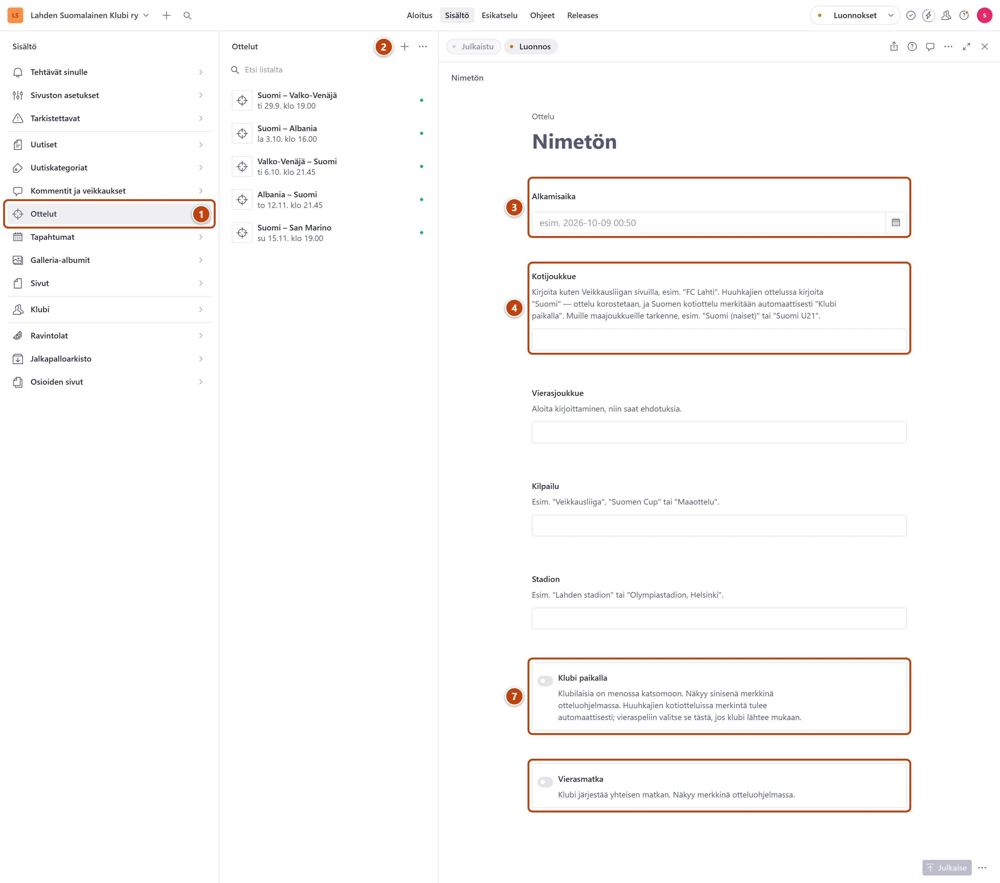

## Milloin

Veikkausliigan ottelut tulevat otteluohjelmaan itsestään. Lisää käsin maajoukkueen ottelut ja
ottelut, joihin klubi lähtee. Ottelut näkyvät etusivulla ja Ottelut-sivulla.

## Askeleet

1. Vasemmasta valikosta valitse **Ottelut**. ①
2. Paina listan yläreunassa plus-painiketta (+). ②
3. Kentän **Alkamisaika** oikeassa reunassa paina kalenterikuvaketta. Valitse päivä ja kirjoita
   kellonaika kalenterin alareunaan. ③
   Voit myös kirjoittaa ajan suoraan kenttään muodossa 2026-10-20 19:00. Muoto 20.10.2026 ei käy.
4. Kirjoita kenttään **Kotijoukkue** nimen alkua ja valitse ehdotus listasta. ④
   Suomen miesten maajoukkue on tasan "Suomi".
5. Tee samoin kentässä **Vierasjoukkue**.
6. Täytä halutessasi **Kilpailu** ja **Stadion**.
7. Jos klubi on katsomossa, käännä kytkin **Klubi paikalla** päälle. Yhteiselle matkalle käännä
   päälle **Vierasmatka**. ⑦
8. Oikeassa alakulmassa paina **Julkaise**.

## Tulos

- Ottelu näkyy etusivulla ja Ottelut-sivulla noin minuutissa.
- Huuhkajien ottelu korostetaan. Etusivun laskuri siirtyy siihen itsestään, jos se on seuraava.
- Suomen kotiottelu saa merkinnän Klubi paikalla itsestään.
- Pelattu ottelu poistuu otteluohjelmasta pari tuntia alkamisen jälkeen.

## Lisävalinnat

- Merkintä Veikkausliigan otteluun: lisää ottelu samalla päivällä ja samoilla joukkueilla ja
  valitse **Klubi paikalla** tai **Vierasmatka**. Merkintä yhdistyy automaattiseen otteluun.
- Ajan muutos: avaa ottelu listasta, muuta **Alkamisaika** ja paina **Julkaise**.
- Peruttu ottelu: avaa **Julkaise**-painikkeen vierestä valikko **Asiakirjatoiminnot** ja valitse **Poista**.
  Vahvista painamalla **Poista nyt**.
- Muiden seurojen ottelut etusivulle: katso [Etusivu](../sivusto/etusivu-ylaosa.md).

## Jos jokin menee vikaan

- Keltainen "Tarkoititko "FC Lahti"?…": korjaa nimi ehdotuksen mukaiseksi. Muuten merkintä ei
  yhdisty oikeaan otteluun. Muiden maiden nimet, esimerkiksi "Albania", ovat kunnossa.
- **Alkamisaika** on punainen: aika on väärässä muodossa. Valitse se kalenterista.
- Ottelu ei näy: tarkista, että painoit **Julkaise**. Lomakkeen yläreunassa lukee
  "Ottelu on jo pelattu…", jos aika on mennyt.
- Muut Suomen joukkueet: kirjoita tarkenne, esimerkiksi "Suomi (naiset)" tai "Suomi U21".

Katso myös: [Lisää tapahtuma](tapahtuman-lisaaminen.md) · [Muutos ei näy sivustolla](../vianetsinta/muutos-ei-nay-sivustolla.md)
