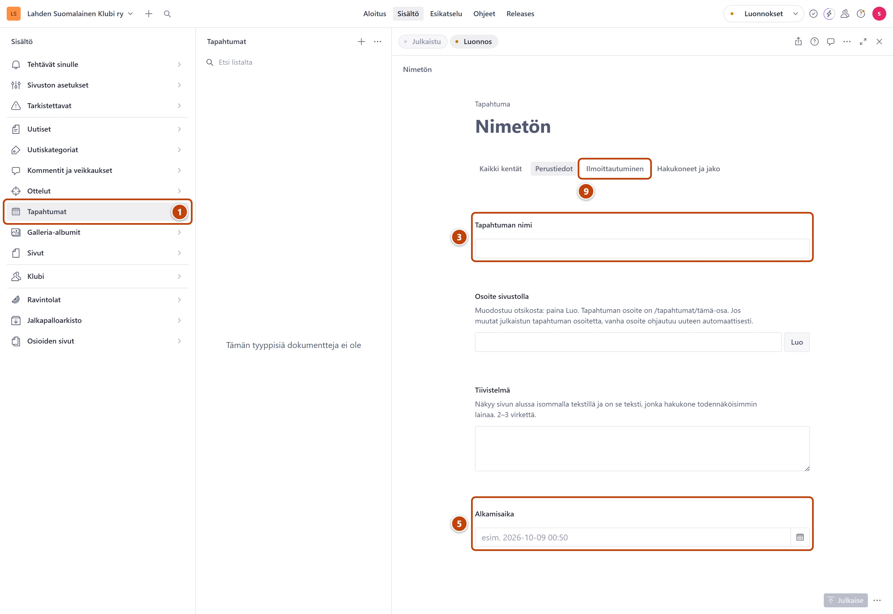

## Milloin

Kun klubi järjestää tilaisuuden, esimerkiksi illanvieton, matkan tai vuosijuhlan.
Tapahtuma näkyy etusivulla ja Tapahtumat-sivulla, kunnes se on ohi.

## Askeleet

1. Vasemmasta valikosta valitse **Tapahtumat**. ①
2. Paina listan yläreunassa plus-painiketta (+).
3. Kirjoita **Tapahtuman nimi**. ③
4. Kentän **Osoite sivustolla** vieressä paina **Luo**.
5. Valitse **Alkamisaika** kentän kalenterikuvakkeesta. Halutessasi valitse myös **Päättymisaika**. ⑤
6. Kirjoita **Paikka**, esimerkiksi "Klubin tila, Lahti".
7. Kohdassa **Kansikuva** paina **Lataa** ja valitse kuva tietokoneelta. Kirjoita kuvalle
   **Vaihtoehtoinen teksti (alt)**.
8. Kirjoita kenttään **Kuvaus** kutsun teksti.
9. Jos ilmoittautuminen tarvitaan, valitse välilehti **Ilmoittautuminen**. ⑨
   Täytä **Ilmoittautumislinkki** tai **Ilmoittautumis-sähköposti**.
10. Oikeassa alakulmassa paina **Julkaise**.

## Tulos

- Tapahtuma näkyy etusivulla ja Tapahtumat-sivulla noin minuutissa.
- Tapahtuman sivulla on painike "Lisää kalenteriin". Kävijä saa tapahtuman omaan kalenteriinsa.
- Tapahtuma poistuu tulevista, kun se on ohi.

## Lisävalinnat

- **Juhlatapahtuma**: valitse vain juhlille ja merkkipäiville. Kortti saa messinginvärisen korostuksen. Käytä harvoin.
- Jaettava kuva: kansikuva näkyy, kun linkki jaetaan WhatsAppissa tai Facebookissa. Käytä
  vaakakuvaa, jonka tärkein kohta on keskellä. Katso [Jakokuva](../uutiset/jakokuva.md).
- Ensimmäinen tapahtuma: Tapahtumat näkyy valikossa vasta, kun lisäät sen sinne. Katso
  [Valikko ja alatunniste](../sivusto/valikko-ja-alatunniste.md).

## Jos jokin menee vikaan

- **Julkaise** ei onnistu: **Tapahtuman nimi**, **Osoite sivustolla**, **Alkamisaika** ja
  **Kuvaus** ovat pakollisia.
- Punainen "Päättymisaika ei voi olla ennen alkamisaikaa.": tarkista ajat.
- Punainen "Alt-teksti on pakollinen (3–200 merkkiä).": kirjoita kansikuvalle kuvaus.

Katso myös: [Kuva](../tekstit/kuva.md) · [Lisää kuva-albumi](galleria-albumi.md) · [Lisää ottelu](ottelun-lisaaminen.md)
