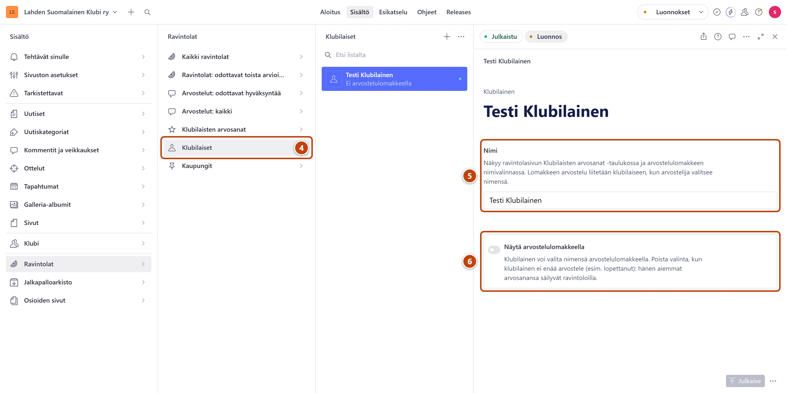

## Milloin

Klubilaiset arvostelevat ravintolat puhelimella sivuston lomakkeella. Lähetä heille linkki, ja
pidä klubilaisten nimilista ajan tasalla. Lomakkeelta tulleet arvostelut odottavat hyväksyntääsi.

## Askeleet

1. Lähetä klubilaisille osoite https://www.lahdensuomalainenklubi.com/ravintolat/arvostele
   esimerkiksi sähköpostilla tai viestillä.
2. Neuvo heitä lisäämään lomake puhelimen kotinäyttöön. Lomake aukeaa silloin kuin sovellus.
   - Androidissa: lähetetyn arvostelun jälkeen lomake näyttää painikkeen "Lisää kotinäyttöön".
   - iPhonessa: Safarin Jaa-painike ja sitten "Lisää Koti-valikkoon".
3. Klubilainen valitsee ensimmäisellä kerralla nimensä listasta. Puhelin muistaa sen.

4. Uusi klubilainen: valitse Studiossa **Ravintolat** → **Klubilaiset** ja paina plus-painiketta (+). ④
5. Kirjoita **Nimi**, esimerkiksi "Mikko K.". ⑤
6. Varmista, että kytkin **Näytä arvostelulomakkeella** on päällä (tumma). Se on valmiiksi päällä.
   Paina oikeassa alakulmassa **Julkaise**. ⑥

## Tulos

- Uusi nimi näkyy heti lomakkeen nimilistassa.
- Lähetetyt arvostelut tulevat Studioon kohtaan **Tehtävät sinulle** → **Arvostelut odottavat hyväksyntää**.

## Lisävalinnat

- Klubilainen lopettaa: avaa hänet, käännä kytkin **Näytä arvostelulomakkeella** pois päältä ja paina
  **Julkaise**. Nimi poistuu lomakkeelta, mutta vanhat arvosanat säilyvät.
- Klubilaista ei voi poistaa, koska ravintoloiden arvosanat viittaavat häneen.
- Ravintolasivulla on myös painike "Lähetä oma arvostelu". Toista arvioijaa odottavat paikat näkyvät
  osoitteessa https://www.lahdensuomalainenklubi.com/ravintolat/odottavat.

## Jos jokin menee vikaan

- Punainen "Samanniminen klubilainen on jo olemassa…": lisää sukunimen alkukirjain, esimerkiksi "Mikko K.".
- Klubilainen valitsi lomakkeella väärän nimen: korjaa kenttä **Klubilainen** arvostelussa ennen
  hyväksyntää. Katso [Hyväksy tai hylkää arvostelu](arvostelun-hyvaksynta.md).

Katso myös: [Hyväksy tai hylkää arvostelu](arvostelun-hyvaksynta.md) · [Lisää klubilaisen pisteet](klubilaisen-pisteet.md)
