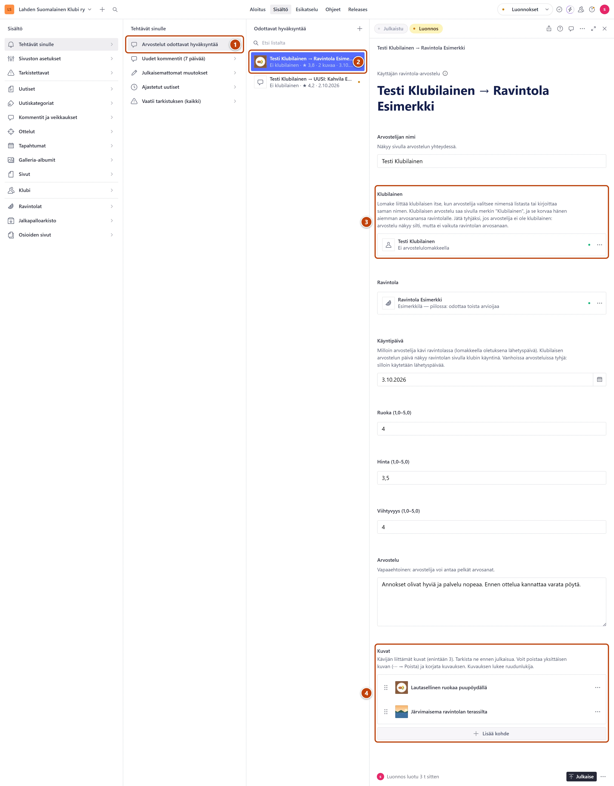
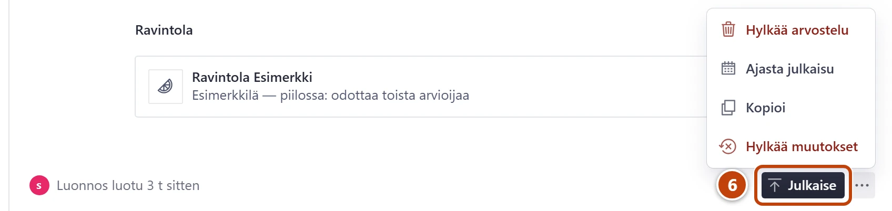

## Milloin

Kävijän tai klubilaisen lomakkeella lähettämä arvostelu odottaa hyväksyntääsi. Se ei näy
sivustolla ennen kuin hyväksyt sen. Aloituksessa näet, montako arvostelua odottaa.

> [!TIP]
> Käy jono läpi mieluiten samana päivänä. Klubilaiset odottavat näkevänsä arvostelunsa sivulla.

## Askeleet

1. Valitse **Tehtävät sinulle** → **Arvostelut odottavat hyväksyntää**. ①
   Sama lista löytyy myös kohdasta **Ravintolat** → **Arvostelut: odottavat hyväksyntää**.
2. Avaa arvostelu listasta. ②
   Rivillä näkyy arvostelija, ravintola, arvosana ja kuvien määrä.
   Jos rivillä lukee UUSI ja ravintolan nimi, katso [Uusi ravintola arvostelusta](uusi-ravintola-arvostelusta.md).
3. Tarkista kohta **Klubilainen**. ③
   Jos se on tyhjä mutta arvostelija on klubilainen, valitse hänen nimensä. Muuten jätä tyhjäksi.
4. Lue **Arvostelu** ja katso **Kuvat**. ④
5. Jos jokin kuva on sopimaton, paina kuvan rivin oikeasta reunasta kolmea pistettä (⋯) ja
   valitse **Poista**. Kuva poistuu heti, ilman kysymystä.

6. Hyväksy arvostelu: paina oikeassa alakulmassa **Julkaise**. ⑥

## Tulos

- Arvostelu ja sen kuvat näkyvät ravintolan sivulla noin minuutin kuluttua.
- Arvostelu poistuu jonosta. Avoinna oleva lista päivittyy, kun avaat sen uudelleen.
- Klubilaisen arvostelu korvaa hänen aiemmat pisteensä. Ravintolan arvosana päivittyy itsestään.

## Lisävalinnat

Hylkää koko arvostelu:

1. Avaa **Julkaise**-painikkeen vierestä valikko **Asiakirjatoiminnot**.
2. Valitse **Hylkää arvostelu**.
3. Oikeaan alakulmaan avautuu kysymys. Lue teksti ja paina **Vahvista**.

> [!WARNING]
> Yksittäisen kuvan poisto ennen julkaisua on turvallinen. Sen sijaan **Hylkää arvostelu** ja
> **Poista arvostelu** poistavat arvostelun ja kaikki sen kuvat pysyvästi. Niitä ei voi palauttaa.

Muut:

- Jo julkaistun arvostelun poisto: avaa se kohdasta **Ravintolat** → **Arvostelut: kaikki**.
  Valikossa lukee silloin **Poista arvostelu**.
- Kuvan kuvaus: kentän **Kuvaus (alt-teksti)** lukee ruudunlukija näkövammaiselle. Voit tarkentaa
  sitä, esimerkiksi "Paahdettu lohi".

## Jos jokin menee vikaan

- **Julkaise**-painiketta ei ole, vain vihreä **Hyväksy ja luo ravintola**: kävijä ehdotti uutta
  ravintolaa. Katso [Uusi ravintola arvostelusta](uusi-ravintola-arvostelusta.md).
- Keltainen "Arvostelijaa ei ole liitetty klubilaiseen…": normaali, jos arvostelija ei ole
  klubilainen. Julkaisu onnistuu.
- Ravintola ei näy sivustolla hyväksynnän jälkeen: katso [Ravintola ei näy](../vianetsinta/ravintola-ei-nay.md).
- Sivustolla on keltainen Esikatselutila-palkki: paina palkista "Poistu esikatselusta".
  Näet sivun kuten kävijät.

Katso myös: [Lisää klubilaisen pisteet](klubilaisen-pisteet.md) · [Uusi ravintola arvostelusta](uusi-ravintola-arvostelusta.md)
