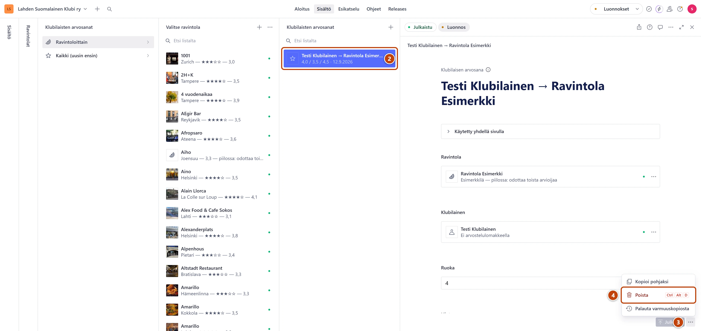

## Milloin

Kun arvosana on kirjattu väärälle ravintolalle tai klubilaiselle, tai sama arvosana on kahdesti.
Jos vain pisteet ovat väärin, korjaa pisteet. Poistoa ei silloin tarvita.

## Askeleet

1. Valitse **Ravintolat** → **Klubilaisten arvosanat** → **Ravintoloittain**. Kirjoita ravintolan
   nimi kenttään **Etsi listalta** ja valitse ravintola.
2. Avaa poistettava arvosana. ②
3. Avaa **Julkaise**-painikkeen vierestä valikko **Asiakirjatoiminnot**. ③
4. Valitse **Poista**. ④
5. Ikkunassa **Poista dokumentti?** paina **Poista nyt**.

## Tulos

- Arvosana katoaa listasta.
- Ravintolan arvosana lasketaan uudelleen itsestään.
- Jos ravintolalle jää alle kaksi klubilaisen arvosanaa, se piiloutuu sivustolta. Alapalkissa näkyy
  silloin merkki **Odottaa toista arvioijaa**.
- Vanhan sivuston ravintolalla palautuu vanha arvosana, jos kaikki klubilaisten arvosanat poistetaan.
  Sen näet välilehden **Arvostelu** kohdasta **Aiempi arvosana**.

## Lisävalinnat

- Klubilaisen lomakkeelta lähettämä arvostelu ei ole tässä listassa. Avaa se kohdasta
  **Ravintolat** → **Arvostelut: kaikki**. Jos arvostelu ei saa vaikuttaa arvosanaan, tyhjennä kenttä
  **Klubilainen** ja paina **Julkaise**. Koko arvostelun poisto: [Hyväksy tai hylkää arvostelu](arvostelun-hyvaksynta.md).

## Jos jokin menee vikaan

- Poistit väärän arvosanan: kirjaa pisteet uudelleen, katso [Lisää klubilaisen pisteet](klubilaisen-pisteet.md).
- Ravintola katosi sivustolta: sillä on nyt alle kaksi arvioijaa. Katso [Ravintola ei näy](../vianetsinta/ravintola-ei-nay.md).

Katso myös: [Lisää klubilaisen pisteet](klubilaisen-pisteet.md) · [Poistetun palautus](../turvaverkko/poistetun-palautus.md)
