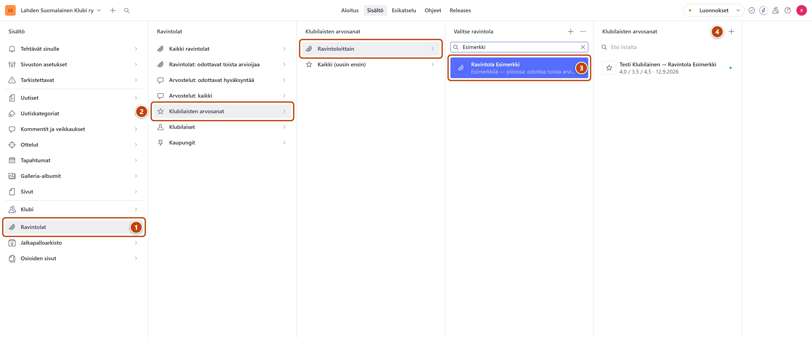
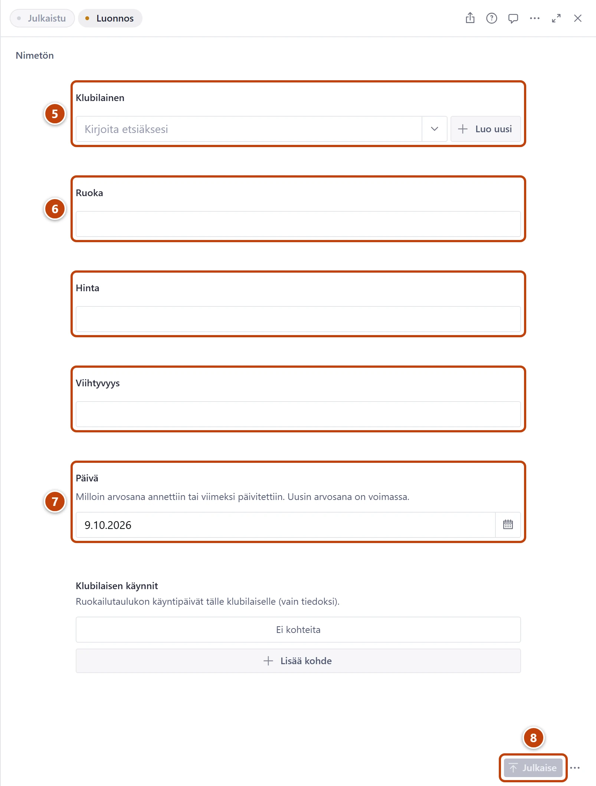

## Milloin

Kun klubilainen on antanut pisteet ravintolalle, mutta ei lähettänyt niitä arvostelulomakkeella.
Ravintolan arvosana lasketaan klubilaisten pisteistä itsestään. Sitä ei kirjoiteta käsin.

## Askeleet

1. Vasemmasta valikosta valitse **Ravintolat**. ①
2. Valitse **Klubilaisten arvosanat** ja sitten **Ravintoloittain**. ②
3. Listassa **Valitse ravintola** kirjoita ravintolan nimi kenttään **Etsi listalta** ja valitse ravintola. ③
   Näet ravintolan kaikki klubilaisten arvosanat, uusin ensin.
4. Paina oikeanpuoleisimman listan **Klubilaisten arvosanat** yläreunassa plus-painiketta (+). ④
   Älä paina listan **Valitse ravintola** plussaa: se tekee uuden ravintolan.
   **Ravintola** ja tämä päivä ovat valmiina.

5. Kirjoita kenttään **Klubilainen** nimen alkua ja valitse nimi listasta. ⑤
6. Kirjoita pisteet kenttiin **Ruoka**, **Hinta** ja **Viihtyvyys**. ⑥
   Pisteet ovat 1–5. Desimaalin voi kirjoittaa pilkulla tai pisteellä, esimerkiksi 3,5.
7. Muuta tarvittaessa **Päivä** käyntipäiväksi. ⑦
8. Oikeassa alakulmassa paina **Julkaise**. ⑧

## Tulos

- Ravintolan arvosana päivittyy itsestään hetken kuluttua.
- Ravintola näkyy sivustolla, kun vähintään kaksi klubilaista on arvioinut sen.
- Ravintolan sivulla taulukko Klubilaisten arvosanat näyttää uudet pisteet.

## Lisävalinnat

- Sama klubilainen kävi uudelleen: älä tee uutta arvosanaa. Avaa hänen vanha arvosanansa
  samasta listasta, muuta pisteet ja **Päivä**, ja paina **Julkaise**. Uusin arvosana on voimassa.
- Uusi klubilainen: valitse **Ravintolat** → **Klubilaiset**, paina plus-painiketta (+),
  kirjoita **Nimi** ja paina **Julkaise**.
- Ravintolaa ei ole listassa: lisää se ensin, katso [Täydennä ravintolan tiedot](ravintolan-tiedot.md).
- Väärin kirjattu arvosana: [Poista klubilaisen arvosana](klubilaisen-arvosanan-poisto.md)
- Kaikki arvosanat yhdessä listassa: **Klubilaisten arvosanat** → **Kaikki (uusin ensin)**.

## Jos jokin menee vikaan

- Punainen "Tällä klubilaisella on jo arvosana tähän ravintolaan…": muokkaa vanhaa
  arvosanaa, älä lisää uutta. Poista tämä keskeneräinen arvosana: **Asiakirjatoiminnot** →
  **Poista** → **Poista nyt**.
- Punainen "Arvosana on 1,0–5,0.": pisteet ovat liian suuret tai pienet. Tarkista luku.
- Ravintola ei näy sivustolla: katso [Ravintola ei näy](../vianetsinta/ravintola-ei-nay.md).

Katso myös: [Hyväksy tai hylkää arvostelu](arvostelun-hyvaksynta.md) · [Jaa arvostelulomake klubilaisille](arvostelulomake-klubilaisille.md)
