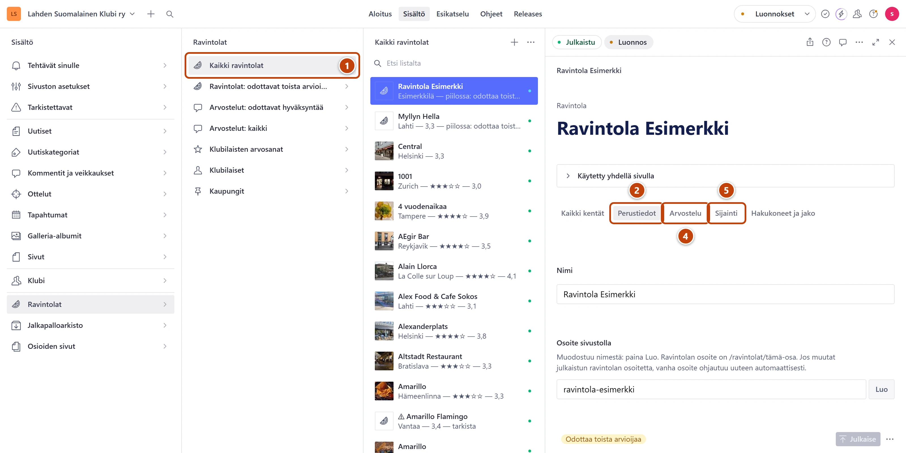

## Milloin

Kun ravintolan kortti tarvitsee kuvan, osoitteen tai sanallisen arvion. Tai kun ravintola on
lopettanut. Arvosanaa et kirjoita tähän: se lasketaan klubilaisten pisteistä.

## Askeleet

1. Valitse **Ravintolat** → **Kaikki ravintolat** ja avaa ravintola. ①
2. Välilehdellä **Perustiedot** täytä tarvittaessa **Puhelin**, **Verkkosivut** ja **Hintaluokka**. ②
3. Lisää kuvat kenttään **Kuvat**. Ensimmäinen kuva näkyy kortissa.
4. Välilehdellä **Arvostelu** kirjoita **Tuomio yhdellä rivillä** ja tarvittaessa
   **Sanallinen arvostelu**, **Plussat** ja **Miinukset**. ④
5. Välilehdellä **Sijainti** tarkista **Kaupunki** ja täytä **Katuosoite** ja **Postinumero**. ⑤
6. Oikeassa alakulmassa paina **Julkaise**.

## Tulos

- Ravintolan kortti ja sivu päivittyvät sivustolla noin minuutissa.
- Jos ravintola odottaa toista arvioijaa, tiedot näkyvät vasta, kun se tulee näkyviin.

## Lisävalinnat

- Ravintola on lopettanut: välilehdellä **Perustiedot** valitse **Toiminta loppunut**. Kirjoita
  halutessasi **Lisätieto lopettamisesta**. Sivu säilyy, mutta se merkitään päättyneeksi.
- Klubin käynti: välilehdellä **Arvostelu** lisää päivä kohdan **Käynnit** alkuun. Uusin käynti
  on ylimpänä. Kirjoita tarvittaessa **Käynnin yhteys**, esimerkiksi "Jouluruokailu".
- Korttiin lyhyt otteluvinkki: **Matka stadionille tai ottelu-yhteys**, esimerkiksi "15 min stadionille".
- Vinkit ottelupäivälle: **Ottelupäivänä**.
- Uusi ravintola ilman arvostelua: paina **Kaikki ravintolat** -listan yläreunassa plus-painiketta (+).
  Täytä **Nimi** ja paina kentän **Osoite sivustolla** vieressä **Luo**. Valitse välilehdellä
  **Sijainti** kenttään **Kaupunki** kaupunki: kirjoita nimen alkua ja valitse listasta.
  Julkaise ja lisää sitten [klubilaisten pisteet](klubilaisen-pisteet.md).
- Kartta: välilehden **Sijainti** kenttä **Karttapaikka** on valinnainen. Sen kenttien nimet ovat
  englanniksi: Latitude on leveysaste ja Longitude pituusaste. Jätä Altitude tyhjäksi.
- Kuvan rajaus ja kuvaus: [Kuva](../tekstit/kuva.md)

## Jos jokin menee vikaan

- Arvosanakentät ovat harmaita: ne lasketaan klubilaisten pisteistä. Muuta pisteitä kohdassa
  **Ravintolat** → **Klubilaisten arvosanat**.
- Punainen "Järjestä käynnit uusin ensin: vedä uusin käynti listan alkuun.": raahaa uusin päivä
  listan ylimmäksi.
- Keltainen "Pidä tuomio lyhyenä…": tuomio on yli 90 merkkiä. Lyhennä sitä.

Katso myös: [Lisää klubilaisen pisteet](klubilaisen-pisteet.md) · [Lisää uusi kaupunki](uusi-kaupunki.md)
