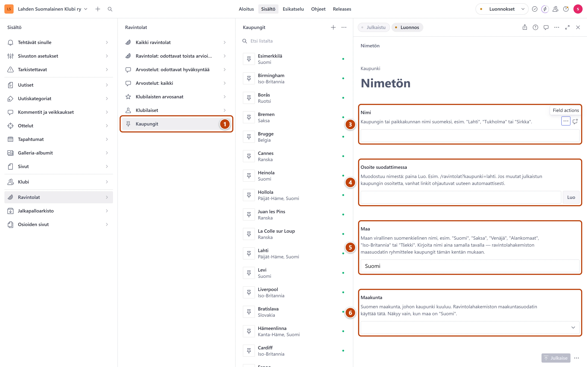

## Milloin

Kun ravintola tai stadion on kaupungissa, jota listassa ei vielä ole. Kaupunki näkyy ravintolasivun
suodattimissa, kun sinne on julkaistu ensimmäinen ravintola.

## Askeleet

1. Valitse **Ravintolat** ja sitten **Kaupungit**. ①
2. Paina listan yläreunassa plus-painiketta (+).
3. Kirjoita **Nimi** suomeksi, esimerkiksi "Jyväskylä" tai "Tukholma". ③
4. Kentän **Osoite suodattimessa** vieressä paina **Luo**. ④
5. Tarkista **Maa**. Valmiina on "Suomi". ⑤
   Kirjoita maa aina samalla tavalla: "Saksa", "Alankomaat", "Iso-Britannia", "Tšekki".
6. Suomen kaupungille valitse **Maakunta**. ⑥
   Kylälle valitaan sen kunnan maakunta, esimerkiksi Vääksy: Päijät-Häme.
7. Oikeassa alakulmassa paina **Julkaise**.

## Tulos

- Kaupunki on valittavissa ravintolan ja stadionin kentässä **Kaupunki**.
- Ravintolasivun alue- ja kaupunkivalikot päivittyvät itsestään.

## Lisävalinnat

- Ravintola, jonka kaupunkia ei tiedetä, esimerkiksi laivalla: tee kaupunki maan nimellä, esimerkiksi "Ruotsi".
- **Hyväksy ja luo ravintola** voi luoda kaupungin itse. Avaa se silloin tästä listasta ja valitse maakunta.

## Jos jokin menee vikaan

- Keltainen "Valitse maakunta, jotta kaupungin ravintolat löytyvät maakuntasuodattimella.":
  valitse **Maakunta**.
- Punainen "Kirjoita maan nimi isolla alkukirjaimella…": korjaa maan nimi, esimerkiksi "Saksa".
- Kaupunki puuttuu maakuntavalikosta: tarkista kaupungin **Maakunta**.

Katso myös: [Täydennä ravintolan tiedot](ravintolan-tiedot.md) · [Lisää stadion](../arkisto/stadion.md)
