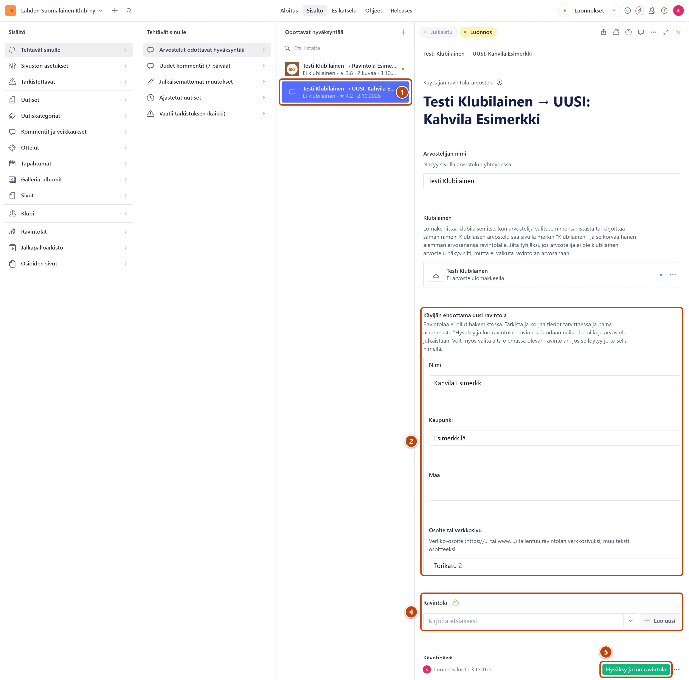

## Milloin

Kävijä arvosteli ravintolan, jota hakemistossa ei vielä ole. Listassa rivillä lukee UUSI ja
ravintolan nimi. Hyväksyntä luo samalla ravintolan.

## Askeleet

1. Valitse **Tehtävät sinulle** → **Arvostelut odottavat hyväksyntää** ja avaa UUSI-rivi. ①
2. Tarkista laatikosta **Kävijän ehdottama uusi ravintola** kentät **Nimi**, **Kaupunki** ja **Maa**. ②
   Korjaa kirjoitusvirheet suoraan kenttiin.
3. Lisää halutessasi **Osoite tai verkkosivu**.
4. Onko ravintola jo hakemistossa toisella nimellä? Valitse se kenttään **Ravintola**. ④
   Paina silloin **Julkaise** ja lopeta tähän.
5. Muuten paina oikeassa alakulmassa vihreää **Hyväksy ja luo ravintola**. ⑤
6. Lue ikkunan teksti ja paina **Vahvista**.
7. Jos ikkuna kertoi uudesta kaupungista, valitse sille maakunta.
   Katso [Lisää uusi kaupunki](uusi-kaupunki.md).

## Tulos

- Ravintola on luotu, ja arvostelu on julkaistu sen sivulle.
- Ravintola näkyy sivustolla vasta, kun kaksi klubilaista on arvioinut sen. Siihen asti ravintolan
  alapalkissa on merkki **Odottaa toista arvioijaa**.

## Lisävalinnat

- Saman illan toinen arvostelu samasta ravintolasta: paina taas **Hyväksy ja luo ravintola**.
  Ikkuna kertoo, että ravintola on jo hakemistossa. Arvostelu liitetään siihen, eikä uutta synny.
- Jos nimet poikkeavat selvästi, esimerkiksi "Savu" ja "Bistro Savu", hyväksy ensimmäinen.
  Valitse toiselle kenttään **Ravintola** juuri luotu ravintola ja paina **Julkaise**.
- Ravintolan kuva, osoite ja muut tiedot: [Täydennä ravintolan tiedot](ravintolan-tiedot.md)

## Jos jokin menee vikaan

- Keltainen "Uusi ravintola … paina alareunan vihreää…" kentässä **Ravintola**: normaali. Se
  poistuu, kun hyväksyt.
- Ikkunassa lukee "Ravintolan luonti epäonnistui…": mitään ei julkaistu. Yritä hetken päästä
  uudelleen.
- Ravintola ei näy sivustolla: katso [Ravintola ei näy](../vianetsinta/ravintola-ei-nay.md).

Katso myös: [Hyväksy tai hylkää arvostelu](arvostelun-hyvaksynta.md) · [Lisää uusi kaupunki](uusi-kaupunki.md)
