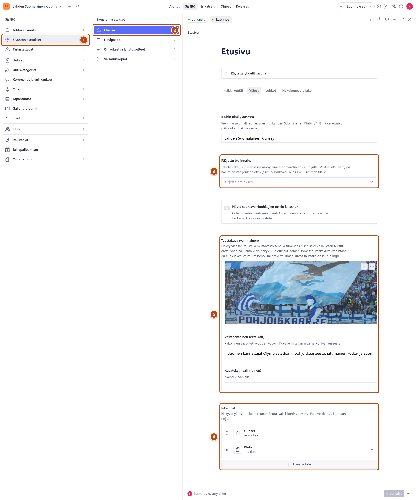

## Milloin

Etusivun yläosa päivittyy itsestään. Siinä näkyy uusin juttu isona. Oikealla olevassa
Seuraavaksi-kortissa näkyvät seuraava Huuhkajien ottelu laskurin kanssa ja seuraava tapahtuma.
Muokkaa yläosaa, kun haluat nostaa tietyn jutun, vaihtaa taustakuvan tai pikalinkit.

[Avaa Etusivu](studio:muokkaa/etusivu)

## Askeleet

1. Vasemmasta valikosta valitse **Sivuston asetukset**. ①
2. Valitse **Etusivu**. ②
   Lomake avautuu välilehdelle **Yläosa**.
3. Halutessasi nosta juttu kenttään **Pääjuttu (valinnainen)**: kirjoita jutun otsikon alkua ja valitse listasta. ③
4. Valitse päivä kenttään **Pääjuttu näkyy asti**. Kenttä tulee näkyviin, kun pääjuttu on valittu.
   Sen jälkeen yläosassa näkyy taas uusin juttu itsestään.
5. Halutessasi vaihda kuva kentässä **Taustakuva (valinnainen)**. ⑤
   Kirjoita kuvalle **Vaihtoehtoinen teksti (alt)**.
6. Halutessasi muokkaa kohtaa **Pikalinkit**: avaa linkki ja muuta **Teksti** tai **Mihin linkki vie?**. ⑥
7. Oikeassa alakulmassa paina **Julkaise**.

## Tulos

- Etusivun yläosa muuttuu viimeistään minuutin kuluttua.
- Pikalinkit näkyvät yläosan Seuraavaksi-kortissa.

## Lisävalinnat

- Uusi pikalinkki: kohdan **Pikalinkit** alla paina **Lisää kohde**. Pikalinkkejä voi olla enintään neljä.
- Laskuri pois: käännä kytkin **Näytä seuraava Huuhkajien ottelu ja laskuri** pois päältä.
- Pieni rivi yläreunassa: **Klubin nimi yläosassa**.
- Googlen hakutuloksen teksti: välilehti **Hakukoneet ja jako**, kenttä **Etusivun kuvaus hakukoneille**. Teksti ei näy itse sivulla.
- Etusivun alempana olevat osiot: [Järjestä, piilota tai lisää etusivun lohkoja](etusivun-lohkot.md).

> [!TIP]
> Hyvä taustakuva on vaakakuva, esimerkiksi katsomosta. Kuva näkyy mustavalkoisena tumman
> sävyn alla, joten tekstit erottuvat aina.

## Jos jokin menee vikaan

- Pääjuttu ei näy: juttua ei ole julkaistu, sen julkaisuaika on tulevaisuudessa tai päivä **Pääjuttu näkyy asti** on jo mennyt.
- **Julkaise** ei onnistu: kuvalta puuttuu **Vaihtoehtoinen teksti (alt)**, tai **Etusivun kuvaus hakukoneille** on tyhjä.
- Laskuria ei näy: seuraavaa Huuhkajien ottelua ei ole tiedossa. Lisää ottelu: [Lisää ottelu](../ottelut/ottelun-lisaaminen.md).

Katso myös: [Järjestä, piilota tai lisää etusivun lohkoja](etusivun-lohkot.md) · [Tee linkki](../tekstit/linkit.md)
