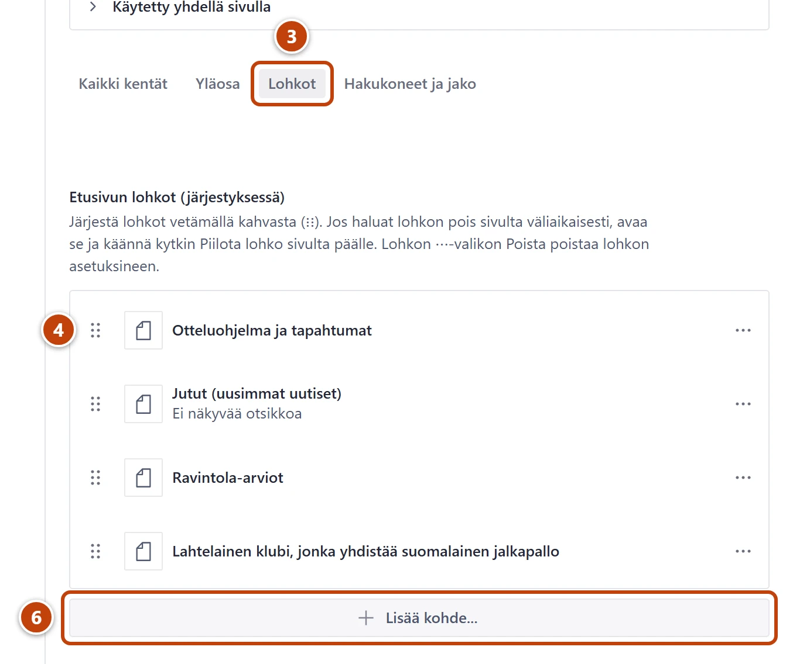
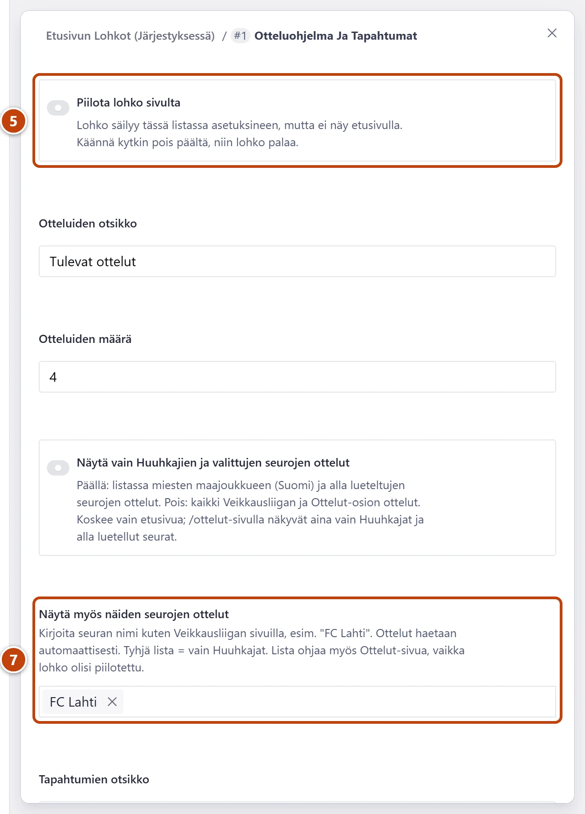

## Milloin

Etusivulla on yläosan alla lohkoja, esimerkiksi jutut, otteluohjelma ja ravintola-arviot.
Tässä muutat niiden järjestystä, piilotat lohkon tai lisäät uuden. Lohkon sisältö,
esimerkiksi jutut ja ottelut, tulee itsestään.

[Avaa Etusivu](studio:muokkaa/etusivu)

## Askeleet

1. Vasemmasta valikosta valitse **Sivuston asetukset**.
2. Valitse **Etusivu**.
3. Lomakkeen yläreunasta valitse välilehti **Lohkot**. ③
   Lohkot ovat listassa samassa järjestyksessä kuin etusivulla.
4. Järjestys: tartu lohkon kahvaan (⋮⋮) ja vedä lohko uuteen kohtaan. ④

5. Piilotus: avaa lohko napsauttamalla sitä ja käännä kytkin **Piilota lohko sivulta** päälle. ⑤
   Lohkon kohdalla listassa lukee Piilotettu. Asetukset säilyvät.
6. Uusi lohko: listan alla paina **Lisää kohde...** ja valitse avautuvasta listasta lohkon tyyppi. ⑥
   Uusi lohko tulee listan loppuun.
7. Muokkaa lohkon asetuksia. Ne on lueteltu alla kohdassa Lisävalinnat. ⑦
8. Oikeassa alakulmassa paina **Julkaise**.

## Tulos

- Etusivu muuttuu viimeistään minuutin kuluttua.
- Piilotettu lohko palaa, kun käännät kytkimen pois päältä ja julkaiset.

## Lisävalinnat

Lohkojen tyypit ja asetukset:

| Lohko | Mitä etusivulla näkyy | Asetukset |
|---|---|---|
| **Jutut (uusimmat uutiset)** | Uusin juttu isona, seuraavat listana | **Yläotsake**, **Otsikko**, **Näytettävien määrä** |
| **Otteluohjelma ja tapahtumat** | Tulevat ottelut vasemmalla, klubin tapahtumat oikealla | **Otteluiden otsikko**, **Otteluiden määrä**, **Näytä vain Huuhkajien ja valittujen seurojen ottelut**, **Näytä myös näiden seurojen ottelut**, **Tapahtumien otsikko**, **Tapahtumien määrä** |
| **Tulevat tapahtumat** | Klubin seuraavat tapahtumat | **Otsikko**, **Näytettävien määrä** |
| **Esittelyteksti (Klubista)** | Kuva vasemmalla, teksti oikealla | **Yläotsake**, **Otsikko**, **Teksti**, **Kuva**, **Linkin teksti**, **Linkin kohde** |
| **Ravintola-arviot** | Tuoreimmin arvioidut ravintolat | **Yläotsake**, **Otsikko**, **Kaupunki (suodatin, valinnainen)**, **Näytettävien määrä** |
| **Jalkapalloarkisto-nosto** | Lyhyt esittely ja nappi arkistoon | **Otsikko**, **Teksti**, **Napin teksti**, **Napin kohde** |
| **Galleria-nosto** | Uusimmat kuva-albumit | **Otsikko**, **Näytettävien albumien määrä** |

- Seurat: kirjoita kohtaan **Näytä myös näiden seurojen ottelut** seuran nimi kuten Veikkausliigan sivuilla, esimerkiksi FC Lahti, ja paina Enter. Lista ohjaa myös Ottelut-sivua, vaikka lohko olisi piilotettu.
- **Napin kohde** on valinnainen. Tyhjänä nappi vie jalkapalloarkiston etusivulle.

> [!NOTE]
> Lohkon rivin valikon ⋯ kohta **Poista** poistaa lohkon asetuksineen. Jos haluat lohkon pois vain
> hetkeksi, käytä kytkintä **Piilota lohko sivulta**. Vahingossa poistetun lohkon saat takaisin aiemmasta
> versiosta: [Luonnos, julkaisu ja peruminen](../alkuun/luonnos-julkaisu-ja-peruminen.md).

## Jos jokin menee vikaan

- Keltainen "Lisää linkin kohde tai poista linkin teksti.": esittelytekstin linkiltä puuttuu kohde. Valitse **Linkin kohde** tai poista **Linkin teksti**.
- Aloituksessa lukee "Etusivun Klubista-lohkosta puuttuu kuva (Etusivu → Lohkot).": avaa lohko **Esittelyteksti (Klubista)** ja lisää **Kuva**.
- Seuran ottelut eivät näy: otteluita haetaan itsestään vain Veikkausliigasta. Lisää muut ottelut käsin: [Lisää ottelu](../ottelut/ottelun-lisaaminen.md).

Katso myös: [Muuta etusivun yläosaa](etusivu-ylaosa.md) · [Muutos ei näy sivustolla](../vianetsinta/muutos-ei-nay-sivustolla.md)
