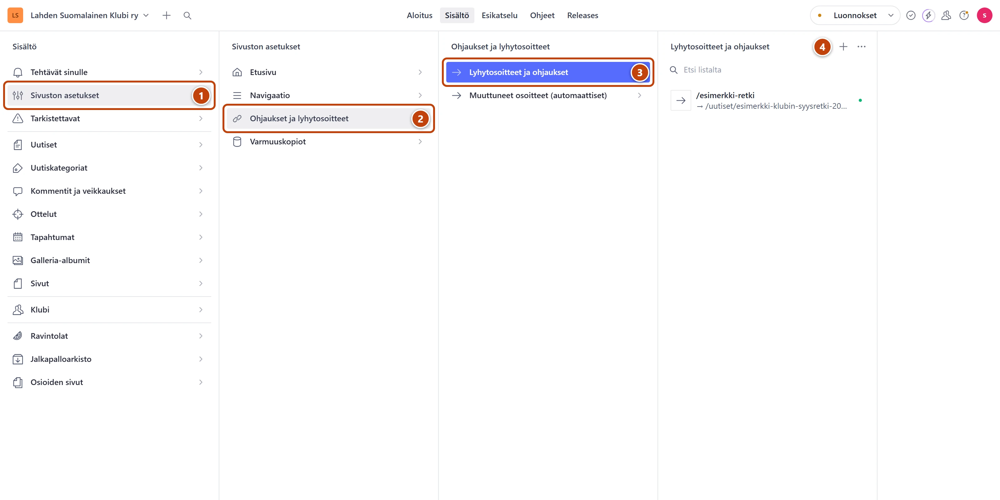
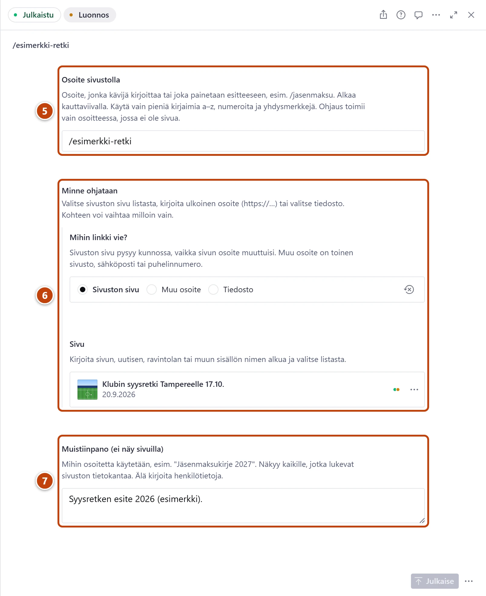

## Milloin

Kun tarvitset lyhyen osoitteen esitteeseen tai kirjeeseen, esimerkiksi /jasenmaksu.
Kohteen voi vaihtaa myöhemmin, jolloin vanha esite vie uuteen kohteeseen. Samalla tavalla
ohjaat poistetun sivun osoitteen toiselle sivulle.

[Avaa Lyhytosoitteet ja ohjaukset](studio:rakenne/asetukset/ohjaukset/lyhytosoitteet)

## Askeleet

1. Vasemmasta valikosta valitse **Sivuston asetukset**. ①
2. Valitse **Ohjaukset ja lyhytosoitteet**. ②
3. Valitse **Lyhytosoitteet ja ohjaukset**. ③
4. Listan yläreunassa paina plus-painiketta (+). ④

5. Kirjoita kenttään **Osoite sivustolla** lyhyt osoite, esimerkiksi /jasenmaksu. ⑤
   Käytä pieniä kirjaimia. Kirjoita ä:n tilalle a ja ö:n tilalle o. Välilyönnin tilalle tulee yhdysmerkki.
6. Kohdassa **Minne ohjataan** valitse kohde. ⑥
   **Sivuston sivu**: kirjoita kenttään **Sivu** sivun nimen alkua ja valitse. **Muu osoite**: toinen sivusto, osoite alkaa https://. **Tiedosto**: esimerkiksi PDF.
7. Kirjoita **Muistiinpano (ei näy sivuilla)**, esimerkiksi "Jäsenmaksukirje 2027". ⑦
8. Oikeassa alakulmassa paina **Julkaise**.
9. Kokeile osoitetta selaimessa: https://www.lahdensuomalainenklubi.com/jasenmaksu.

## Tulos

- Osoite vie valitsemaasi kohteeseen muutaman sekunnin kuluttua.
- Listassa ohjauksen nimenä on osoite. Sen alla näkyvät kohde ja muistiinpano.

> [!WARNING]
> Muistiinpano ei näy sivuilla, mutta sen voi lukea sivuston tietokannasta. Älä kirjoita
> siihen nimiä tai muita henkilötietoja.

## Lisävalinnat

- Kohteen vaihto: avaa ohjaus, vaihda **Minne ohjataan** ja julkaise.
- Ohjauksen poisto: avaa ohjaus ja valitse **Julkaise**-painikkeen vieressä olevasta valikosta **Poista**. Osoite näyttää sen jälkeen Sivua ei löytynyt -sivun.
- Poistetun sivun osoite toiselle sivulle: poista ensin vanha sivu. Poiston ikkuna näyttää kohdassa **Nykyinen osoite:** osoitteen, josta ohjaus tehdään. Tee ohjaus siitä osoitteesta heti poiston jälkeen. Yksi ohjaus riittää.

## Jos jokin menee vikaan

- Punainen tai keltainen teksti kentän alla: [Lyhytosoitteessa punainen teksti](../vianetsinta/ohjauksen-ilmoitukset.md).
- Osoite ei ohjaa: ohjaus toimii vain osoitteessa, jossa ei ole sivua. Sivu voittaa aina. Tarkista myös, että painoit **Julkaise**.

Katso myös: [Muuta sivun osoitetta](osoitteen-muuttaminen.md) · [Et ehkä voi poistaa](../vianetsinta/et-ehka-voi-poistaa.md)
