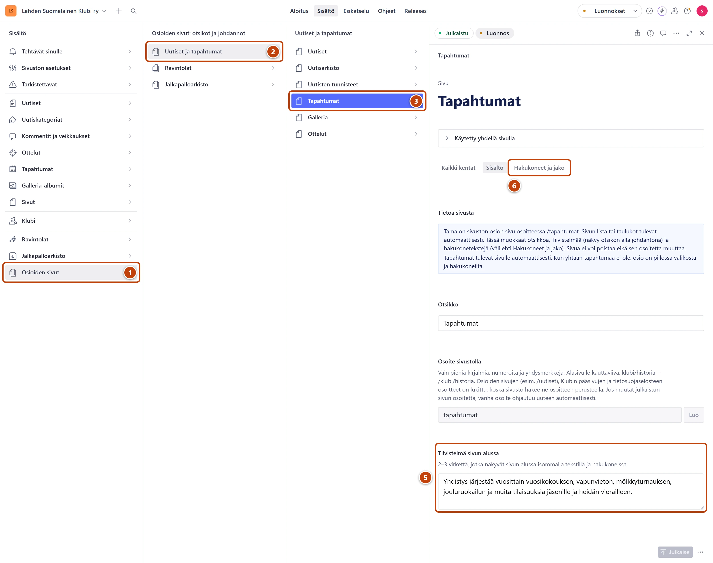

## Milloin

Sivuston listasivuilla, kuten Uutiset, Tapahtumat ja Ravintola-arviot, lista tai taulukot
tulevat itsestään. Otsikon, sen alla näkyvän johdannon ja Googlen tekstin muokkaat itse.

[Avaa Osioiden sivut](studio:rakenne/osiosivut)

## Askeleet

1. Vasemmasta valikosta valitse **Osioiden sivut**. ①
2. Valitse ryhmä, esimerkiksi **Uutiset ja tapahtumat**. ②
3. Valitse sivu, esimerkiksi **Tapahtumat**. ③
   Välilehtien alla sininen laatikko **Tietoa sivusta** kertoo, mitä sivulle tulee itsestään.
4. Muokkaa tarvittaessa **Otsikko**.
5. Muokkaa johdantoa kentässä **Tiivistelmä sivun alussa**. ⑤
6. Halutessasi valitse välilehti **Hakukoneet ja jako** ja kirjoita **Kuvaus hakutuloksissa (valinnainen)**. ⑥
   Jos jätät sen tyhjäksi, Google näyttää johdannon.
7. Oikeassa alakulmassa paina **Julkaise**.

## Tulos

- Uusi otsikko ja johdanto näkyvät sivulla viimeistään minuutin kuluttua.
- Valikon ja välilehtien nimet eivät muutu otsikon mukana.

## Lisävalinnat

- Klubin sivut ovat kohdassa **Klubi**: **Klubi → Hallitus → Hallitus-sivun otsikko ja johdanto**, **Klubi → Toiminta → Toiminta-sivun otsikko ja johdanto** ja **Klubi → Yhteystiedot → Yhteystiedot-sivun otsikko ja johdanto**. Muokkaa niitä samalla tavalla.
- Jalkapalloarkiston osiolla on lisäksi kenttä **Teksti arkiston etusivun kortissa**: yksi lyhyt virke arkiston etusivun korttiin.
- Ravintola-arviot: jos jätät johdannon tyhjäksi, sivusto kirjoittaa sen itse ravintoloiden määrästä. Oma tekstisi korvaa sen, eikä määrä silloin päivity itsestään.
- Uutiset-sivulla kävijä voi valita kategorian. Silloin otsikko ja kuvaus tulevat kategoriasta: [Kategoriat ja tunnisteet](../uutiset/kategoriat-ja-tunnisteet.md).
- Kaikki osioiden sivut: [Studion valikon kartta](../hakuteos/valikon-kartta.md).

## Jos jokin menee vikaan

- **Julkaise** ei onnistu, ja kentän alla lukee "Tiivistelmä on tällä sivulla pakollinen: se näkyy otsikon alla johdantona ja hakukoneissa.": kirjoita johdanto.
- Poisto ja kopiointi ovat harmaina, ja **Osoite sivustolla** on lukittu. Tämä on tarkoituksellista: sivusto hakee sivun aina samasta osoitteesta. Sisällön saat muokata vapaasti.

Katso myös: [Mikä teksti näkyy missä](../hakuteos/mika-teksti-nakyy-missa.md) · [Muokkaa Klubi-sivun esittelyä](../klubi/esittely.md)
