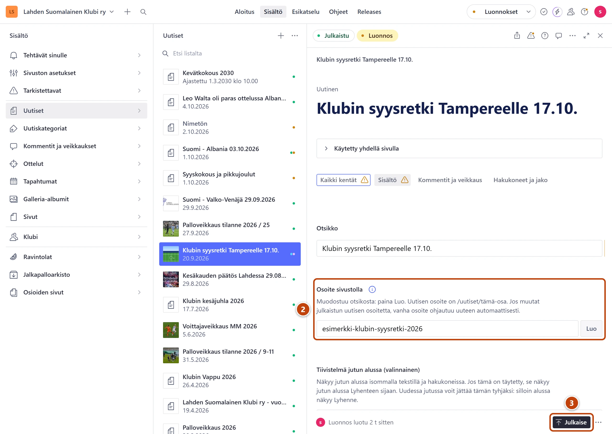

## Milloin

Kun osoitteessa on kirjoitusvirhe tai sivun nimi muuttuu. Vanha osoite ohjautuu uuteen
itsestään. Vanhat linkit Googlessa, Facebookissa ja esitteissä toimivat siis edelleen.

## Ennen kuin aloitat

- Osoitteen voi muuttaa sivuilta, uutisilta, tapahtumilta, ravintoloilta, galleria-albumeilta, toimintamuodoilta, arvokisoilta, pelaajilta, stadioneilta, taulukoilta, uutiskategorioilta ja kaupungeilta.
- Lukittujen sivujen osoitetta ei voi muuttaa. Niitä ovat osioiden sivut, Klubin pääsivut, tietosuojaseloste ja Jari Litmanen.

## Askeleet

1. Avaa sivu, uutinen tai muu, jonka osoitteen haluat muuttaa. Ohje: [Etsi haulla](../alkuun/etsi-haulla.md).
2. Kirjoita uusi osoite kenttään **Osoite sivustolla**. ②
   Kentän nimen viereen tulee sininen i-merkki. Vie hiiri sen päälle: tieto kertoo, että vanha
   osoite ohjautuu uuteen, kun julkaiset.
3. Oikeassa alakulmassa paina **Julkaise**. ③
4. Kokeile vanhaa osoitetta selaimessa. Sen pitäisi viedä uuteen osoitteeseen.

## Tulos

- Sivu näkyy uudessa osoitteessa heti.
- Vanha osoite ohjautuu uuteen muutaman sekunnin kuluttua.
- Vanha osoite näkyy kentässä **Aiemmat osoitteet**, yleensä välilehdellä **Hakukoneet ja jako**. Kenttä täyttyy itsestään, etkä voi muuttaa sitä.
- Kaikki muuttuneet osoitteet ovat koottuina kohdassa **Sivuston asetukset → Ohjaukset ja lyhytosoitteet → Muuttuneet osoitteet (automaattiset)**.

## Lisävalinnat

- Sivun alasivujen osoitteet eivät muutu mukana. Sinisen i-merkin tieto kertoo, montako alasivua sivulla on. Muuta niiden osoitteet erikseen.
- Jos palautat osoitteen ennalleen, se poistuu kentästä **Aiemmat osoitteet** itsestään.
- Valikon ja tekstien linkit, joissa on valittu **Sivuston sivu**, seuraavat uutta osoitetta itsestään.
- Taulukon osoite: taulukko näkyy samalla sivulla kuin ennenkin. Vain suora linkki taulukkoon vie jatkossa sivun alkuun.

## Jos jokin menee vikaan

- **Osoite sivustolla** on harmaa, eikä siihen voi kirjoittaa: sivu on lukittu. Jos osoite on pakko muuttaa, kerro tukihenkilölle.
- Uutisessa punainen "Osoite “arkisto” on varattu uutisosion omalle sivulle. Valitse toinen.": valitse toinen osoite.
- Keltainen teksti "… Jos muutat sen, vanhat linkit tähän sivuun lakkaavat toimimasta …": tämän sivun vanha osoite ei ohjaudu itsestään. Palauta vanha osoite tai tee ohjaus: [Tee lyhytosoite esitteeseen](lyhytosoite.md).

Katso myös: [Tee lyhytosoite esitteeseen](lyhytosoite.md) · [Linkki vie väärään paikkaan](../vianetsinta/linkki-vie-vaaraan-paikkaan.md)
