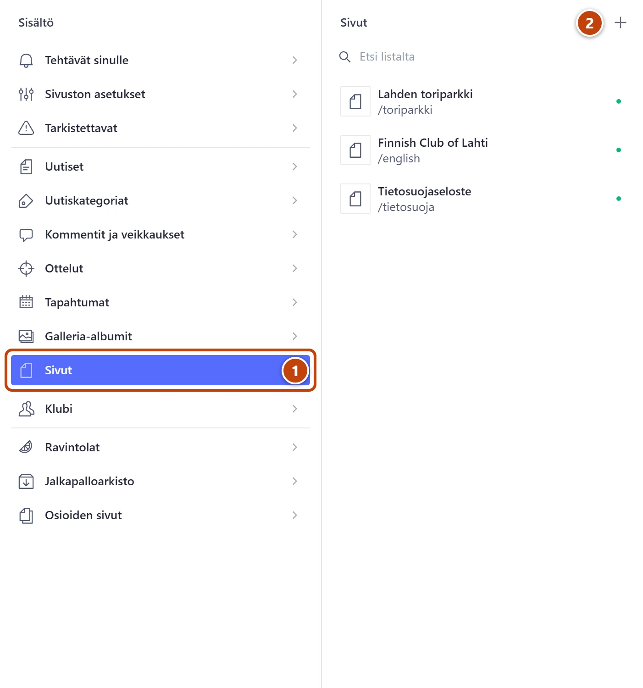
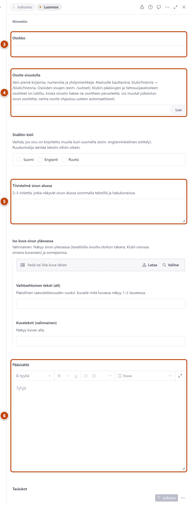

## Milloin

Kun tarvitset uuden tekstisivun, esimerkiksi säännöt tai klubin historian. Uutinen ei ole
sivu: uutisen ohje on erikseen.

[Avaa Sivut](studio:rakenne/sivut)

## Askeleet

1. Vasemmasta valikosta valitse **Sivut**. ①
2. Listan yläreunassa paina plus-painiketta (+). ②
   Tyhjä lomake avautuu oikealle.

3. Kirjoita **Otsikko**, esimerkiksi Klubin säännöt. ③
4. Kentän **Osoite sivustolla** vieressä paina **Luo**. ④
   Kenttään tulee otsikosta tehty osoite, esimerkiksi klubin-saannot.
   Alasivulle kirjoita alkuun yläsivun osoite ja kauttaviiva, esimerkiksi klubi/historia.
5. Kirjoita **Tiivistelmä sivun alussa**: kaksi tai kolme virkettä. ⑤
6. Kirjoita teksti kenttään **Pääsisältö**. ⑥
7. Oikeassa alakulmassa paina **Julkaise**.

## Tulos

- Sivu näkyy osoitteessa, jonka annoit, esimerkiksi https://www.lahdensuomalainenklubi.com/klubi/historia.
- Sivu ei tule valikkoon itsestään. Lisää se valikkoon: [Muokkaa valikkoa ja alatunnistetta](valikko-ja-alatunniste.md).

## Lisävalinnat

- Kuva sivun yläosaan: **Iso kuva sivun yläosassa**.
- Taulukot sivun loppuun: kohta **Taulukot**. Taulukko tehdään ensin: [Tee uusi taulukko](../arkisto/uusi-tilastotaulukko.md).
- Tekstin lisäosat, kuten kuva, liite, painike ja kartta: [Lisää kuva](../tekstit/kuva.md) · [Tee linkki](../tekstit/linkit.md).
- Muun kuin suomenkielinen sivu: valitse **Sisällön kieli**. Ruudunlukija ääntää tekstin silloin oikein.
- Pohjaksi olemassa oleva sivu: avaa sivu ja valitse **Julkaise**-painikkeen vieressä olevasta valikosta **Kopioi pohjaksi**.

## Jos jokin menee vikaan

- "Tämä osoite on sivuston oma osio, joten sivu ei näkyisi siinä. Valitse toinen osoite.": osoite kuuluu sivuston omalle osiolle, esimerkiksi uutiset. Valitse toinen osoite.
- "Tämä osoite kuuluu sivuston omalle sivulle (Studiossa kohdassa Osioiden sivut tai Klubi). Muokkaa sitä siellä, tai valitse tälle sivulle toinen osoite.": sivu on jo olemassa. Muokkaa sitä: [Muokkaa listasivun otsikkoa ja johdantoa](osioiden-sivut.md).
- Punainen "Virheellinen osoitteen osa …": käytä osoitteessa vain pieniä kirjaimia, numeroita ja yhdysmerkkejä. Kirjoita ä:n tilalle a ja ö:n tilalle o.

> [!NOTE]
> Uusi Klubi-osion alasivu, esimerkiksi klubi/jasenyys, ei näy Klubi-sivun välilehdissä.
> Lisää siihen linkki valikkoon tai toisen sivun tekstiin.

Katso myös: [Muuta sivun osoitetta](osoitteen-muuttaminen.md) · [Muokkaa valikkoa ja alatunnistetta](valikko-ja-alatunniste.md)
