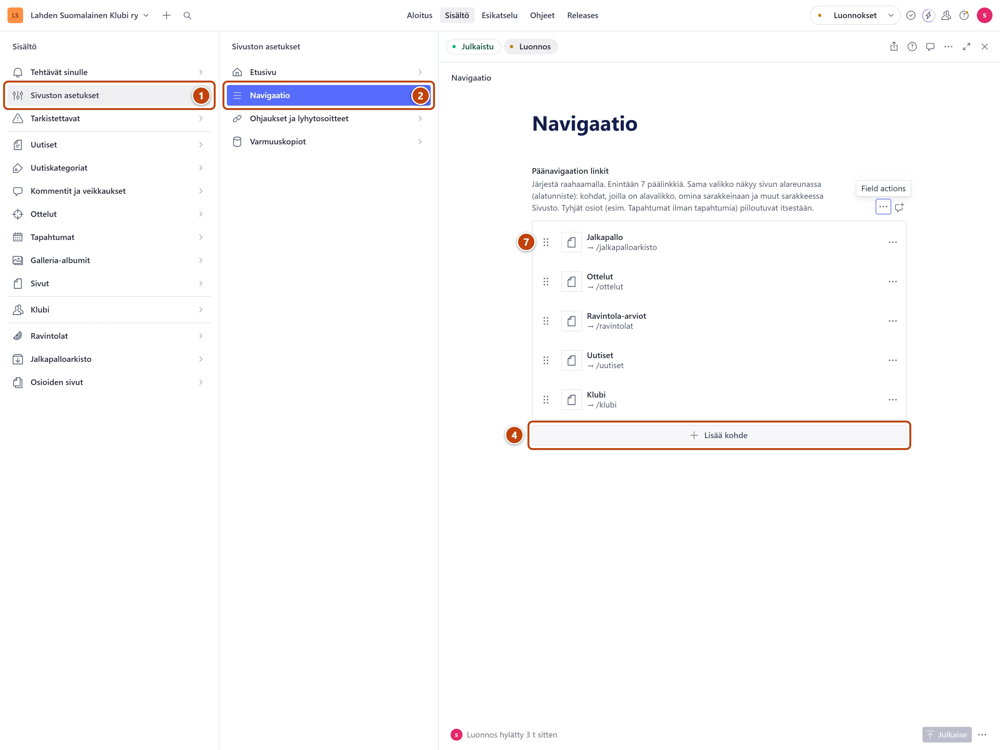
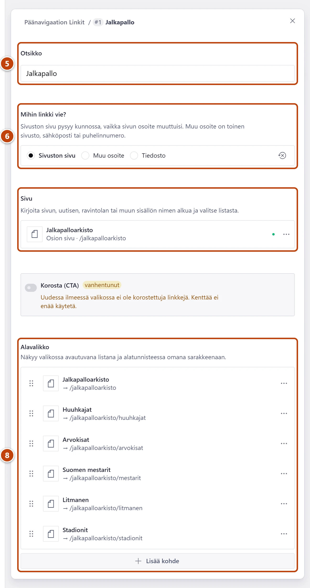

## Milloin

Kun haluat lisätä valikkoon sivun, nimetä kohdan uudelleen tai muuttaa järjestystä.
Sama valikko näkyy sivuston yläreunassa ja alatunnisteessa sivun alareunassa.

[Avaa Navigaatio](studio:muokkaa/navigaatio)

## Askeleet

1. Vasemmasta valikosta valitse **Sivuston asetukset**. ①
2. Valitse **Navigaatio**. ②
3. Vanhan kohdan muutos: avaa kohta ja muuta **Otsikko** tai valittu **Sivu**. Siirry sitten askeleeseen 7.
4. Uusi kohta: kohdan **Päänavigaation linkit** alla paina **Lisää kohde**. ④

5. Kirjoita **Otsikko**, esimerkiksi Historia. ⑤
6. Kohdassa **Mihin linkki vie?** on valmiina **Sivuston sivu**. Kirjoita kenttään **Sivu** sivun nimen alkua ja valitse listasta. ⑥
   Kohdan alla näkyy osoite, esimerkiksi "→ /klubi/historia".
7. Järjestys: tartu kohdan kahvaan (⋮⋮) ja vedä se paikalleen. ⑦
8. Alavalikko: avaa kohta, ja kohdan **Alavalikko** alla paina **Lisää kohde**. Täytä kuten askeleissa 5 ja 6. ⑧
9. Oikeassa alakulmassa paina **Julkaise**.

## Tulos

- Valikko muuttuu viimeistään minuutin kuluttua.
- Alatunniste muuttuu samalla. Kohdat, joilla on alavalikko, näkyvät alatunnisteessa omina sarakkeinaan. Muut kohdat ovat sarakkeessa Sivusto.
- Yhteystiedot sekä linkit Tietosuojaseloste ja Ylläpito ovat alatunnisteessa aina.

## Lisävalinnat

- Linkki toiselle sivustolle: valitse **Mihin linkki vie?** -kohdasta **Muu osoite** ja kirjoita osoite, joka alkaa https://. Ohje: [Tee linkki](../tekstit/linkit.md).
- Tyhjät osiot piiloutuvat valikosta itsestään, esimerkiksi Tapahtumat ilman yhtään tapahtumaa. Kun julkaiset ensimmäisen tapahtuman tai albumin, lisää Tapahtumat tai Galleria valikkoon.
- Jos alavalikossa ei ole pääkohdan omaa sivua, alatunnisteen sarakkeen alkuun tulee linkki Yleisesittely.

## Jos jokin menee vikaan

- Keltainen "Enintään 7 päälinkkiä, jotta valikko mahtuu puhelimen näytölle.": valikossa on yli seitsemän pääkohtaa. Siirrä osa jonkin kohdan alavalikkoon.
- Kohta puuttuu sivustolta ja kentän alla lukee "… ei ole vielä julkaistu.": julkaise ensin sivu, johon kohta vie.
- **Julkaise** ei onnistu, ja kentän alla lukee "Valitse sivu, johon linkki vie.": valitse sivu kenttään **Sivu**.

Katso myös: [Tee uusi sivu](uusi-sivu.md) · [Linkki vie väärään paikkaan](../vianetsinta/linkki-vie-vaaraan-paikkaan.md)
