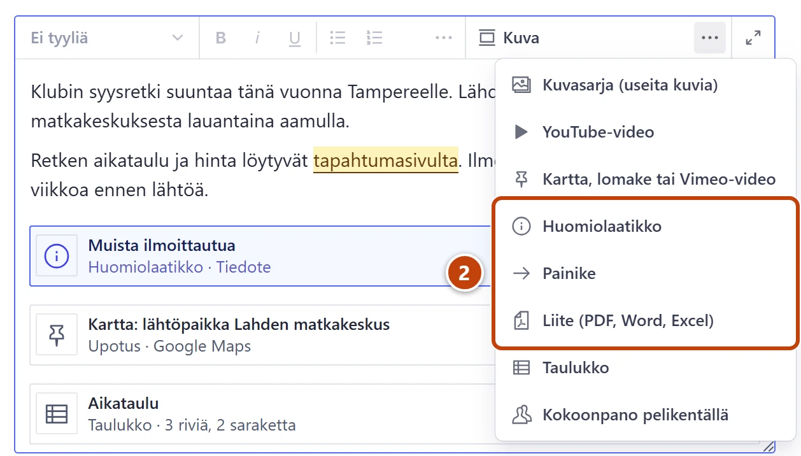
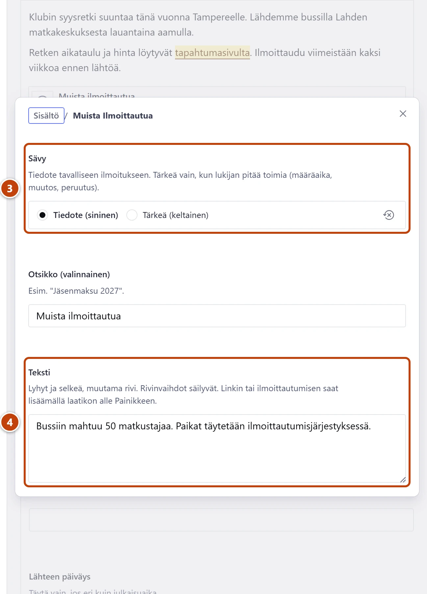

## Milloin

- Huomiolaatikko: lyhyt ilmoitus, joka erottuu tekstistä, esim. jäsenmaksun eräpäivä.
- Painike: selvä toiminto, esim. "Ilmoittaudu" tai "Lue säännöt".
- Liite: tiedosto luettavaksi, esim. kokouskutsu tai säännöt.

Nämä toimivat sivuilla, uutisissa, tapahtumissa ja klubin toiminnassa.

## Askeleet

1. Napsauta tekstiin kohtaan, johon lisäys tulee.
2. Työkalupalkissa paina **Kuva**-painikkeen oikealla puolella olevaa kolmea pistettä (**Näytä lisää**).
   Valitse **Huomiolaatikko**, **Painike** tai **Liite (PDF, Word, Excel)**. ② Ikkuna aukeaa.

3. Huomiolaatikko: valitse **Sävy**. ③
   **Tiedote (sininen)** tavalliseen ilmoitukseen, **Tärkeä (keltainen)** vain, kun lukijan pitää toimia.
4. Kirjoita **Teksti** ja halutessasi **Otsikko (valinnainen)**. ④ Muutama rivi riittää.
5. Painike: kirjoita **Painikkeen teksti**, esim. "Ilmoittaudu".
6. Kohdassa **Mihin painike vie** valitse kohde samalla tavalla kuin linkissä.
7. Liite: kirjoita **Linkin teksti**, esim. "Vuosikokouskutsu 2027".
8. Raahaa PDF-, Word- tai Excel-tiedosto kenttään **Tiedosto**.
9. Sulje ikkuna oikean yläkulman rastista (×). Lopuksi paina **Julkaise**.

> [!WARNING]
> Liitetty tiedosto on julkinen. Se löytyy sivustolta, vaikka poistaisit liitteen, ja myös tiedoston nimi näkyy. Älä liitä jäsenluetteloita, henkilötietoja sisältäviä pöytäkirjoja tai muuta luottamuksellista.

## Tulos

- Huomiolaatikko näkyy sivulla värillisenä laatikkona.
- Painike näkyy sinisenä nappina.
- Liite näkyy linkkinä, jonka perässä on tyyppi ja koko, esim. "Klubin säännöt (PDF, 240 kt)".

## Lisävalinnat

- Linkin kohteen valinta: [Lisää linkki](linkit.md)
- Wordista saat PDF:n valitsemalla Wordissa "Tallenna nimellä" ja muodoksi PDF.
- Väärä tiedosto julkaistu: poista liite tekstistä ja julkaise. Käyttämätön tiedosto poistuu itsestään viikon kuluttua. Kiireellinen poisto: [Poista henkilön tiedot pyynnöstä](../turvaverkko/tietosuojapyynto.md)

> [!TIP]
> Käytä keltaista **Tärkeä (keltainen)** säästeliäästi. Jos kaikki on tärkeää, mikään ei erotu.

## Jos jokin menee vikaan

- Painike ei näy sivulla: valittu sivu on julkaisematta tai osoite on virheellinen. Tarkista kohta **Mihin painike vie**.
- Tiedosto ei kelpaa: vain PDF, Word (.docx) ja Excel (.xlsx) käyvät. Tallenna tiedosto ensin johonkin näistä muodoista.
- Keltainen "Tiedosto on iso…": pienennä PDF. Liitteen voi silti julkaista.

Katso myös: [Lisää video, kartta tai lomake](video-kartta-lomake.md) · [Lisää taulukko tekstiin](taulukko-tekstissa.md)
