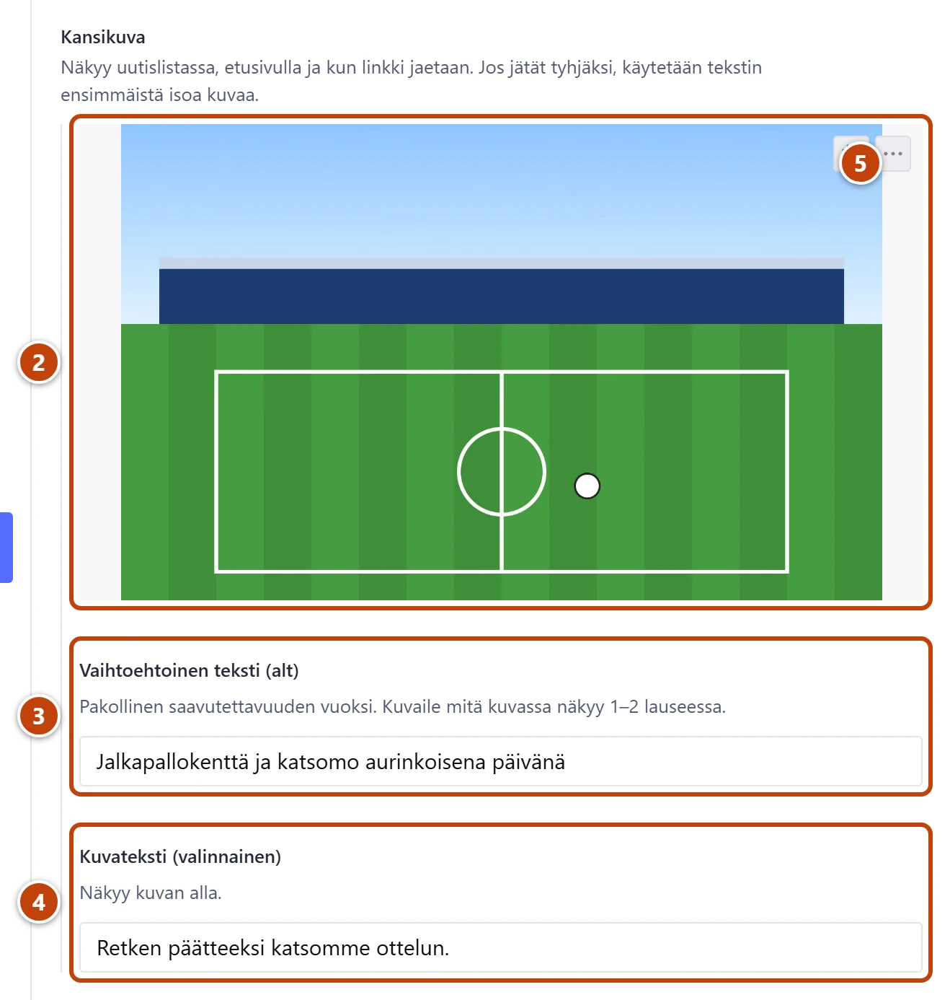
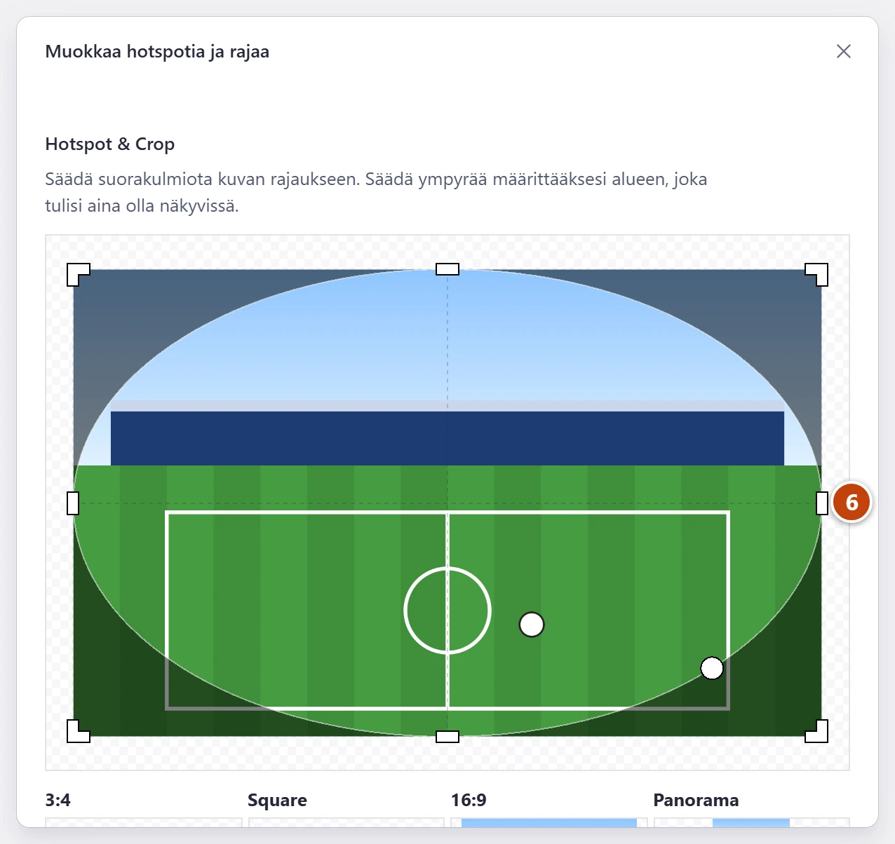

## Milloin

Kun lisäät kuvan uutiseen, sivulle tai muuhun sisältöön, tai vaihdat vanhan kuvan. Kuva näkyy sivulla ja usein myös silloin, kun linkki jaetaan.

## Ennen kuin aloitat

- Kuva on tietokoneella tai puhelimessa. Puhelimen kuvan voi ladata sellaisenaan, sivusto pienentää sen itse.

## Askeleet

1. Avaa sisältö ja etsi kuvakenttä, esim. **Kansikuva**.
   Tekstin sekaan: napsauta tekstiin kohtaan ja paina työkalupalkista **Kuva**.
2. Raahaa kuva kenttään, tai paina **Lataa** ja valitse kuva. ②
3. Kirjoita **Vaihtoehtoinen teksti (alt)**: mitä kuvassa näkyy, 1–2 lausetta. ③
   Esim. "Klubilaiset Lahden torilla vappuna". Ruudunlukija lukee tämän näkövammaiselle.
4. Halutessasi kirjoita **Kuvateksti (valinnainen)**. ④ Se näkyy kuvan alla.
5. Kuvan oikeassa yläkulmassa on kaksi pientä painiketta. Paina vasemmanpuoleista, **Rajaa kuva**. ⑤
   Ikkuna **Muokkaa hotspotia ja rajaa** aukeaa.

6. Vedä ympyrä kuvan tärkeimmän kohdan päälle, esim. kasvojen. ⑥
   Kehyksen kulmista voit lisäksi rajata reunoja pois. Sulje ikkuna oikean yläkulman rastista (×).
7. Lopuksi paina **Julkaise**.

## Tulos

- Kuva näkyy lomakkeella, ja **Vaihtoehtoinen teksti (alt)** on täytetty.
- Sivulla kuvan tärkein kohta pysyy näkyvissä, vaikka kuva rajataan eri kokoon.

## Lisävalinnat

- Vaihda kuva: paina kuvan oikean yläkulman kolmea pistettä. Valitse ylin **Lataa** ja uusi kuva koneelta. Tarkista kuvaus.
- Käytä aiemmin ladattua kuvaa: paina kentässä **Valitse** (tai kuvan kolmen pisteen valikosta **Valitse**). Kuvat ovat uusimmasta vanhimpaan, ja lisää saat painikkeesta **Lataa lisää**. Kirjoita kuvaus tähän käyttöön sopivaksi.
- Poista kuva: kuvan kolmen pisteen valikosta **Tyhjennä kenttä**.
- Useita kuvia kerralla tekstiin: valitse työkalupalkista **Kuvasarja (useita kuvia)**. Raahaa kuvat kenttään **Kuvat** ja kirjoita **Mitä kuvissa on (yhteinen kuvaus)**. Kohdassa **Kuvien muoto** voit valita, rajataanko kuvat neliöiksi.
- Iso kuvajoukko omaksi albumiksi: [Lisää kuva-albumi galleriaan](../ottelut/galleria-albumi.md)
- Kuva linkin jakoon: [Valitse kuva, joka näkyy jaossa](../uutiset/jakokuva.md)

## Jos jokin menee vikaan

- Kentän **Vaihtoehtoinen teksti (alt)** nimen vieressä on punainen huutomerkki. Vie hiiri sen päälle: "Alt-teksti on pakollinen (3–200 merkkiä)." Kirjoita kuvaus kenttään.
- Uutisessa keltainen "Uutisessa ei ole kansikuvaa eikä isoa kuvaa tekstissä": uutisen voi julkaista silti. Listassa näkyy silloin pelkkä teksti.
- Sivulla kuvasta leikkautuu tärkeä kohta pois: siirrä ympyrää rajausikkunassa ja julkaise uudelleen.

Katso myös: [Lisää linkki](linkit.md) · [Kirjoita uutinen](../uutiset/uutisen-kirjoittaminen.md)
