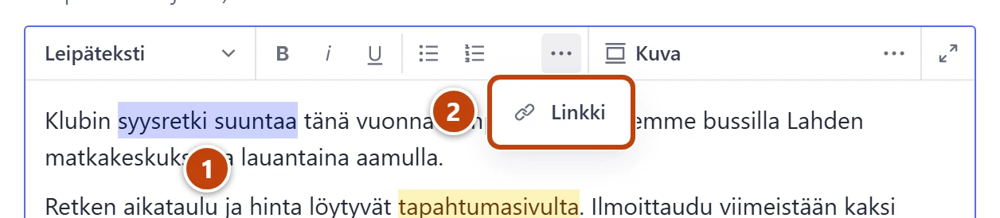
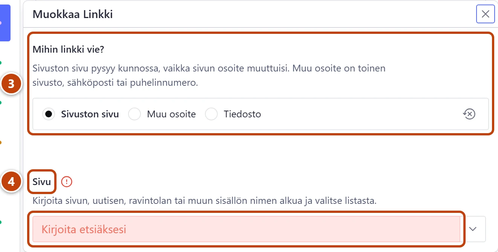

## Milloin

Kun haluat, että sana tekstissä vie toiselle sivulle, toiselle sivustolle, sähköpostiin tai tiedostoon. Sama valinta **Mihin linkki vie?** on myös valikossa, etusivun pikalinkeissä, painikkeissa ja klubin toiminnan vuosilinkeissä.

## Askeleet

1. Maalaa tekstistä sana tai lause, josta linkki tehdään. ①
2. Paina työkalupalkista **Linkki** (ketjun kuva). ②
   Jos sitä ei näy, paina ensin luettelopainikkeiden oikealla puolella olevaa kolmea pistettä (**Näytä lisää**). Ikkuna **Muokkaa Linkki** aukeaa.

3. Kohdassa **Mihin linkki vie?** valitse **Sivuston sivu**, **Muu osoite** tai **Tiedosto**. ③
   **Sivuston sivu** on valmiiksi valittuna.
4. **Sivuston sivu**: kirjoita kenttään **Sivu** sivun, uutisen tai ravintolan nimen alkua. Valitse listasta. ④
   Tämä linkki pysyy kunnossa, vaikka sivun osoite muuttuisi.
5. **Muu osoite**: kirjoita kenttään **Osoite** koko osoite.
   Esim. https://www.palloliitto.fi, mailto:nimi@esimerkki.fi tai tel:+358401234567.
6. **Tiedosto**: raahaa PDF-, Word- tai Excel-tiedosto kenttään **Tiedosto**.
7. Muulle osoitteelle ja tiedostolle voit kytkeä päälle **Avaa uuteen välilehteen**.
8. Sulje ikkuna oikean yläkulman rastista (×). Lopuksi paina **Julkaise**.

> [!WARNING]
> Tiedosto on julkinen. Se löytyy sivustolta, vaikka poistaisit linkin, ja myös tiedoston nimi näkyy. Älä liitä jäsenluetteloita tai muuta luottamuksellista.

## Tulos

- Sana näkyy tekstissä linkkinä.
- Julkaisun jälkeen linkki toimii sivustolla. Tiedoston perässä näkyy tyyppi ja koko, esim. "(PDF, 240 kt)".

## Lisävalinnat

- Valikon linkit: [Muokkaa valikkoa ja alatunnistetta](../sivusto/valikko-ja-alatunniste.md)
- Linkki näyttävänä nappina: [Lisää huomiolaatikko, painike tai liite](huomiolaatikko-painike-liite.md)

> [!TIP]
> Valitse klubin omalle sivulle aina **Sivuston sivu**. Valitse **Muu osoite** vain, jos sivua ei löydy listasta.

## Jos jokin menee vikaan

Kentän nimen vieressä on keltainen kolmio tai punainen huutomerkki. Vie hiiri sen päälle, niin näet tekstin:

- Keltainen "… ei ole vielä julkaistu": valitsemasi sivu on luonnos. Linkki näkyy sivustolla vasta, kun julkaiset sen sivun.
- Keltainen "Tätä valintaa ei käytetä…": vaihdoit linkin muualle. Tyhjennä vanha sivuvalinta: paina valitun sivun rivin kolmea pistettä ja valitse **Tyhjennä**. Tiedostolle valinta on **Tyhjennä kenttä**.
- Punainen "Valittua sivua ei enää ole. Valitse toinen sivu.": sivu on poistettu. Valitse toinen. Lisää: [Linkki vie väärään paikkaan tai puuttuu sivulta](../vianetsinta/linkki-vie-vaaraan-paikkaan.md).

Katso myös: [Lisää tai vaihda kuva](kuva.md) · [Muotoile teksti](tekstin-muotoilu.md)
