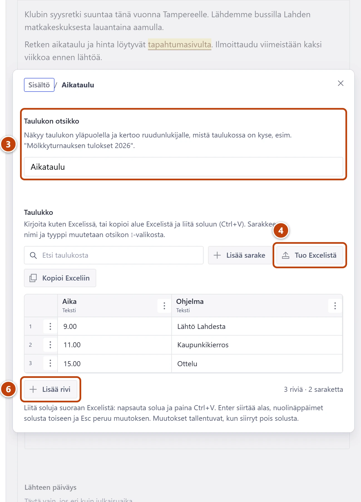

## Milloin

Kun juttuun tarvitaan pieni taulukko, joka kuuluu vain tähän juttuun. Esimerkiksi mölkkyturnauksen tulokset.

## Ennen kuin aloitat

- Tilasto, joka näkyy monella sivulla tai jota päivitetään vuosia, tehdään jalkapalloarkistoon. Katso [Päivitä tilastotaulukko](../arkisto/tilastotaulukon-paivitys.md).

## Askeleet

1. Napsauta tekstiin kohtaan, johon taulukko tulee.
2. Työkalupalkissa paina **Kuva**-painikkeen oikealla puolella olevaa kolmea pistettä (**Näytä lisää**). Valitse **Taulukko**. Taulukon ikkuna aukeaa.
3. Kirjoita **Taulukon otsikko**, esim. "Mölkkyturnauksen tulokset 2026". ③
4. Jos tiedot ovat Excelissä, paina **Tuo Excelistä**. ④
   Kopioi solut Excelissä ja liitä ne kohtaan **Liitä solut tähän**. Paina sinistä painiketta, jossa lukee "Korvaa taulukko".
5. Muuten paina **Lisää sarake**, anna **Sarakkeen nimi** ja paina **Tallenna**. Toista jokaiselle sarakkeelle.
6. Lisää rivejä painikkeella **Lisää rivi** ja kirjoita soluihin. ⑥
   Enter siirtää alas, nuolinäppäimet solusta toiseen.
7. Sulje ikkuna oikean yläkulman rastista (×). Lopuksi paina **Julkaise**.

## Tulos

- Tekstissä näkyy laatikko, jossa on taulukon otsikko sekä rivien ja sarakkeiden määrä.
- Sivulla taulukko näkyy otsikkoineen tekstin keskellä.

## Lisävalinnat

- Rivin lisäys väliin, siirto tai poisto: rivinumeron vieressä olevasta valikosta.
- Sarakkeen nimen muutos: sarakkeen otsikon valikosta **Muokkaa nimeä ja tyyppiä**.
- Koko taulukko Exceliin muokattavaksi: **Kopioi Exceliin**. Tuo takaisin valinnalla **Korvaa koko taulukko (sarakkeet ja rivit)**.
- Taulukkoeditorin kaikki toiminnot: [Päivitä tilastotaulukko](../arkisto/tilastotaulukon-paivitys.md)

## Jos jokin menee vikaan

- Poistit rivin vahingossa: paina heti ilmoituksen painiketta **Kumoa**.
- Solun alla on aaltoviiva: arvo ei näytä numerolta tai päivämäärältä. Se tallentuu silti.
- Punainen "Kirjoita taulukolle otsikko.": täytä **Taulukon otsikko**.

Katso myös: [Lisää huomiolaatikko, painike tai liite](huomiolaatikko-painike-liite.md) · [Muotoile teksti](tekstin-muotoilu.md)
