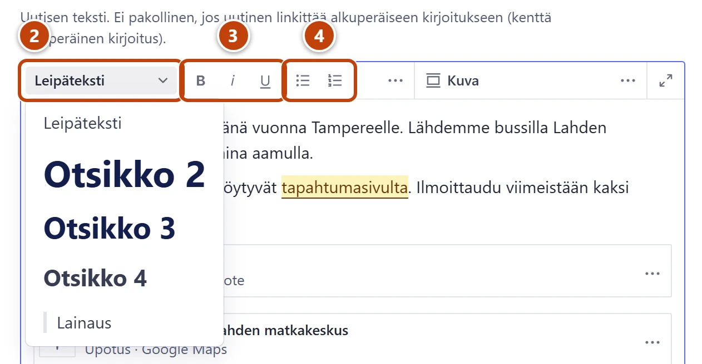

## Milloin

Kun kirjoitat pidemmän tekstin ja haluat siihen väliotsikoita, lihavointeja tai luettelon. Työkalupalkki on tekstikentän yläreunassa.

## Askeleet

1. Napsauta tekstikenttään, esim. uutisen **Sisältö**.
2. Väliotsikko: napsauta riville ja avaa työkalupalkin vasemman reunan tyylivalikko, jossa lukee **Leipäteksti**. Valitse **Otsikko 2**. ②
   Jos valikossa lukee **Ei tyyliä**, napsauta ensin tekstiriville.
   Pienempi väliotsikko on **Otsikko 3**. Lainaukselle valitse **Lainaus**.
3. Korostus: maalaa sana ja paina **Lihava** (B), **Kursiivi** (I) tai **Alleviivattu** (U). ③
4. Luettelo: napsauta riville ja paina **Luettelo** tai **Numeroitu**. ④
5. Rivinvaihto saman kappaleen sisällä: paina Shift + Enter. Enter aloittaa uuden kappaleen.
6. Lopuksi paina **Julkaise**.

## Tulos

- Väliotsikot, korostukset ja luettelot näkyvät lomakkeella ja sivulla.
- Lyhyt ensimmäinen kappale näkyy sivulla isommalla johdantona.

## Lisävalinnat

- Tekstiä voi liittää Wordista tai sähköpostista (Ctrl + V). Tarkista sen jälkeen väliotsikot ja luettelot.
- Linkit: [Lisää linkki](linkit.md)
- Kuvat, videot ja muut lisäosat: [Lisää tai vaihda kuva](kuva.md), [Lisää video, kartta tai lomake](video-kartta-lomake.md)

> [!TIP]
> Älä käytä väliotsikkoa korostukseen. Ruudunlukija käyttää väliotsikoita sivun rakenteena. Korosta sanalla **Lihava**.

## Jos jokin menee vikaan

- Muotoilu meni väärin: maalaa teksti ja valitse tyylivalikosta **Leipäteksti**.
- Liitetyssä tekstissä on outoja välejä: poista tyhjät rivit käsin.
- Työkalupalkista puuttuu painike, esim. **Linkki**: se on kolmen pisteen painikkeen (**Näytä lisää**) takana.

Katso myös: [Kirjoita uutinen](../uutiset/uutisen-kirjoittaminen.md) · [Lisää taulukko tekstiin](taulukko-tekstissa.md)
