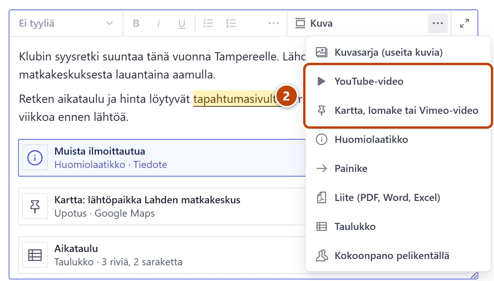
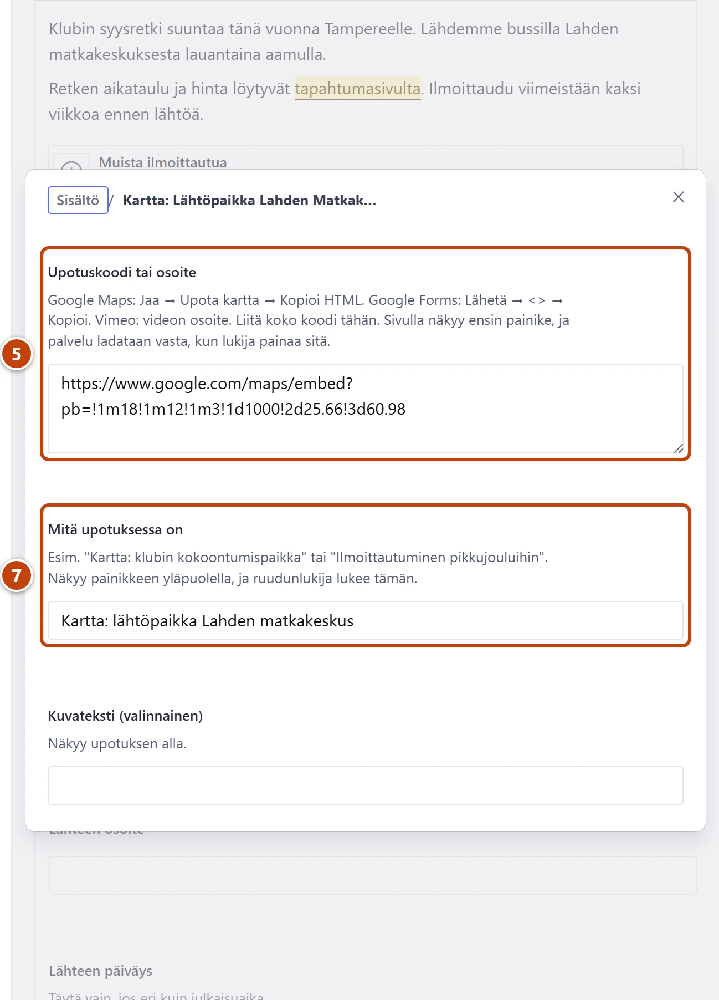

## Milloin

Kun haluat tekstiin YouTube- tai Vimeo-videon, kartan kokoontumispaikkaan tai Google Forms -ilmoittautumislomakkeen. Sivulla näkyy ensin painike, ja video tai kartta latautuu vasta, kun lukija painaa sitä.

## Ennen kuin aloitat

- YouTube-video toimii kaikissa tekstikentissä.
- Kartta, lomake ja Vimeo toimivat sivuilla, uutisissa, tapahtumissa ja klubin toiminnassa.

## Askeleet

1. Napsauta tekstiin kohtaan, johon video tai kartta tulee.
2. Työkalupalkissa paina **Kuva**-painikkeen oikealla puolella olevaa kolmea pistettä (**Näytä lisää**).
   Valitse **YouTube-video** tai **Kartta, lomake tai Vimeo-video**. ② Ikkuna aukeaa.
3. YouTube: kopioi videon osoite YouTubesta selaimen osoiteriviltä. Liitä se kenttään **Videon osoite**.
4. Kirjoita **Videon otsikko**, esim. "Huuhkajien maali Unkaria vastaan 2023".

5. Kartta: avaa paikka Google Mapsissa ja valitse "Jaa" → "Upota kartta" → "Kopioi HTML". Liitä koko koodi kenttään **Upotuskoodi tai osoite**. ⑤
6. Lomake: avaa lomake Google Formsissa ja valitse "Lähetä" → "<>" → "Kopioi". Vimeo: kopioi videon osoite. Liitä samaan kenttään.
7. Kirjoita **Mitä upotuksessa on**, esim. "Kartta: klubin kokoontumispaikka". ⑦
8. Sulje ikkuna oikean yläkulman rastista (×). Lopuksi paina **Julkaise**.

## Tulos

- Tekstissä näkyy laatikko videon tai upotuksen nimellä.
- Sivulla näkyy otsikko ja painike. Video tai kartta aukeaa painamalla.

## Lisävalinnat

- Video alkamaan tietystä kohdasta: YouTuben "Jaa"-ikkunassa rastita "Aloita kohdasta" ennen kopiointia.
- Facebookia ja Instagramia ei voi upottaa. Lisää niihin linkki tai painike: [Lisää linkki](linkit.md), [Lisää huomiolaatikko, painike tai liite](huomiolaatikko-painike-liite.md)

## Jos jokin menee vikaan

- Punainen "Osoite ei ole YouTube-video…": kopioi osoite suoraan videon sivulta.
- Kenttä **Upotuskoodi tai osoite** on punainen: lue virheen ohje. Pelkkä jakolinkki (maps.app.goo.gl tai forms.gle) ei käy, vaan tarvitaan upotuskoodi.
- Muiden palveluiden upotuksia ei voi sallia itse. Kerro tarpeesta tukihenkilölle.

Katso myös: [Lisää linkki](linkit.md) · [Lisää tai vaihda kuva](kuva.md)
