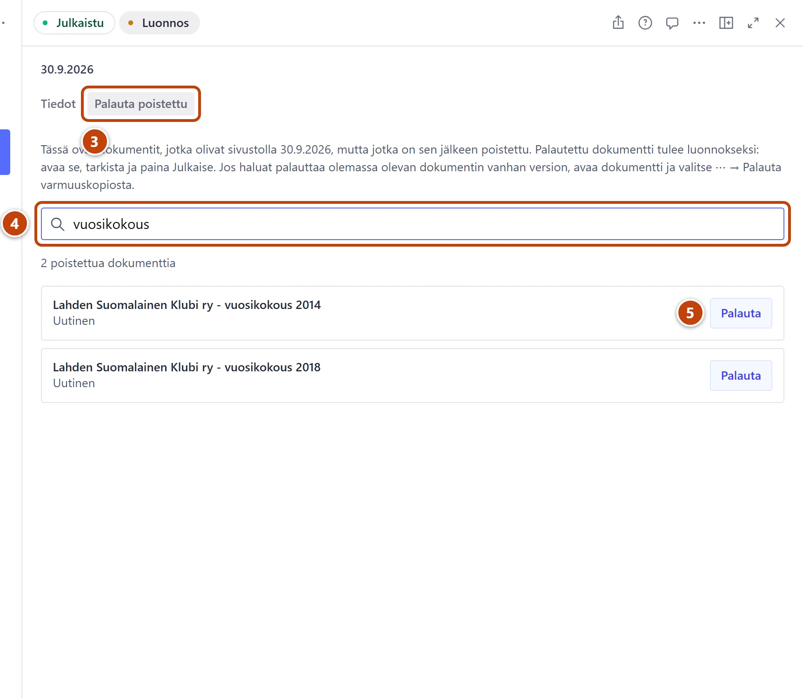

## Milloin

Kun olet poistanut vahingossa uutisen, sivun tai muun sisällön. Poistetun saa takaisin viikoittaisesta varmuuskopiosta.

## Askeleet

1. Vasemmasta valikosta valitse **Sivuston asetukset → Varmuuskopiot**.
2. Avaa uusin kopio, joka on tehty ennen poistoa.
3. Valitse yläreunasta välilehti **Palauta poistettu**. ③
   Listassa ovat kaikki kopion jälkeen poistetut sisällöt.
4. Kirjoita hakukenttään nimen osa, esim. "vuosikokous". ④
5. Paina oikean rivin kohdalla **Palauta**. ⑤
   Sisältö palautuu luonnokseksi.
6. Paina saman rivin painiketta **Avaa**.
7. Tarkista sisältö ja paina **Julkaise**.

## Tulos

- Palautettu sisältö näkyy taas Studion listassa ja julkaisun jälkeen sivustolla.

## Lisävalinnat

- Heti poiston jälkeen: paina selaimen Takaisin-nuolta. Lomake aukeaa, ja yläreunassa lukee **Tämä asiakirja on poistettu.** Paina **Palauta viimeisin versio**, tarkista ja julkaise.
- Olemassa olevan sisällön vanha versio: [Palauta vanha versio varmuuskopiosta](vanhan-version-palautus.md)

> [!NOTE]
> Kommentteja ja kävijöiden ravintola-arvosteluja ei palauteta. Niiden poisto on tarkoituksellista.
> Sisältöä, joka tehtiin ja poistettiin saman viikon aikana, ei ole missään kopiossa. Kerro silloin tukihenkilölle.

## Jos jokin menee vikaan

- Listassa lukee "Kopion jälkeen ei ole poistettu yhtään dokumenttia.": avaa vanhempi kopio.
- Ilmoitus kertoo, että tiedosto tai kuva puuttuu: lisää se uudelleen ennen julkaisua.
- Koko sivuston sisältö on kadonnut: älä yritä palauttaa itse. Kerro tukihenkilölle heti.

Katso myös: [Tarkista ja lataa varmuuskopio](varmuuskopiot.md) · [Poistin vahingossa](../vianetsinta/poistin-vahingossa.md)
