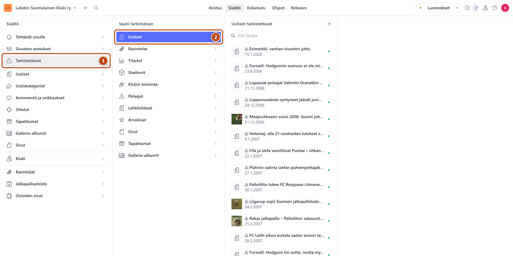
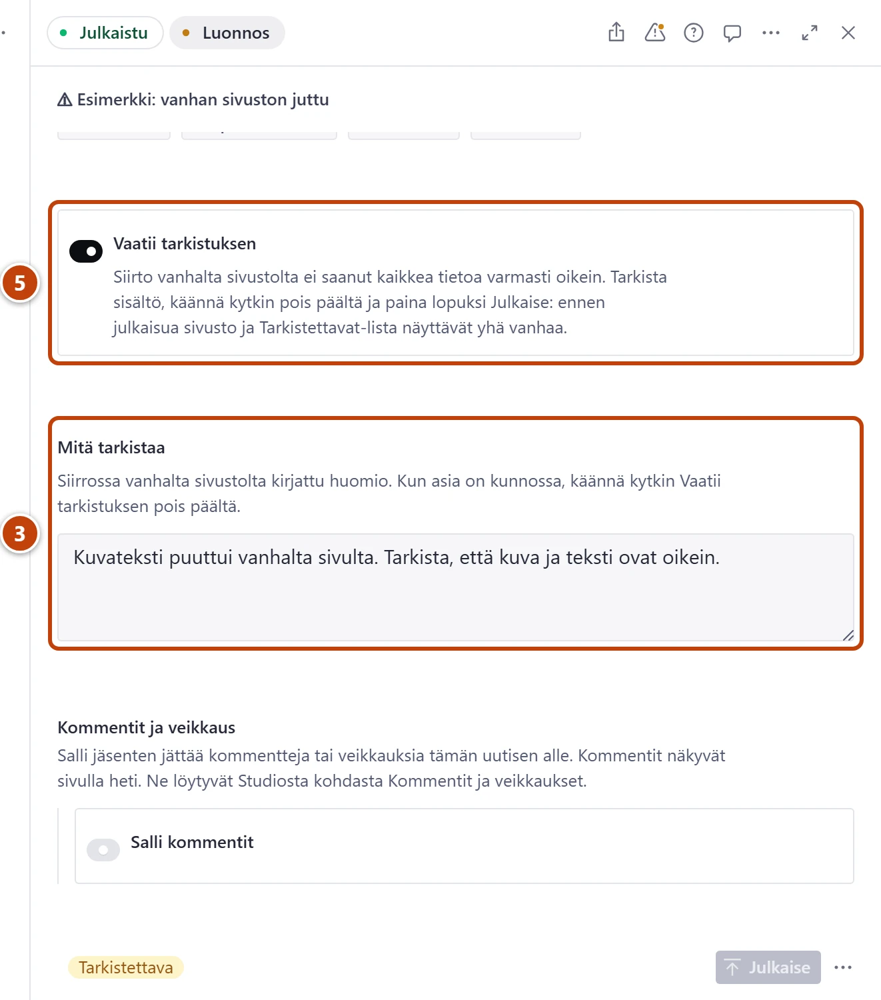

## Milloin

Kun vanhan sivuston sisältö siirrettiin, osa tiedoista jäi epävarmaksi. Ne on merkitty tarkistettaviksi. Käy niitä läpi muutama kerrallaan, esim. viisi joka kerta, kun avaat Studion.

## Askeleet

1. Vasemmasta valikosta valitse **Tarkistettavat**. ①
   Kaikki yhdessä listassa: **Tehtävät sinulle → Vaatii tarkistuksen (kaikki)**.
2. Valitse tyyppi, esim. **Uutiset** tai **Tilastot**. ②
   Listan rivien edessä on merkki ⚠.

3. Avaa rivi. Vieritä lomakkeen loppuun ja lue kohta **Mitä tarkistaa**. ③
4. Korjaa tieto, tai totea se oikeaksi.
5. Kytke pois **Vaatii tarkistuksen**. ⑤ Kytkin on heti **Mitä tarkistaa** -kohdan yläpuolella.
6. Paina **Julkaise**.

## Tulos

- Merkki **Tarkistettava** katoaa alapalkista, ja rivi poistuu listalta.
- Aloituksen kortin **Vaatii tarkistuksen (kaikki)** luku pienenee.

## Lisävalinnat

- Merkin selitys: [Tilamerkit ja listojen merkinnät](../hakuteos/tilamerkit.md)

> [!TIP]
> Et voi rikkoa mitään tarkistamalla. Jos et ole varma oikeasta tiedosta, jätä kytkin **Vaatii tarkistuksen** päälle ja siirry seuraavaan.

## Jos jokin menee vikaan

- Rivi ei poistu listalta: painoitko **Julkaise**? Lista päivittyy vasta julkaisun jälkeen.
- Kohta **Mitä tarkistaa** puuttuu: syytä ei ole kirjattu. Lue sisältö kokonaan. Jos et löydä virhettä, käännä kytkin **Vaatii tarkistuksen** pois päältä ja julkaise.

Katso myös: [Lue Aloitus ja sivuston tila](../alkuun/aloitus-ja-sivuston-tila.md) · [Tallenna, julkaise ja peru muutos](../alkuun/luonnos-julkaisu-ja-peruminen.md)
