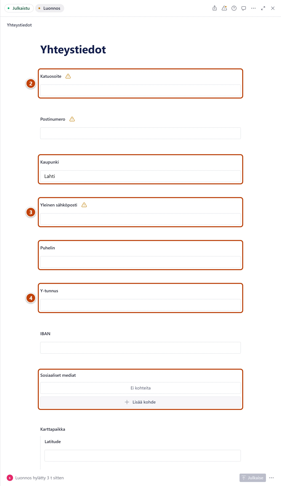

## Milloin

Kun Aloituksessa näkyy kohta **Täydennä perustiedot**, tai kun haluat tarkistaa, että sivuston perustiedot ovat kunnossa. Osaa tiedoista ei ollut vanhalla sivustolla.

## Askeleet

1. Avaa **Klubi → Yhteystiedot → Osoite, sähköposti ja some**.
   Aloituksen **Täydennä perustiedot** -rivi vie kohtaan **Klubi → Yhteystiedot**. Valitse sieltä **Osoite, sähköposti ja some**.
2. Täytä **Katuosoite**, **Postinumero** ja **Kaupunki**. ②
3. Täytä **Yleinen sähköposti** ja **Puhelin**. ③
4. Täytä **Y-tunnus**, **IBAN** ja **Sosiaaliset mediat**. ④ Paina **Julkaise**.
5. Lisää hallituksen jäsenet: **Klubi → Hallitus → Nykyinen hallitus**. Ohje: [Vaihda hallituksen jäseniä](../klubi/hallitus.md).
6. Avaa **Sivuston asetukset → Etusivu**. Lisää välilehdellä **Yläosa** kuva kohtaan **Taustakuva (valinnainen)**.
7. Välilehdellä **Lohkot** avaa klubin esittelylohko, esim. "Lahtelainen klubi, …". Lisää **Kuva** ja sulje ikkuna. Paina **Julkaise**.
8. Halutessasi kirjoita johdannot: **Klubi → Hallitus → Hallitus-sivun otsikko ja johdanto** ja **Klubi → Toiminta → Toiminta-sivun otsikko ja johdanto**.
9. Pyydä hallitusta vahvistamaan tietosuojaseloste. Avaa se valikon kohdasta **Sivut** ja lisää alla olevat kaksi kappaletta.

Valmiit kappaleet tietosuojaselosteeseen:

> Sivuilla voi olla Google Maps -karttoja, Google Forms -lomakkeita ja Vimeo-videoita. Ne ladataan vasta, kun painat niiden painiketta. Silloin Google tai Vimeo voi tallentaa evästeitä laitteellesi.

> Sivustolle ladatut tiedostot ja kuvat ovat julkisia. Liitetiedosto (PDF, Word, Excel) poistetaan automaattisesti, kun mikään sivu ei ole käyttänyt sitä 7 päivään.

## Tulos

- Aloituksessa ei enää näy kohtaa **Täydennä perustiedot**.
- Yhteystiedot näkyvät sivuston alareunassa ja yhteystietosivulla.

## Lisävalinnat

- Tulevat tapahtumat: [Lisää tapahtuma](../ottelut/tapahtuman-lisaaminen.md)
- Yhteystietosivun teksti: [Päivitä klubin yhteystiedot](../klubi/yhteystiedot.md)

## Jos jokin menee vikaan

- **Täydennä perustiedot** näkyy yhä: paina Aloituksessa **Päivitä**. Tarkista, että painoit **Julkaise**.
- Hallituksen jäsen ei näy: tarkista, että kytkin **Nykyinen jäsen** on päällä ja jäsen on julkaistu.

Katso myös: [Lue Aloitus ja sivuston tila](../alkuun/aloitus-ja-sivuston-tila.md) · [Lisää tai vaihda kuva](../tekstit/kuva.md)
